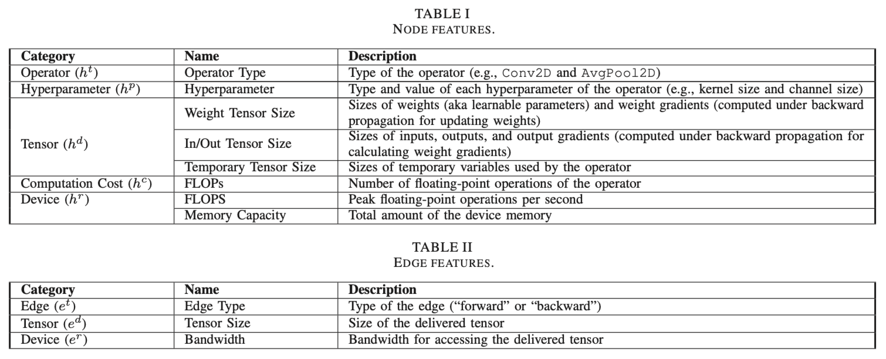

# Meeting Dec. 1

## DNNPerf

* $\mathcal{M}$ as a directed acyclic graph
  $$
  \mathcal{M}=\langle \{u_i\}_{i=1}^n,\{e_{ij}=(u_i,u_j)\}_{i,j\in[1,n]},\{hp_k\}_{k=1}^m\rangle
  $$

  * $u_i$: operator
  * $e_{ij}$: tensor
  * $hp_k$: hyperparameter of some operator (batch size, input tensor shape)
    * domain $B_k$

* configuration space $\Delta_{\mathcal{M}}$
  $$
  \Delta_{\mathcal{M}}={\mathcal{M}(b_1,b_2\dots b_m)}
  $$

* runtime specification $\mathcal{S}$

  * runtime specification describes the execution environment, which currently contains the information of *target devices*
  * floating-point operations per second (FLOPS) and memory capacity

* **performance function**

$$
f_i: \mathcal{\Delta_M \times S \rightarrow} \mathbb{R}
$$

### Attention-based Node-Edge Encoder (ANEE)

* model encoding

  1. Initial node encoding
  2. Initial edge encoding
  3. Normalization

* ANEE

  * ANEE captures both the node and edge features

  * ANEE performs multiple rounds of computation to encode the nodes and edges

    * edges
      $$
      \bar h_{g,u}^i = \text{LeakyReLU}(W_u\times h_{g,u}^{i-1})
      $$

      $$
      e_{g,l}^i=\sigma(a^\top \times(\bar h_{g,s}^i||\bar h_{g,d}^i)\times W_e\times e_{g,l}^{i-1})
      $$

    * nodes
      $$
      f(u',l')=\text{Softmax}(W_m\times e_{g,l'}^i)\times \bar h_{g,u'}^i
      $$

      $$
      h_{g,u}^i=\text{LeakyReLU}(\sum_{l'=(u'u)}f(u',l'))
      $$

***

* DIPPM: A Deep Learning Inference Performance Predictive Model Using Graph Neural Networks
  * GraphSage
  * A100
* NNLQP: A Multi-Platform Neural Network Latency Query and Prediction System with An Evolving Database
  * query + database + predict
* SLAPP: Subgraph-level attention-based performance prediction for deep learning models
  * Edge Aware Graph Attention Network (EAGAT)
  * total latency = $\sum$ subgraph latency

## GNN based Predictor

DNNPerf + Profiler => Predictor => Optimized graph

## TODO

* 监督学习的标签？

- oracle