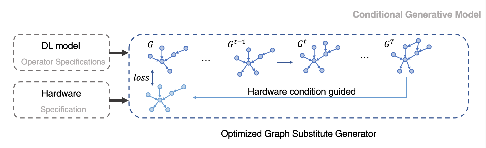

# Meeting Dec. 15

## Conditional Generative Model

### Decision Making

**guided diffusion objective**: modelling the conditional data distribution $q(x|y)$ makes it possible to generate samples with attributes of the label $y$

- classifier-guided
  - train a classifier $p_\phi(y|x_k)$ to predict $y$ from noisy data $x_k$
- classifier-free
  - $\hat \epsilon := \epsilon_\theta(x_k,k)+\omega(\epsilon_\theta(x_k,y,k)-\epsilon_\theta(x_k,k))$
  - learn both conditional $\epsilon_\theta(x_k,y,k)$ and unconditional $\epsilon_\theta(x_k,k)$

### DiGress

**DiGress: Discrete denoising diffusion for graph generation**

diffuse separately on each node and edge feature

**noise model**

for node/edge, transition probabilities:

$[Q_X^t]_{ij}=q(x^t=j|x^{t-1}=i)$ / $[Q_E^t]_{ij}=q(x^t=j|x^{t-1}=i)$ 

adding noise = sample each node and edge type from a categorical distribution

**denoise neural network $\phi_\theta$**

optimize the cross-entropy loss $l$ between the predicted probabilities $\hat p^G=(\hat p^X,\hat p ^E)$ for each node and edge and the true graph $G$

#### Conditional generation

**discrete guidance scheme**

uses a regressor $g_\eta$ which is trained to predict target properties $y_G$ of a clean graph $G$ from a noisy version of $G: g_η(G^t) = y$

### SaGess

**DiGress**: multiple training samples => small graph

**SaGess**: single large graph data set => large graph

*devide-and-conquer*

***

💡 generate computational graph with diffusion model

‼️ condition: hardware bound

## Nash Learning

1. *preference model*
   - two inputs given a prompt
2. policy (Nash equilibrium)
   - generate preferred response

***

💡 perference: hardware (bound/specification)

## Tokenization

transformer generator

### Trajeglish

Trajeglish: Learning the Language of Driving Scenarios

tokenizer + renderer

### DNNFuser

DNNFuser: Transformer as a Generalized Mapper for Fusion in DNN Accelerators

- state

$$
s_t=[K_t,C_t,Y_t,X_t,R_t,S_t,\widehat M,P_{a_0\dots a_{t-1}}]
$$

- action: fusion micro-batch size
- reward: estimated runtime performance

$N$ layer model trajectory: $(\widehat r_0,s_0,a_0),\dots,(\widehat r_t,s_t,a_t),\dots,(\widehat r_N,s_N,a_N)$ 

### DNNFusion

1. Fusion seed operator(s) selection
   - selects the One-to-One operator with the minimum intermediate result
2. Propagated exploration along seed's successors
   - process succussors one-by-one
3. Propagated exploration along seed's predecessors

***

💡 token: sequntial fuse decision

### Transferable Graph Optimizer

**operator fusion**

- given graph $\mathcal{G}$, fusion priority $\mathcal{F}$
- learn policy $\pi:\mathcal{G}\rightarrow \mathcal{F}$ (assign priority for ops)

compute the action distribution
$$
p(y|G)=\prod_{i=1\dots N}p(y_i|h_G,y_{i-1},y_{i-2},\dots)
$$
*approximation*
$$
p(y^{(t)}|G)=\prod_{i=1\dots N}p(y_i^{(t)}|h_G,y^{(t)})
$$

***

💡 token: operator fusion priority policy