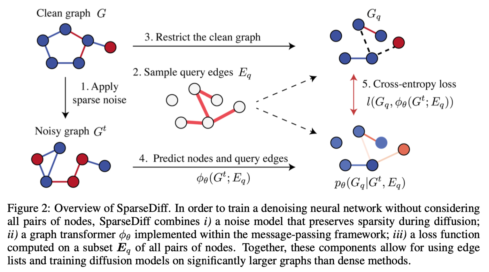

# Meeting Dec. 22

## Diffusion on Graph

### Gaussian diffusion

- EDP-GNN [1]

  adding Gaussian noise only to the upper triangular part of the adjacency matrix for edge diffusion 

- GraphGDP [2]

  forward: stophastic differential equation (SDE)

- GDSS [3]

  transforms both the node features and the adjacency matrices to a simple noise distribution

- GSDM [4]

  diffusion SDEs on both the node feature space and the graph spectrum space (the eigenvalue matrix of the adjacency matrix)

- NVDiff [5]

  diffuse on node vectors on latent space

  

### Discrete diffusion

- Discrete Diffusion for Graphs [6]

- DiGress [7] ‼️

  diffuse separately on each node (node types $\mathcal{X}$) and edge (edge types $\mathcal{E}$) feature

  optimize the cross-entropy loss $l$ between the predicted probabilities $\hat p^G=(\hat p^X,\hat p ^E)$ for each node and edge and the true graph $G$

  

- SparseDiff [8] ‼️

  

  💡 query edges = operator block

- EDGE [9]

  EDGE only focuses on a small portion of graph nodes and only adds edges between these nodes

  1. sparsity => set empty graph as convergent distribution

     diffusion = edge removal

  2. generative model = edge add

     predict edge only on small portion of "active nodes"

  3. model node degrees explicitly in probabilistic framework

- GraphArm [13] ‼️

  

  

  

## CoGen

- Rand Wired NN [10]

  generating general graphs => map to computable neural networks

  💡 model structure templates

  

  - chain structure
    - FC, VGG, DenseNet
  - cell based
    - repetitions of fixed structures

- FlowGEN [11]

  learns how to jointly generate graph *topologies* and *flows* with diverse dynamics directly from data using a novel (flow) graph neural network

  1. graph generative models: $\mathcal{H:Z}\rightarrow \{0,1\}^{N\times N}$
  2. learn additional flow function $\mathcal{F}:\{0,1\}^{N\times N}\rightarrow \R^{N\times N}$

  💡 generate computational graph topology => learn computational "flow"

- GenCoG

  operator specification + generate node by node

## DNNFusion[12] idea

1. Mathematical-Property-Based Graph Rewriting

2. Light-Weight Profile-Driven Fusoin Plan Exploration

   greedy

   

   💡 transformer: fusion plan exploration

3. Fusion Code Generation and Optimizations

💡 Nash Learning: hardware preference model

## Ref.

[1] C. Niu, Y. Song, J. Song, S. Zhao, A. Grover, and S. Ermon, “Permutation Invariant Graph Generation via Score-Based Generative Modeling,” in *Proceedings of the Twenty Third International Conference on Artificial Intelligence and Statistics*, PMLR, Jun. 2020, pp. 4474–4484. Accessed: Dec. 19, 2023. [Online]. Available: https://proceedings.mlr.press/v108/niu20a.html

[2] H. Huang, L. Sun, B. Du, Y. Fu, and W. Lv, “GraphGDP: Generative Diffusion Processes for Permutation Invariant Graph Generation,” in *2022 IEEE International Conference on Data Mining (ICDM)*, Nov. 2022, pp. 201–210. doi: [10.1109/ICDM54844.2022.00030](https://doi.org/10.1109/ICDM54844.2022.00030).

[3] J. Jo, S. Lee, and S. J. Hwang, “Score-based Generative Modeling of Graphs via the System of Stochastic Differential Equations,” in *Proceedings of the 39th International Conference on Machine Learning*, PMLR, Jun. 2022, pp. 10362–10383. Accessed: Dec. 19, 2023. [Online]. Available: https://proceedings.mlr.press/v162/jo22a.html

[4] T. Luo, Z. Mo, and S. Jialin Pan, “Fast Graph Generation via Spectral Diffusion,” *arXiv e-prints*. Nov. 01, 2022. doi: [10.48550/arXiv.2211.08892](https://doi.org/10.48550/arXiv.2211.08892).

[5] X. Chen, Y. Li, A. Zhang, and L.-P. Liu, “NVDiff: Graph Generation through the Diffusion of Node Vectors.” arXiv, Jun. 19, 2023. doi: [10.48550/arXiv.2211.10794](https://doi.org/10.48550/arXiv.2211.10794).

[6] K. K. Haefeli, K. Martinkus, N. Perraudin, and R. Wattenhofer, “Diffusion Models for Graphs Benefit From Discrete State Spaces,” presented at the NeurIPS 2022 Workshop: New Frontiers in Graph Learning, Nov. 2022. [Online]. Available: https://openreview.net/forum?id=06erEMdoSml

[7] C. Vignac, I. Krawczuk, A. Siraudin, B. Wang, V. Cevher, and P. Frossard, “DiGress: Discrete Denoising diffusion for graph generation,” presented at the The Eleventh International Conference on Learning Representations, Sep. 2022. [Online]. Available: https://openreview.net/forum?id=UaAD-Nu86WX

[8] Y. Qin, C. Vignac, and P. Frossard, “Sparse Training of Discrete Diffusion Models for Graph Generation.” arXiv, Nov. 03, 2023. doi: [10.48550/arXiv.2311.02142](https://doi.org/10.48550/arXiv.2311.02142).

[9] X. Chen, J. He, X. Han, and L.-P. Liu, “Efficient and Degree-Guided Graph Generation via Discrete Diffusion Modeling.” arXiv, May 31, 2023. doi: [10.48550/arXiv.2305.04111](https://doi.org/10.48550/arXiv.2305.04111).

[10] S. Xie, A. Kirillov, R. Girshick, and K. He, “Exploring Randomly Wired Neural Networks for Image Recognition,” presented at the Proceedings of the IEEE/CVF International Conference on Computer Vision, 2019, pp. 1284–1293. Accessed: Dec. 20, 2023. [Online]. Available: https://openaccess.thecvf.com/content_ICCV_2019/html/Xie_Exploring_Randomly_Wired_Neural_Networks_for_Image_Recognition_ICCV_2019_paper.html

[11] F. Kocayusufoglu, A. Silva, and A. K. Singh, “FlowGEN: A Generative Model for Flow Graphs,” in *Proceedings of the 28th ACM SIGKDD Conference on Knowledge Discovery and Data Mining*, in KDD ’22. New York, NY, USA: Association for Computing Machinery, 2022, pp. 813–823. doi: [10.1145/3534678.3539406](https://doi.org/10.1145/3534678.3539406).

[12] W. Niu, J. Guan, Y. Wang, G. Agrawal, and B. Ren, “DNNFusion: accelerating deep neural networks execution with advanced operator fusion,” in *Proceedings of the 42nd ACM SIGPLAN International Conference on Programming Language Design and Implementation*, in PLDI 2021. New York, NY, USA: Association for Computing Machinery, 2021, pp. 883–898. doi: [10.1145/3453483.3454083](https://doi.org/10.1145/3453483.3454083).

[13] L. Kong, J. Cui, H. Sun, Y. Zhuang, B. A. Prakash, and C. Zhang, “Autoregressive Diffusion Model for Graph Generation,” in *Proceedings of the 40th International Conference on Machine Learning*, PMLR, Jul. 2023, pp. 17391–17408. [Online]. Available: https://proceedings.mlr.press/v202/kong23b.html

