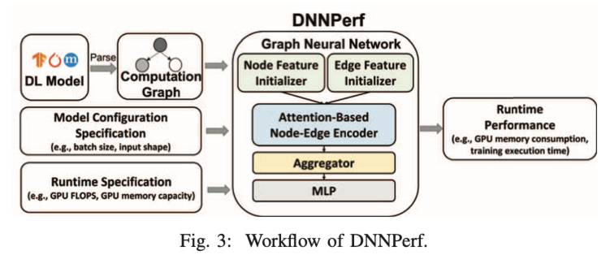

# Meeting Nov. 17

* graph optimization paper
* performance prediction paper
* outline
* cache学习

## Graph Optimization

### MetaFlow[1]

* *backtracking search algorithm*: find optimized networks
* *flow-based graph split algorithm*: allow efficient search

**cost model**

computes metrics for each operator in a graph and combines them appropriately to obtain a total cost

* static metrics
  * FLOPs, memory usage, number of kernel launches 
* dynamic metrics
  * execution time on particular GPU or CPU
  * bandwidth
  * cache hit rate

accurately *predict* the execution time of a computation graph by only measuring a few representative operators on hardware

💡 estimation

### TASO[2]

automatically generates graph substitutions

**data layout**

data layout: has a high impact on runtime performance

*cost-based backtracking search* algorithm extends its cost model to also capture performance differences that arise from different data layouts

💡 TASO *enumerates possible layouts* for tensors in the target graph

capture potential layout transformation opportunities when performing graph substitutions

## Performance Prediction

### Performance Prediction with GNN[3]

runtime performance (e.g., GPU memory consumption and training time)

* **performance function**

$$
f_i: \mathcal{\Delta_M \times S \rightarrow} \mathbb{R}
$$

💡 训练数据

### Cache Level Prediction[4]

predicts which memory hierarchy level a load will access allowing the memory loads to start earlier

**miss predictors**

* predict the level of a cache block based on its observed hit/miss history
* miss-map approach uses a table or a Bloom filter to track which blocks are in a specific cache

## Outline

## TODO

* performance prediction/estimation
* 针对Lanczos算法

***

[1] Z. Jia, J. Thomas, T. Warszawski, M. Gao, M. Zaharia, and A. Aiken, “Optimizing DNN Computation with Relaxed Graph Substitutions,” *Proceedings of Machine Learning and Systems*, vol. 1, pp. 27–39, Apr. 2019.

[2] Z. Jia, O. Padon, J. Thomas, T. Warszawski, M. Zaharia, and A. Aiken, “TASO: optimizing deep learning computation with automatic generation of graph substitutions,” in *Proceedings of the 27th ACM Symposium on Operating Systems Principles*, in SOSP ’19. New York, NY, USA: Association for Computing Machinery, 2019, pp. 47–62. doi: [10.1145/3341301.3359630](https://doi.org/10.1145/3341301.3359630).

[3] Y. Gao, X. Gu, H. Zhang, H. Lin, and M. Yang, “Runtime Performance Prediction for Deep Learning Models with Graph Neural Network,” in *2023 IEEE/ACM 45th International Conference on Software Engineering: Software Engineering in Practice (ICSE-SEIP)*, May 2023, pp. 368–380. doi: [10.1109/ICSE-SEIP58684.2023.00039](https://doi.org/10.1109/ICSE-SEIP58684.2023.00039).

[4] M. Jalili and M. Erez, “Reducing Load Latency with Cache Level Prediction,” in *2022 IEEE International Symposium on High-Performance Computer Architecture (HPCA)*, Apr. 2022, pp. 648–661. doi: [10.1109/HPCA53966.2022.00054](https://doi.org/10.1109/HPCA53966.2022.00054).

