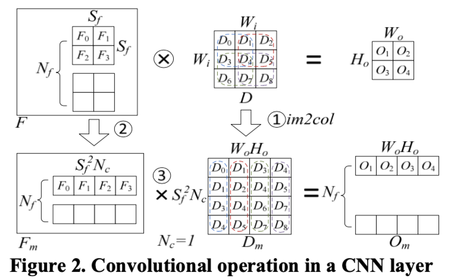
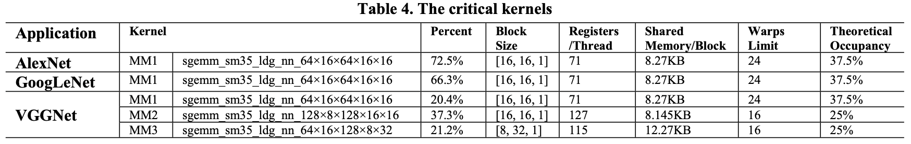
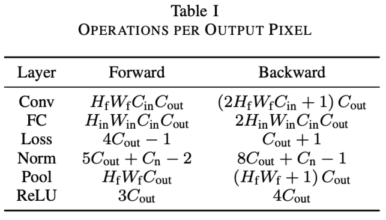
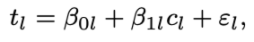
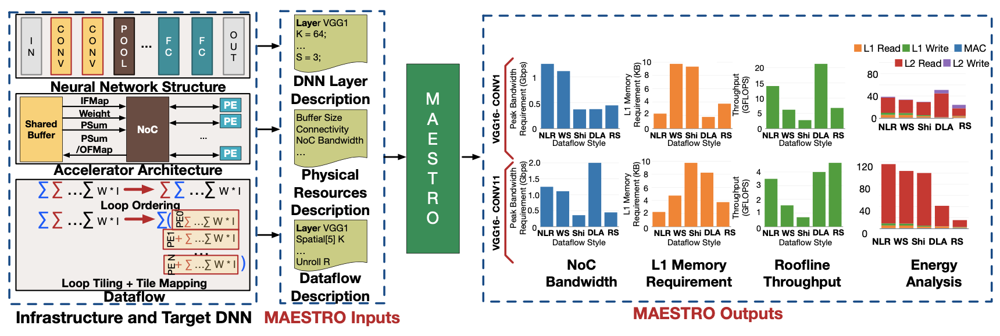

# Meeting Nov. 22

## CNN on GPU

**convolution strategies**

* direct convolution

  * 7 loop-nest

* unrolling based convolution ‼️

  * im2col
    $$
    Conv_{flops} = 2N_f\times S_f^2 N_c \times W_o H_o
    $$
    

  * GPU MM kernels

    

* FFT based convolution

  * a discrete convolution in the spatial domain can be converted into the product of the Fourier domain

**hot spot layer**

Conv

**performance prediction**

a gray box *per layer* approach where modeling is performed layer by layer and the only explanatory variable is computational complexity

线性模型

将计算复杂度作为输入，运行时间作为输出，构造线性回归模型，实验收集数据得到预测回归线

## CNN on DNN Accelerator

**MAESTRO** (**M**odeling **A**ccelerator **E**fficiency via **S**patio-**T**emporal **R**esource **O**ccupancy)

💡 data-centric：将CNN layer的操作描述为PE上的dataflow（包括schedual/tiling/mapping），通过dataflow分析data reuse

