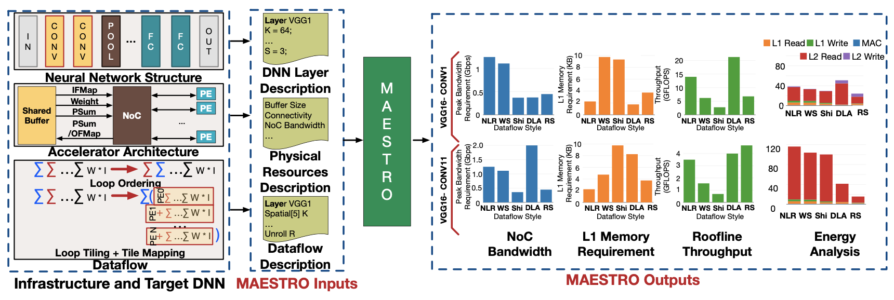

# Meeting Nov. 24

## MAESTRA

**Deep Learning Accelerator**

**MAESTRO**

*receives* the DNN model description, hardware resources information, and mapping

*analyzes* various forms of data reuse in an accelerator based on inputs quickly and generates more than 20 statistics including total latency, energy, throughput, etc., as outputs

**Hardware**

**Analysis Framework**

## Flexagon

**PSRAM**

* storing the psums
  * this structure stores blocks of elements (coordinate, value)
* sets corresponding to different rows
* each set into blocks for different K dimension within a row
* Each block has a valid bit

* PartialWrite(row, k, E)
* Consume(row, k)
* Write(offset, E)