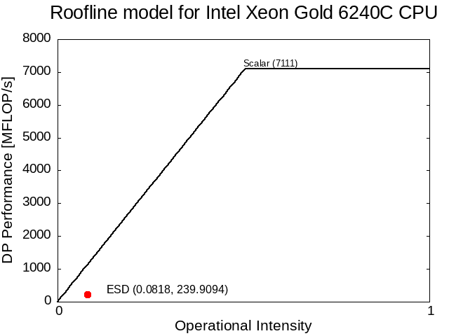
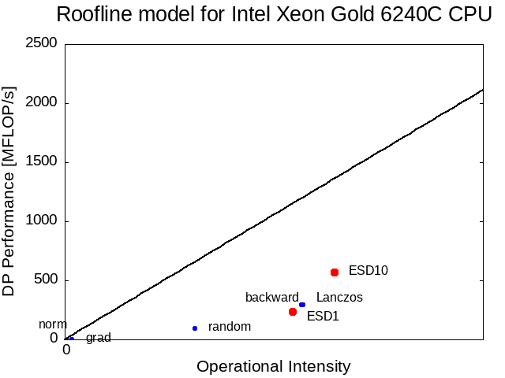
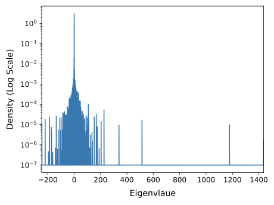
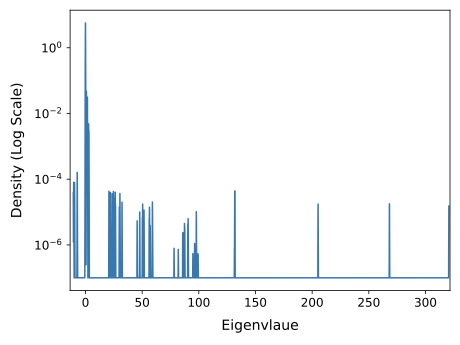
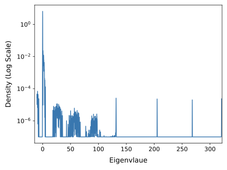

# Meeting Oct. 16

## CPU roofline

🔧 likwid

ResNet20

1 core

|                               | operation intensity | performance |
| :---------------------------: | :-----------------: | :---------: |
|           **ESD_1**           |       0.0818        |  239.9094   |
|          **ESD_10**           |       0.0968        |  576.6117   |
| **grad $\frac{dL}{d\theta}$** |       0.0025        |   3.8844    |
|         **random-v**          |       0.0466        |   98.1253   |
|         **normalize**         |       0.0007        |   0.6327    |
|       **backward $Hv$**       |       0.0849        |  299.5716   |
|        **Lanczos $T$**        |       0.0854        |  297.5051   |

* random-v 需要读取模型参数形状
* normalize需要读取存储的random-v

🤔️ 多核性能未提升

## GPU roofline

🔧 Nsight Compute

###### instruction

进度：收集到数据，还未处理+绘图

## Outline

🤔️ 1次Lanczos取一个random vector

$\phi_\sigma(t)\approx\frac{1}{n_v}\sum_{i=1}^{n_v} (\sum_{i=1}^q \tau_if(\tilde \lambda_i;t,\sigma))$

$n_v$较大👉构造伪随机vector计算Lanczos

$n_v$较小👉Lanczos内部进行多步（$q$）计算 如何进行operator fusion

***

`100iter * 1n_v`

`10iter * 10n_v`

`10iter * 100n_v`

## TODO

* GPU roofline
* cache-aware roofline for cpu
* 方案设计 Lanczos
