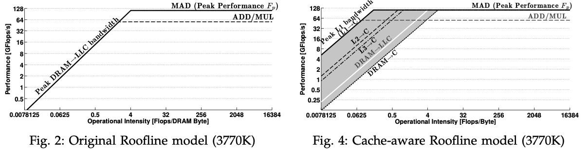
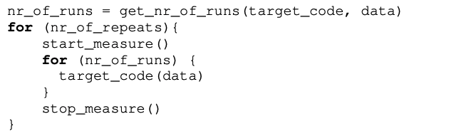
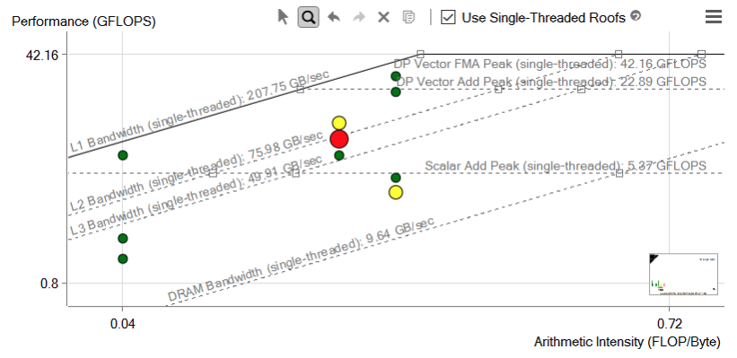

# Meeting Oct. 2


## Roofline Model

**Cache-aware Roofline model**

Ilic, Aleksandar, Frederico Pratas, and Leonel Sousa. “Cache-Aware Roofline Model: Upgrading the Loft.” *IEEE Computer Architecture Letters* 13, no. 1 (January 2014): 21–24. https://doi.org/10.1109/L-CA.2013.6.

**differences**

1. we account for all memory operations including accesses to the *different cache levels*
2. the bandwidth depends on the accessed memory levels and it is defined relatively to the Core




## Applying Roofline

### Roofline Model for CPU

Ofenbeck, Georg, Ruedi Steinmann, Victoria Caparros, Daniele G. Spampinato, and Markus Püschel. “Applying the Roofline Model.” In *2014 IEEE International Symposium on Performance Analysis of Systems and Software (ISPASS)*, 76–85, 2014. https://doi.org/10.1109/ISPASS.2014.6844463.

strategy on how to produce roofline plots with measured data on recent generations of Intel platforms

💻 **peak FLOPS**

```
theoretical maximum FLOPS = Clock Speed * CPU * SIMD factor * FMA factor * Super-scalarity factor
```

**Measuring strategy**



**Hardware Performance Counters**

Intel Performance Counter Monitor (PCM) 

* Measuring Work $W$

  * Sandy Bridge platform

    $W$ =  Scalar_double + SSE_double × 2 + AVX_double × 4

* Measuring Runtime $T$

  * Counters for timing

* Measuring Memory Traffic $Q$

  * Counters for memory traffic

### Roofline Model for GPU

Ding, Nan, and Samuel Williams. “An Instruction Roofline Model for GPUs.” In *2019 IEEE/ACM Performance Modeling, Benchmarking and Simulation of High Performance Computer Systems (PMBS)*, 7–18, 2019. https://doi.org/10.1109/PMBS49563.2019.00007.

**Instructions and Bandwidth Ceilings**

```
peak instructions (GIPS) = sm * warp schedualer * instructions/cycle * frequency
bandwidth (GTXN/s) => transaction
```

“Instruction Intensity” on the GPU is defined as warp-based *instructions* per transaction. 

**Global Memory Walls**

a warp-level load instruction can generate anywhere from 1 to 32 transactions

**Shared Memory Walls**

🤔️ “bank conflict” and multiple transactions will be generated

**Thread Prediction**

to understand resource utilization

### Try

#### Intel Advisor



🤔️

#### GPU-roofline-GPU

🤔️ NSIGHT COMPUTE


## Blog

[Making Deep Learning Go Brrrr From First Principle](https://horace.io/brrr_intro.html#fn3)

3 components of efficiency

* Compute: Time spent on your GPU computing actual floating point operations (FLOPS)
* Memory: Time spent transferring tensors within a GPU
* Overhead: Everything else

### Compute

you (mostly) can't reduce the computation required

### Bandwidth

**operator fusion** -instead of writing our data to global memory just to read it again, we elide the extra memory accesses by performing several computations at once

**eager mode** vs **graph mode**

* [`Torch.FX`](https://pytorch.org/docs/stable/fx.html) - graph mode

### Overhead

overhead generally doesn't scale with problem size (while compute and memory do)

### Conclusion

| Performance Regime | Plausible Solutions                                          |
| ------------------ | ------------------------------------------------------------ |
| Overhead-Bound     | Tracing, Operator Fusion, don't use Python, a *real* JIT :^) |
| Bandwidth-Bound    | Operator Fusion                                              |
| Compute-Bound      | Use Tensor Cores, give Nvidia more money                     |


## TODO

1. Try
2. how to fuse operator 

固定参数：希腊字母

todo: pagerank