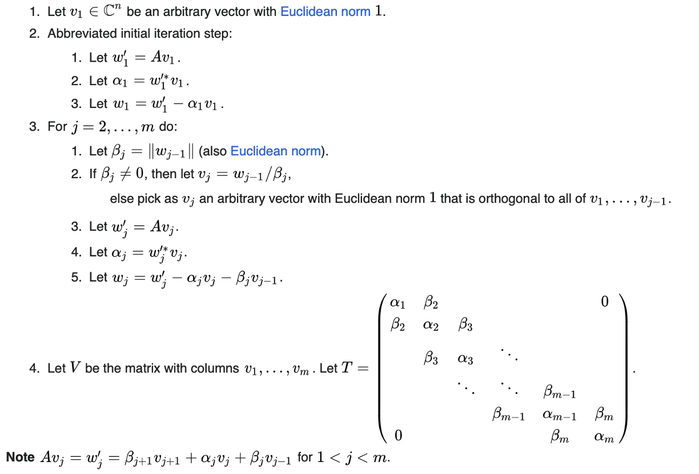

# Meeting Oct. 10

## Roofline Tools

|     🔧     |       Intel Advisor       |         likwid         | NVIDIA NSight |
| :-------: | :-----------------------: | :--------------------: | :-----------: |
| platforms |   Intel CPU, Intel GPU    | Intel CPU, NVIDIA GPU? |  NVIDIA GPU   |
| execution |       auto-roofline       |           /            |       /       |
|    try    | high-overhead, loop-level |      low-overhead      |               |

## Operator Fusion

**bottleneck**

* 矩阵乘法（backward）
* 向量正交化

**operator fusion**

* NVFuser

  `torch.compile()`

* DNNFusion [1]

* end-to-end frameworks

  * Tensorflow Lite
  * TVM
  * MNN
  * PyTorch-Mobile

* loop fusion
* polyhedral analysis

[1] Niu, Wei, Jiexiong Guan, Yanzhi Wang, Gagan Agrawal, and Bin Ren. “DNNFusion: Accelerating Deep Neural Networks Execution with Advanced Operator Fusion.” In *Proceedings of the 42nd ACM SIGPLAN International Conference on Programming Language Design and Implementation*, 883–98. PLDI 2021. New York, NY, USA: Association for Computing Machinery, 2021. https://doi.org/10.1145/3453483.3454083.

