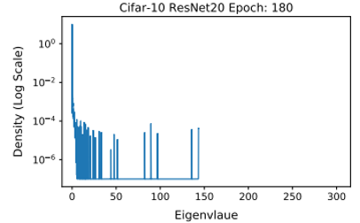

# Meeting Sep. 11

课题：**基于高效Hessian阵特征值计算的可信AI健壮性分析方法难题挑战**

## Hessian

* Hessian
  $$
  H=\frac{\part^2L}{\part \theta^2}=\frac{\part g_\theta}{\part \theta} \in \R ^{m\times m}
  $$

1. how the landscape looks like
2. modify our algorithm to make it go **faster** and **find better solutions**
3. 分析模型的健壮性和特定特征的泛化能力

### Challenge

1. it is hard to acquire information on what the actual Hessian looks like
2. 计算Hessian矩阵特征值的复杂度为 $O(n^3)$

‼️ 存储H开销过大 矩阵计算复杂

### Problem Description

1. Top $k$ Hessian eigenvalues
2. Trace of Hessian
3. ESD (empirical spectral density) / DOS (density of state) / spectral density / Hessian spectrum

### Methodology

#### 1. Top $k$ Hessian eigenvalues

**power method**

选择2范数单位向量，power mthod产生向量$q^{(k)}$收敛到特征向量（主特征值）

compute properties of the Hessian spectrum without explicitly forming the Hessian matrix
$$
\frac{\part g_\theta ^T v}{\part \theta}=\frac{\part g_\theta ^T}{\part \theta}v+\frac{\part v}{\part \theta}g_\theta ^T = \frac{\part g_\theta ^T}{\part \theta}=Hv
$$
💡 Hessian matvec = one gradient backpropagation 

#### 2. Trace of Hessian

**Hutchison Trace Estimator**

random vector $v$, whose entries are i.i.d sampled from a **Rademacher distribution** (or **Gaussian distribution** with mean 0 and variance 1)
$$
tr(H)=tr(HI)=tr(H\mathbb{E}[vv^T])=\mathbb{E}[tr(Hvv^T)]=\mathbb{E}[v^THv]
$$
$v^THv$是$tr(H)$的无偏估计

#### 3. ESD

* ESD定义
  $$
  \phi(t)=\frac{1}{m}\sum_{i=1}^m \delta(t-\lambda_i)
  $$

* 1 approximation: **Gaussian kernel**
  $$
  \phi(t)\approx \phi_\sigma(t)=\frac{1}{m}\sum_{i=1}^m f(\lambda;t,\sigma)
  $$
  where $f(\lambda;t,\sigma)=\frac{1}{\sigma\sqrt{2\pi}}\exp(-(t-\lambda)^2/2\sigma ^2)$

  💡 使用$f$近似$\delta$

  * 由于$tr(f(H))=tr(Qf(\Lambda)Q^T)=tr(f(\lambda))$
    $$
    \phi_\sigma(t)=\frac{1}{m}tr(f(H;t,\sigma))
    $$
    Hutchison method
    $$
    \phi_\sigma(t)=\frac{1}{m} \mathbb{E}(v^Tf(H;t,\sigma)v)
    $$

* 2 approximation: **Gaussian quadrature**

  * 定义
    $$
    \phi_\sigma^v(t)=v^Tf(H;t)v=v ^TQf(\Lambda;t)Q^Tv\\=\sum_{i=1}^m\mu_i^2f(\lambda_i;t)
    $$
    **Riemann-Stieltjes integral**
    $$
    \phi_\sigma^v(t)=\int_{\lambda_m}^{\lambda_1}\omega(\alpha)f(\alpha;t)d\alpha
    $$
    其中
    $$
    \omega(\alpha)=
    \left\{
    	\begin{array}{rcl}
    		0 && \alpha < \lambda_m,\\
    		\sum_{i=1}^j\mu_i^2 && \lambda_{j}\leqslant\alpha \leqslant \lambda_{j-1},\\
    		\sum_{i=1}^m\mu_i^2 && \lambda_{1}\leqslant\alpha.
    	\end{array}
    \right.
    $$

  * Gaussian quadrature

    a quadrature rule approximates an integral as a weighted sum

    $$
    \phi_\sigma^v(t) \approx \sum_{i=1}^q w_i f(\ell_i;t,\sigma)\equiv \widehat \phi^v(t)
    $$
    The hope is that there exists a good choice of $(w_i, \ell_i)_{i=1}^q$ where $q \ll m$ such that $\widehat \phi^v(t)$ And $\phi_\sigma^v(t)$ are close enough for all $t$

* 3 approximation: **stochastic Lanczos algorithm**

   $W^THW = T$, where $T$ is an tridiagonal matrix 

  weights of the quadrature rule can be computed as the *eigenvalues* and the squares of the first entries of the eigenvectors of $T$

  * Specifically, for the q-step Lanczos algorithm, we have q eigenpairs $(\tilde \lambda_i, \tilde v_i)$

    $\tau_i=(\tilde v_i[1])^2$
    $$
    \phi_\sigma^v(t) \approx \sum_{i=1}^q w_i f(\ell_i;t,\sigma) \approx \sum_{i=1}^q \tau_i f(\tilde \lambda_i;t,\sigma)
    $$

* 4 approximation: **expectation**

  $n_v$ run of Lanczos algorithm
  $$
  \phi_\sigma(t)
  \approx\frac{1}{n_v}\sum_{i=1}^{n_v}\widehat\phi^v(t)\\
  \approx\frac{1}{n_v}\sum_{i=1}^{n_v} (\sum_{i=1}^q \tau_if(\tilde \lambda_i;t,\sigma))
  $$

## TODO

* 设计实现高性能Hessian矩阵特征值分布求解算法
  * 性能目标：较现有benchmark特征值分布计算算法，效率提升70%以上。
  * 通用性目标：算法需适配典型模型结构，如Transformer类、**CNN类**、Wide&Deep等推荐类

课题调研方向？

‼️ PyHessian 代码的瓶颈

