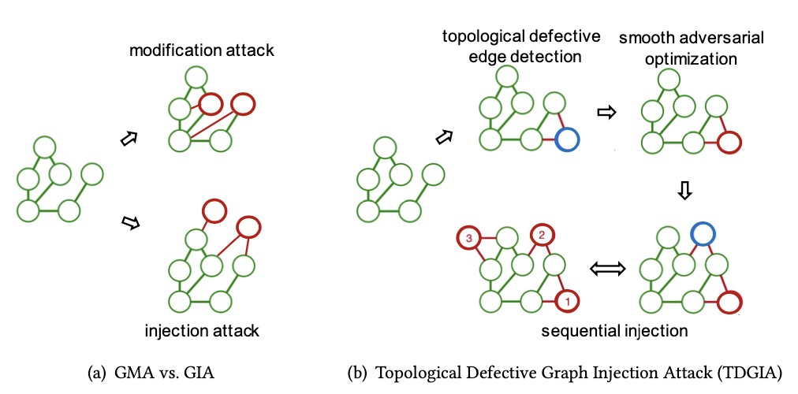
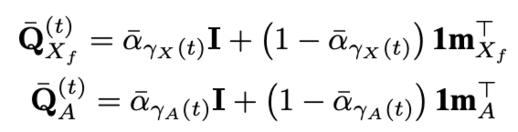
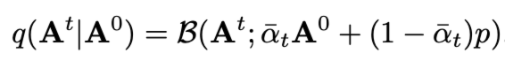

# Meeting Apr. 8

## Paper Draft

## Diffusion Model

base model

|                 |           GraphMaker[1]           |          EDGE[2]          |
| :-------------: | :-------------------------------: | :-----------------------: |
|  **diffusion**  | node attributes & graph structure |      graph structure      |
|    **noise**    |        marginal transition        |  edge remove transition   |
|   **dataset**   |  citation & co-purchase networks  | citation & social network |
| **source code** |         training template         |     training template     |

## Subgraph Extraction

### Node Injection Attack Oriented

diffusion denoise smoothing: purify noise on node feature & graph structure

cannot handle *node injection attack* on graph

**greedy node removal**

remove node with minimum degree

- more impact on classification result
  - GCN: `aggregation` weight $w=\frac{1}{d_u d_v}$
- high node centrality
  - $\mathcal{H}(G)=-\sum_{i=1}^n \frac{d_i}{2m}\log \frac{d_i}{2m}$

**threshold**

- budget $b$ represents maximal nodes to prune
- until the predicted class for target node *change*

## TODO

- experiment
- 助教

## Supplement

### GraphMaker[1]

**diffusion**

- *synchronous*: simultaneously corrupts node attributes and edges for all time steps
- *asynchronous*: denoise node attributes and graph structure asynchronously instead

**forward noise process**: marginal transition

**dataset**

- citation network: Cora
- co-purchase networks: Amazon Photo, Amazon Computer

**source code**

✅ training template

❎ model checkpoints

### EDGE [2]

*Efficient and Degree-guided graph GEnerative model* (EDGE)

**diffusion** ‼️no feature diffusion

use empty graphs as the convergent distribution (remove edge)

**forward noise process**

**dataset**

- citation network: ego(citeseer), Cora
- social network: Polblogs

**source code**

✅ training template

❎ model checkpoints

## Ref.

[1] M. Li, E. Kreačić, V. K. Potluru, and P. Li, “GraphMaker: Can Diffusion Models Generate Large Attributed Graphs?” arXiv, Jan. 27, 2024. doi: [10.48550/arXiv.2310.13833](https://doi.org/10.48550/arXiv.2310.13833).

[2] X. Chen, J. He, X. Han, and L.-P. Liu, “Efficient and Degree-Guided Graph Generation via Discrete Diffusion Modeling.” arXiv, May 31, 2023. doi: [10.48550/arXiv.2305.04111](https://doi.org/10.48550/arXiv.2305.04111).

