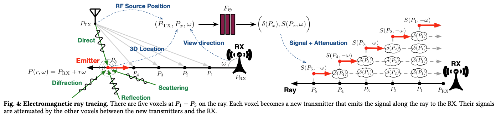

# Meeting Dec. 20

## Normalization

数据尺度 <=> 噪声尺度

|         norm         |        noise         |  SSIM  |  FID   | Spec SSIM |
| :------------------: | :------------------: | :----: | :----: | :-------: |
|     std [-2, 2]      | $\bar \sigma = 3.85$ | 0.8615 | 0.1943 |  0.8907   |
| $d$ + minmax [-2, 2] | $\bar \sigma = 3.85$ | 0.8471 | 0.2677 |  0.8622   |
| $d$ + minmax [0, 1]  | $\bar \sigma = 3.85$ | 0.5265 | 1.7665 |  0.4161   |
| $d$ + minmax [-1, 1] | $\bar \sigma = 3.85$ | 0.5847 | 0.9043 |  0.6041   |
| $d$ + minmax [-1, 1] | $\bar \sigma = 2.78$ | 0.6934 | 0.2455 |  0.7155   |
| $d$ + minmax [-1, 1] | $\bar \sigma = 1.98$ | 0.7887 | 0.4550 |  0.7876   |

🤔 将噪声尺度和数据尺度对应后，测试结果不完全相同

## Noise Schedule $\beta_t$

$$
x_{t} = \sqrt{1-\beta_t}x_{t-1} +\sqrt{\beta_t}\epsilon\\
\alpha_t= 1-\beta_t
$$

**RF-Diffuson**

- linear noise schedule
  $$
  \beta_t =\frac{t}{T}
  $$
  

- cosine-beta schedule [1]
  $$
  \bar \alpha_t=\frac{f(t)}{f(0)}， f(t) = \cos(\frac{t/T+s}{1+s}\cdot \frac{\pi}{2})^2\\
  \beta_t = 1-\frac{\bar \alpha_t}{\bar \alpha_{t-1}}
  $$
  

- *cosine schedule*
  $$
  \beta_t = \left(1 + \cos\left(\frac{t \cdot \pi}{T-1}\right)\right)
  $$

| $\beta$  |  SSIM  |  FID   |  SSIM  |
| :------: | :----: | :----: | :----: |
|   lin    | 0.7028 | 0.2071 | 0.7208 |
| cos-beta | 0.6596 | 0.2973 | 0.6775 |
|  *cos*   | 0.8471 | 0.2677 | 0.8622 |

test with $d$ + minmax [-2, 2]

## Rx-Tx $\alpha$

**objective**
$$
\text{CSI:}\quad H = \mathbf{F}(d, \alpha, c)
$$

### NeRF2

- Case I: Single-Antenna RX Model

  - a single omnidirectional or a single directional antenna

  

- Case II: Multi-Antenna RX Model

  - receive signals from a particular direction

  

  

  训练数据中的$\Psi(\omega)$是实验测是得到的

### Use NeRF2 in RF-Diffusion

- Case I: Single-Antenna TX Model
  $$
  \text{CSI:}\quad |H'| = |H|(\frac{d}{d'})^\gamma
  $$

- Case II: Multi-Antenna TX Model
  $$
  \text{CSI:}\quad |H'| = |H|(\frac{d}{d'})^\gamma \frac{G(\alpha')}{G(\alpha)}
  $$
  🤔 怎么获得训练数据中的antenna gain

## Ref.

[1] A. Q. Nichol and P. Dhariwal, “Improved Denoising Diffusion Probabilistic Models,” in *Proceedings of the 38th International Conference on Machine Learning*, PMLR, Jul. 2021, pp. 8162–8171. Accessed: Dec. 18, 2024. [Online]. Available: https://proceedings.mlr.press/v139/nichol21a.html

## Supplements

**std cos asc**

info weight: 0.9277

noise weight: 3.3745

FID value: 0.15855537556848995
Average SSIM: 0.8576215314865112
Average SNR: 7.485175657272339
Average Spec SSIM: 0.8984061479568481

**std lin**

info weight: 0.9254

noise weigh: 3.5865

FID value: 0.47531525274274844
Average SSIM: 0.7701209712028504
Average SNR: 5.513485911488533
Average Spec SSIM: 0.797420859336853

**augmentation**

gain pattern of a *directional antenna* such as a *dipole antenna*
$$
G(\alpha)=K|\ell\sin\alpha|^2
$$

$$
\text{CSI:}\quad |H'| = |H|(\frac{d}{d'})^\gamma \frac{|\sin\alpha_t'|^2|\sin\alpha_r'|^2}{|\sin \alpha_t|^2|\sin\alpha_r|^2}
$$

