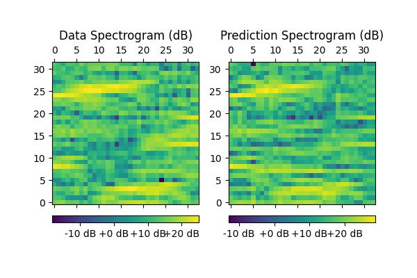

# Meeting Dec. 9

## SSIM &  FID

$$
\text{SSIM}(x, y) = \frac{(2\mu_x \mu_y + C_1)(2\sigma_{xy} + C_2)}{(\mu_x^2 + \mu_y^2 + C_1)(\sigma_x^2 + \sigma_y^2 + C_2)}
$$

- Gaussian kernel $G = w(i, j) $
- $\mu(x, y) = \frac{\sum_{i, j} w(i, j) \cdot I(x + i, y + j)}{\sum_{i, j} w(i, j)}$
- $\sigma^2(x, y) = \frac{\sum_{i, j} w(i, j) \cdot (I(x + i, y + j) - \mu(x, y))^2}{\sum_{i, j} w(i, j)}$

$$
\text{FID} = ||\mu_x - \mu_y||^2 + \text{Tr}(\Sigma_x + \Sigma_y - 2(\Sigma_x \Sigma_y)^{1/2})
$$

- $\mu_x, \Sigma_x$ : Mean and covariance of real data
- $\mu_y, \Sigma_y$ : Mean and covariance of gevnerated data
- STFT FID score (InceptionV3) [n_fft = 32, hop_length = 2]

## Normalization 

- **data**

- z-score normalization => [-2, 2]
- minmax normalization => [0, 1] / [-2, 2]

## Experiment

**Widar3.0/20181128**

|               model               |  FID   |  SSIM  | Spec SSIM |
| :-------------------------------: | :----: | :----: | :-------: |
|                DiT                | 0.1509 | 0.8811 |  0.9166   |
|                $d$                | 0.1498 | 0.9348 |  0.9415   |
|         $d$ + offline aug         | 0.2702 | 0.8699 |  0.8180   |
|           minmax [0, 1]           | 0.4356 | 0.5222 |  0.4174   |
|          minmax [-2, 2]           | 0.2989 | 0.8356 |  0.8634   |
|       $d$ + minmax [-2, 2]        | 0.1725 | 0.8682 |  0.8973   |
| $d$ + minmax [-2, 2] + online aug | 0.1006 | 0.8191 |  0.8535   |

- online augmentation
  $$
  \text{CSI:}\quad |H'| = |H|(\frac{d}{d'})^\gamma
  $$

**Widar3.0/20181208**

|               model               |  FID   |  SSIM  | Spec SSIM |
| :-------------------------------: | :----: | :----: | :-------: |
|                DiT                | 0.2627 | 0.7231 |  0.8110   |
| $d$ + minmax [-2, 2] + online aug | 0.2689 | 0.7620 |  0.8099   |

**Widar3.0**

|               model               |  FID   |  SSIM  | Spec SSIM |
| :-------------------------------: | :----: | :----: | :-------: |
|                DiT                | 0.2078 | 0.7245 |  0.7709   |
| $d$ + minmax [-2, 2] + online aug | 3.3329 | 0.5676 |  0.6891   |

## TODO

- RF experiment
  - more augmentation ?
- infocom camera-ready
- TMC = infocom + icassp

***

**1128 unnorm**

FID value: 0.3202
Average SSIM: 0.6438
Average SNR: 4.7341
Average Spec SSIM: 0.6158 (数据未standardized)

FID value: 0.3293
Average SSIM: 0.8766
Average SNR: 5.8659
Average Spec SSIM: 0.9158 (数据standardized)

**1128 distance minmax**

FID value: 0.6752
Average SSIM: 0.5321
Average SNR: 5.5446
Average Spec SSIM: 0.4878

