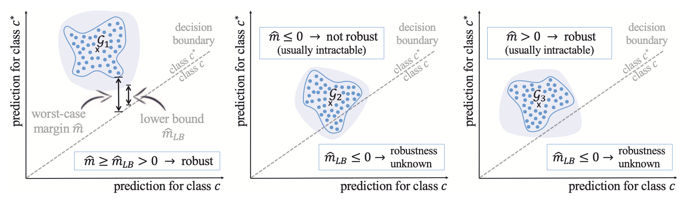
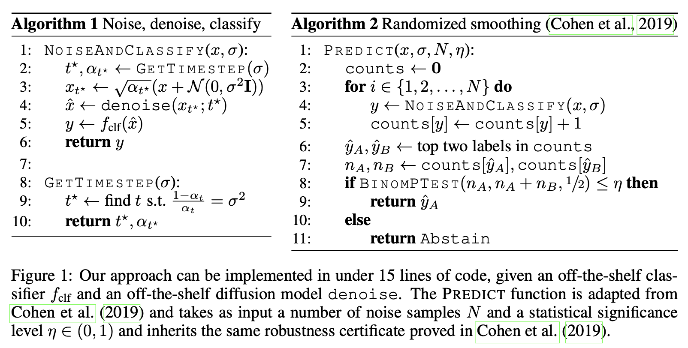

# Meeting Feb. 26

- Certified defense with diffusion model on graph
  - certificate
  - graph model
  - diffusion model
- DIFUSCO
- TODO

## Certified with Diffusion on Graph

### Certificate of Graph

#### Certificate

- **node classification**: Given a graph $\mathcal{G}$, a perturbation set $\Phi(\mathcal{G})$, and a GNN $f_\theta$ . Verify that the predicted class for node $v$ stays the same for all $\mathcal {\hat G} \in \Phi(\mathcal{G})$. If this holds, we say that $v$ is *certifiably robust* w.r.t. $\Phi(\mathcal{G})$.
  - metric: certified ratio, clean accuracy
- **graph classification**: Given a graph set $\mathcal{G}$, a perturbation set $\Phi(\mathcal{G})$, and a GNN $f_\theta$ . Verify that the predicted class stays the same for all $\mathcal {\hat G} \in \Phi(\mathcal{G})$. If this holds, we say that $f_\theta$ is *certifiably robust* w.r.t. $\Phi(\mathcal{G})$.
  - metric: certified accuracy, clean accuracy

#### Threat Model $\Phi(\mathcal{G})$

$\mathcal{G}=(\mathcal {V,E})=(A,X)$, adjacency matrix $A\in \{0,1\}^{N\times N}$, node attributes $X\in \{0,1\}^{N\times D}$

- **node attibute**
  - global budget: $\parallel \hat X-X\parallel_0<Q$
  - local budget:  $\parallel \hat X_n-X_n\parallel_0<q, \forall n\in\mathcal{N}_{L-1}$
- **graph structure**
  - fragile edges $\mathcal{F}$, i.e. an attacker has control over them
  - global budget: $\parallel \hat A-A\parallel_0<Q$
  - local budget:  $\parallel \hat A_i-A_i\parallel_0<q_i, \forall i\in \mathcal{V}$
- **discrete data**[2]: node attributes and graph structure
  - $\mathcal{B}_{r_d,r_a}(x)=\{\hat x\in\mathcal{X}:\sum \mathbb{1}(\hat x_i=x_i-1)\leq r_d, \sum \mathbb{1}(\hat x_i=x_i+1)\leq r_a\}$
    - deleting at most $r_d$ bits (flipping 1 to 0); adding at most $r_a$  bits (flipping 0 to 1)
    - $\ell_0$ constraint: $r_a+r_d=r$

### GNN Model

#### Model-Specific

model: PPNP(personalized propagation of neural predictions), GCN

worst case margin $\hat m(c^*, c)=\min_{\mathcal {\hat G} \in \Phi(\mathcal{G})}[f_\theta(\mathcal {\hat G})_{c^*}-f_\theta(\mathcal {\hat G})_{c}]$

#### Model-Agnostic

model: GCN, GAT, PPNP

**random smoothing**: smooth classifier $g(\mathcal{G})=\arg \max_{c\in\mathcal{C}} \Pr[f(\tau(\mathcal{G}))=c]$, $\tau$ is randomization scheme

$g(\mathcal {\hat G})=c^*$ for all $\mathcal {\hat G} \in \Phi(\mathcal{G})$

- *Bernoulli noise*
- *sparsity-aware noise*[2]:  flips the bit $x_i$ = 1 to 0 (e.g. deletes an existing edge) with probability $p_−$, and similarly flips the bit $x_i$ = 0 to 1 (e.g. adds a new edge) with probability $p_+$

### Diff on graph

#### Certified!![1]

#### DiGress[3]

graphs with categorical node and edge attributes

**discrete diffusion**

diffuse separately on each node and edge feature
$$
q(G_t|G_{t-1})=(X_{t-1}Q^X_t,A_{t-1},Q^A_{t})\\
q(G_t|G)=(X_{0}\bar Q^X_t,A_{0},\bar Q^A_{t})\\
$$
**denoising network**

- graph transformer network

## DIFUSCO

NPC problems => discrete {0, 1}-vector optimization problems => graph-based denoising diffusion models to generate high-quality solutions

**diffusion**

- Gaussian
- Bernoulli

**combinatorial optimization**

- Traveling Salesman Problem (TSP) 
  - edge
- Maximal Independent Set (MIS)
  - node

**discrete diffusion**
$$
q(x_t|x_{t-1})=\text{Cat}(x_t;p=\tilde x_{t-1}Q_t)\\
q(x_t|x_{0})=\text{Cat}(x_t;p=\tilde x_{0}\bar Q_t)\\
Q_t=
\left[
\begin{array}{cc}
(1-\beta_t) && \beta_t\\
\beta_t && (1-\beta_t)
\end{array}
\right]
$$

- $Q_t$: transition probability matrix

**denoising network**
$$
p_\theta(x_{t-1}|x_{t})=\sum_{\tilde x}q(x_{t-1}|x_t,\tilde x_0)p_\theta(\tilde x_0|x_t)
$$

- anisotropic graph neural network with edge gating mechanisms

## TODO

- DIFUSCO code
- sparsity aware random smoothing <=> DiGress

- PhD
- 广州会议报销
- 键盘鼠标

## Ref.

[1] N. Carlini, F. Tramer, K. D. Dvijotham, L. Rice, M. Sun, and J. Z. Kolter, “(Certified!!) Adversarial Robustness for Free!” arXiv, Mar. 06, 2023. doi: [10.48550/arXiv.2206.10550](https://doi.org/10.48550/arXiv.2206.10550).

[2] A. Bojchevski, J. Gasteiger, and S. Günnemann, “Efficient Robustness Certificates for Discrete Data: Sparsity-Aware Randomized Smoothing for Graphs, Images and More,” in *Proceedings of the 37th International Conference on Machine Learning*, PMLR, Nov. 2020, pp. 1003–1013. Accessed: Feb. 03, 2024. [Online]. Available: https://proceedings.mlr.press/v119/bojchevski20a.html

[3] C. Vignac, I. Krawczuk, A. Siraudin, B. Wang, V. Cevher, and P. Frossard, “DiGress: Discrete Denoising diffusion for graph generation.” arXiv, May 23, 2023. doi: [10.48550/arXiv.2209.14734](https://doi.org/10.48550/arXiv.2209.14734).