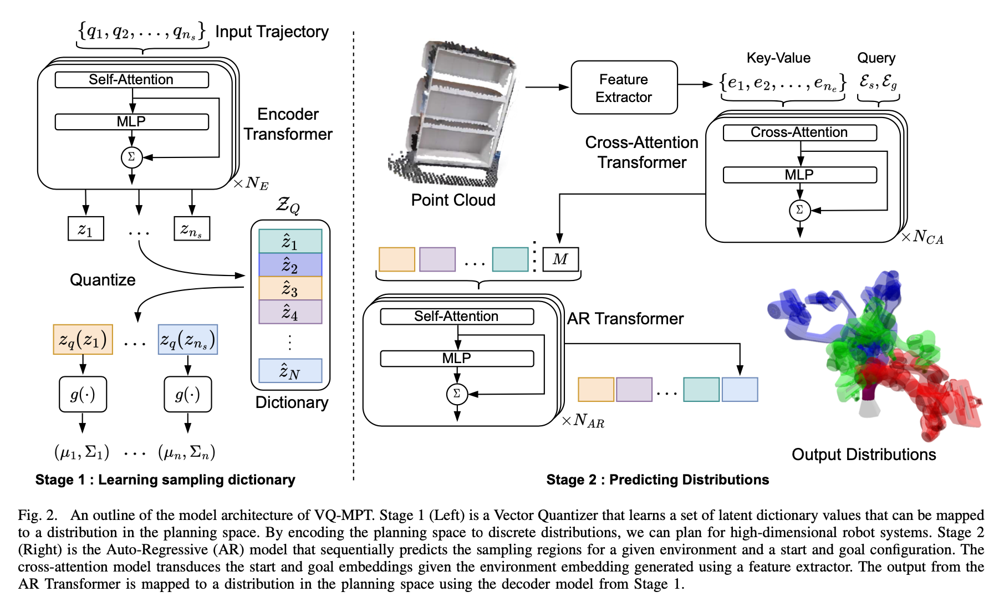
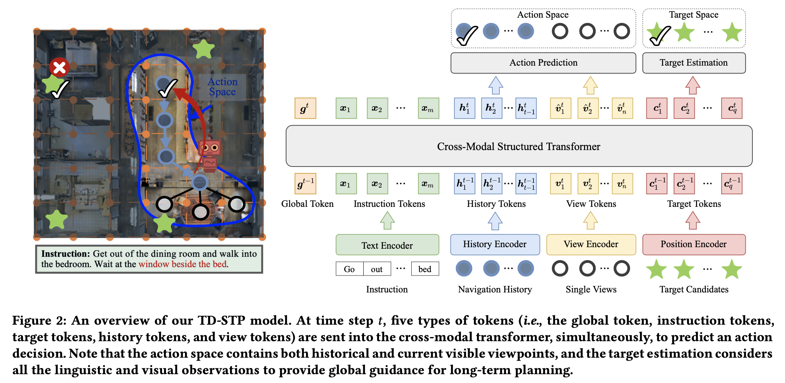
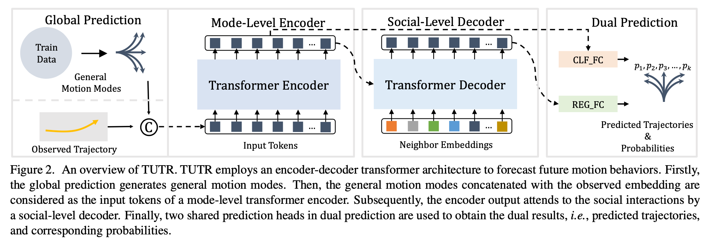

# Meeting Feb. 7

**outline**

- trajectory
  - 如何在computation map中添加hardware instruction/guidance
- adversarial defense on graph
  - certified defense

## Trajectory

operator = track point

computaion = trajectory

### hardware as dictionary[6]

💡使用不同trajectory（computation graph）在不同硬件上的表现训练，得到dictionary是operator在硬件尺度上的隐空间的分布

输入新的model+hardware，训练transformer预测dictionary index，得到优化的trajectory

### hardware as instruction[7]

💡学习hardware perference，在生成trajectory时，将hardware perference作为instruction（类似于language intruction)

### hardware as obstacle[8]

💡学习operator在何种hardware上会导致低效率，将其建模成map上的obstacle，生成不会产生collision的trajectory

### hardware as reward[9]

model returns-to-go reward (sum of future rewards)

💡将在hardware上的得分作为reward添加到轨迹token当中

### hardware as agent[10]

💡不同类型的hardware作为不同agent，在map上有不同trajectory

### hardware as mode[1]

the trajectories with similar motion behaviors could have a small distance

💡 在某种hardware上高效的轨迹之间的“距离”更小（相同分支），使用global prediction得到训练数据的不同mode（不同hardware），经过Transformer预测得到不同的trajectory

## Adversaraial Defense on Graph

- Certified Defense
- Certified Defense via random smoothing[2]

### Certified with Diffusion[8]

- random smoothing

  

- denoise smoothing

  

- diffusion denoised smoothing

  

### Idea

💡 Certified Defense on Graph via Diffusion Denoised Smoothing

### Adversarial Attacks&Defenses on Graph[3]

#### Attacks

**Attack Perturbation**

+ Edge-Level Perturbation
+ Node-Level Perturbation

**Attack Method**

+ Gradient-Based Attack
+ Non-Gradient-Based Attack
  + RL: long-term rewards
  + generative models

**Attack Task**

+ Node-Relevant Task
  + node classification
  + node embedding
+ Link-Relevant Task
  + link prediction
+ Graph-Relevant Task
  + graph classification

#### Defenses

**Defense Method**

- Adversarial Training
- Attack Detection
  - Graph Preprocessing
  - Model Training
  - Robustness Certification ‼️

### Certified Defense on Graph

|            paper            |               perturbation               |                    task                    |            method            |                       metrics                        |                model                 |
| :-------------------------: | :--------------------------------------: | :----------------------------------------: | :--------------------------: | :--------------------------------------------------: | :----------------------------------: |
|   [4] (Bojchevski, 2019)    |             graph structure              |            node classification             |     MDP, robust training     |     certified ratio, accuracy, worst case margin     | label/feature propagation alg., PPNP |
|     [5] (Zügner, 2019)      |             node attributes              |            node classification             |     convex optimization      | certified ratio, accuracy, average worst case margin |               GCN, GNN               |
| **[11]** (Bojchevski, 2020) | node attributes / graph structure / both | node classification / grpah classification |       random smoothing       |         certified ratio, certified accucracy         |   model-agnostic (GCN, GAT, APPNP)   |
|    **[12]** (Gao, 2020)     |             graph structure              |            graph classification            |       random smoothing       |                  certified accuracy                  |         model-agnostic (GCN)         |
|    **[13]** (Jia, 2020)     |             graph structure              |            community detection             |       random smoothing       |                  certified accuracy                  |      community dectection alg.       |
|      [14] (Jin, 2020)       |             graph structure              |            graph classification            |         optimization         |                  worst case margin                   |                 GCN                  |
|     [15] (Zügner, 2020)     |             graph structure              |            node classification             |         optimization         |          worst case margin, certified ratio          |                 GCN                  |
|    **[16]** (Lai, 2023)     |             graph structure              |            node classification             |       random smoothing       |              certified ratio, accuracy               |      model-agnostic (GCN, PPNP)      |
|      [25] (Tao, 2021)       |             graph structure              |            node classification             |   edge-level immunization    |          worst case margin, certified ratio          |                 PPNP                 |
|    **[26]** (Wang, 2021)    |             graph structure              |         node&graph classification          |       random smoothing       |                  certified accuracy                  |    model-agnostic (GCN, GAT, GIN)    |
|      [27] (Tao, 2023)       |     graph structure / node injection     |            node classification             | edge&node-level immunization |          worst case margin, certified ratio          |                 PPNP                 |
|  **[28]** (Scholten, 2022)  |             node attributes              |            node classification             |       random smoothing       |        clean accuracy, certified ratio, AUCRC        |    model-agnostic (GCN, GAT, SMA)    |
|  **[29]** (Scholten, 2024)  |             node attributes              |            node classification             |       random smoothing       |                  certified accuracy                  |   model-agnostic (GCN, GAT, APPNP)   |

- [4] : Certificate <=> PageRank Optimization <=> *Markov Decision Process*
  - personalized propagation of neural predictions (PPNP) [GCN]
- [5] : binary node attributes
- [11] : randomization scheme $\phi$ flips the bit $x_i$ = 1 to 0 (e.g. deletes an existing edge) with probability $p_−$, and similarly flips the bit $x_i$ = 0 to 1 (e.g. adds a new edge) with probability $p_+$
- [12] : use *Bernoulli distribution* as the random noise to perturb the graph data
- [13] : *Bernoulli distribution*
  -  neither sparsity-aware nor efficient, and does not apply to GNN[11]

- [14] : Lagrange dualization and convex envelope
- [15] : jointly constrained bilinear program
- [16] : add noise sampled from the Gaussian distribution $N (0, σ_0^2 )$ to the 0’s (nonedges) in **A,** and add Gaussian noise from distribution $N (0, σ_0^2)$ to the 1’s (edges)
- [25]. : vaccinating an affordable fraction of node pairs
- [26] : we show that our certified robustness guarantee is tight
- [28] : SMA(soft medoid aggregation networks), the area under this (normalized) certified ratio curve (*AUCRC*)
- [29] : hierarchical randomized smoothing

### Diffusion on Graph

|            paper            |                  diffusion                  |
| :-------------------------: | :-----------------------------------------: |
|         EDP-GNN[17]         |               graph structure               |
|        GraphGDP[18]         |               graph structure               |
|          GDSS[19]           |      node features and graph structure      |
|          GSDM[20]           |     node feature and the graph spectrum     |
|         NVDiff[21]          |        node vectors on latent space         |
| DiGress[22], SparseDiff[23] | node types and edge types (graph structure) |
|        GraphArm[24]         | node types and edge types (graph structure) |

 

## Ref.

[1] L. Shi, L. Wang, S. Zhou, and G. Hua, “Trajectory Unified Transformer for Pedestrian Trajectory Prediction,” presented at the Proceedings of the IEEE/CVF International Conference on Computer Vision, 2023, pp. 9675–9684. Accessed: Feb. 01, 2024. [Online]. Available: https://openaccess.thecvf.com/content/ICCV2023/html/Shi_Trajectory_Unified_Transformer_for_Pedestrian_Trajectory_Prediction_ICCV_2023_paper.html

[2] J. Cohen, E. Rosenfeld, and Z. Kolter, “Certified Adversarial Robustness via Randomized Smoothing,” in *Proceedings of the 36th International Conference on Machine Learning*, PMLR, May 2019, pp. 1310–1320. Accessed: Jul. 05, 2023. [Online]. Available: https://proceedings.mlr.press/v97/cohen19c.html

[3] L. Sun *et al.*, “Adversarial Attack and Defense on Graph Data: A Survey,” *IEEE Transactions on Knowledge and Data Engineering*, vol. 35, no. 8, pp. 7693–7711, Aug. 2023, doi: [10.1109/TKDE.2022.3201243](https://doi.org/10.1109/TKDE.2022.3201243).

[4] A. Bojchevski and S. Günnemann, “Certifiable Robustness to Graph Perturbations,” in *Advances in Neural Information Processing Systems*, Curran Associates, Inc., 2019. Accessed: Feb. 02, 2024. [Online]. Available: https://proceedings.neurips.cc/paper_files/paper/2019/hash/e2f374c3418c50bc30d67d5f7454a5b4-Abstract.html

[5] D. Zügner and S. Günnemann, “Certifiable Robustness and Robust Training for Graph Convolutional Networks,” in *Proceedings of the 25th ACM SIGKDD International Conference on Knowledge Discovery & Data Mining*, in KDD ’19. New York, NY, USA: Association for Computing Machinery, 2019, pp. 246–256. doi: [10.1145/3292500.3330905](https://doi.org/10.1145/3292500.3330905).

[6] J. J. Johnson, A. H. Qureshi, and M. C. Yip, “Learning Sampling Dictionaries for Efficient and Generalizable Robot Motion Planning With Transformers,” *IEEE Robot. Autom. Lett.*, vol. 8, no. 12, pp. 7946–7953, Dec. 2023, doi: [10.1109/LRA.2023.3322087](https://doi.org/10.1109/LRA.2023.3322087).

[7] Y. Zhao *et al.*, “Target-Driven Structured Transformer Planner for Vision-Language Navigation,” in *Proceedings of the 30th ACM International Conference on Multimedia*, in MM ’22. New York, NY, USA: Association for Computing Machinery, 2022, pp. 4194–4203. doi: [10.1145/3503161.3548281](https://doi.org/10.1145/3503161.3548281).

[8] X. Zang, M. Yin, J. Xiao, S. Zonouz, and B. Yuan, “GraphMP: Graph Neural Network-based Motion Planning with Efficient Graph Search,” presented at the Thirty-seventh Conference on Neural Information Processing Systems, Nov. 2023. Accessed: Jan. 30, 2024. [Online]. Available: https://openreview.net/forum?id=cQdc9Dyk4i

[8] N. Carlini, F. Tramer, K. D. Dvijotham, L. Rice, M. Sun, and J. Z. Kolter, “(Certified!!) Adversarial Robustness for Free!” arXiv, Mar. 06, 2023. doi: [10.48550/arXiv.2206.10550](https://doi.org/10.48550/arXiv.2206.10550).

[9] L. Chen *et al.*, “Decision Transformer: Reinforcement Learning via Sequence Modeling,” in *Advances in Neural Information Processing Systems*, Curran Associates, Inc., 2021, pp. 15084–15097. Accessed: Jan. 31, 2024. [Online]. Available: https://proceedings.neurips.cc/paper_files/paper/2021/hash/7f489f642a0ddb10272b5c31057f0663-Abstract.html

[10] Z. Wang, J. Guo, Z. Hu, H. Zhang, J. Zhang, and J. Pu, “Lane Transformer: A High-Efficiency Trajectory Prediction Model,” *IEEE Open Journal of Intelligent Transportation Systems*, vol. 4, pp. 2–13, 2023, doi: [10.1109/OJITS.2023.3233952](https://doi.org/10.1109/OJITS.2023.3233952).

[11] A. Bojchevski, J. Gasteiger, and S. Günnemann, “Efficient Robustness Certificates for Discrete Data: Sparsity-Aware Randomized Smoothing for Graphs, Images and More,” in *Proceedings of the 37th International Conference on Machine Learning*, PMLR, Nov. 2020, pp. 1003–1013. Accessed: Feb. 03, 2024. [Online]. Available: https://proceedings.mlr.press/v119/bojchevski20a.html.

[12] Z. Gao, R. Hu, and Y. Gong, “Certified Robustness of Graph Classification against Topology Attack with Randomized Smoothing,” in *GLOBECOM 2020 - 2020 IEEE Global Communications Conference*, Taipei, Taiwan: IEEE, Dec. 2020, pp. 1–6. doi: [10.1109/GLOBECOM42002.2020.9322576](https://doi.org/10.1109/GLOBECOM42002.2020.9322576).

[13] J. Jia, B. Wang, X. Cao, and N. Z. Gong, “Certified Robustness of Community Detection against Adversarial Structural Perturbation via Randomized Smoothing,” in *Proceedings of The Web Conference 2020*, in WWW ’20. New York, NY, USA: Association for Computing Machinery, 2020, pp. 2718–2724. doi: [10.1145/3366423.3380029](https://doi.org/10.1145/3366423.3380029).

[14] H. Jin, Z. Shi, V. J. S. A. Peruri, and X. Zhang, “Certified Robustness of Graph Convolution Networks for Graph Classification under Topological Attacks,” in *Advances in Neural Information Processing Systems*, Curran Associates, Inc., 2020, pp. 8463–8474. Accessed: Feb. 03, 2024. [Online]. Available: https://proceedings.neurips.cc/paper/2020/hash/609a199881ca4ba9c95688235cd6ac5c-Abstract.html.

[15] D. Zügner and S. Günnemann, “Certifiable Robustness of Graph Convolutional Networks under Structure Perturbations,” in *Proceedings of the 26th ACM SIGKDD International Conference on Knowledge Discovery & Data Mining*, in KDD ’20. New York, NY, USA: Association for Computing Machinery, 2020, pp. 1656–1665. doi: [10.1145/3394486.3403217](https://doi.org/10.1145/3394486.3403217).

[16] Y. Lai, J. Zhou, X. Zhang, and K. Zhou, “Toward Certified Robustness of Graph Neural Networks in Adversarial AIoT Environments,” *IEEE Internet of Things Journal*, vol. 10, no. 15, pp. 13920–13932, Aug. 2023, doi: [10.1109/JIOT.2023.3263384](https://doi.org/10.1109/JIOT.2023.3263384).

[17] C. Niu, Y. Song, J. Song, S. Zhao, A. Grover, and S. Ermon, “Permutation Invariant Graph Generation via Score-Based Generative Modeling,” in *Proceedings of the Twenty Third International Conference on Artificial Intelligence and Statistics*, PMLR, Jun. 2020, pp. 4474–4484. Accessed: Dec. 19, 2023. [Online]. Available: https://proceedings.mlr.press/v108/niu20a.html

[18] H. Huang, L. Sun, B. Du, Y. Fu, and W. Lv, “GraphGDP: Generative Diffusion Processes for Permutation Invariant Graph Generation,” in *2022 IEEE International Conference on Data Mining (ICDM)*, Nov. 2022, pp. 201–210. doi: [10.1109/ICDM54844.2022.00030](https://doi.org/10.1109/ICDM54844.2022.00030).

[19] J. Jo, S. Lee, and S. J. Hwang, “Score-based Generative Modeling of Graphs via the System of Stochastic Differential Equations,” in *Proceedings of the 39th International Conference on Machine Learning*, PMLR, Jun. 2022, pp. 10362–10383. Accessed: Dec. 19, 2023. [Online]. Available: https://proceedings.mlr.press/v162/jo22a.html

[20] T. Luo, Z. Mo, and S. Jialin Pan, “Fast Graph Generation via Spectral Diffusion,” *arXiv e-prints*. Nov. 01, 2022. doi: [10.48550/arXiv.2211.08892](https://doi.org/10.48550/arXiv.2211.08892).

[21] X. Chen, Y. Li, A. Zhang, and L.-P. Liu, “NVDiff: Graph Generation through the Diffusion of Node Vectors.” arXiv, Jun. 19, 2023. doi: [10.48550/arXiv.2211.10794](https://doi.org/10.48550/arXiv.2211.10794).

[22] C. Vignac, I. Krawczuk, A. Siraudin, B. Wang, V. Cevher, and P. Frossard, “DiGress: Discrete Denoising diffusion for graph generation,” presented at the The Eleventh International Conference on Learning Representations, Sep. 2022. [Online]. Available: https://openreview.net/forum?id=UaAD-Nu86WX

[23] Y. Qin, C. Vignac, and P. Frossard, “Sparse Training of Discrete Diffusion Models for Graph Generation.” arXiv, Nov. 03, 2023. doi: [10.48550/arXiv.2311.02142](https://doi.org/10.48550/arXiv.2311.02142).

[24] L. Kong, J. Cui, H. Sun, Y. Zhuang, B. A. Prakash, and C. Zhang, “Autoregressive Diffusion Model for Graph Generation,” in *Proceedings of the 40th International Conference on Machine Learning*, PMLR, Jul. 2023, pp. 17391–17408. [Online]. Available: https://proceedings.mlr.press/v202/kong23b.html.

[25] S. Tao, H. Shen, Q. Cao, L. Hou, and X. Cheng, “Adversarial Immunization for Certifiable Robustness on Graphs,” in *Proceedings of the 14th ACM International Conference on Web Search and Data Mining*, in WSDM ’21. New York, NY, USA: Association for Computing Machinery, 2021, pp. 698–706. doi: [10.1145/3437963.3441782](https://doi.org/10.1145/3437963.3441782).

[26] B. Wang, J. Jia, X. Cao, and N. Z. Gong, “Certified Robustness of Graph Neural Networks against Adversarial Structural Perturbation,” in *Proceedings of the 27th ACM SIGKDD Conference on Knowledge Discovery & Data Mining*, in KDD ’21. New York, NY, USA: Association for Computing Machinery, 2021, pp. 1645–1653. doi: [10.1145/3447548.3467295](https://doi.org/10.1145/3447548.3467295).

[27] S. Tao, Q. Cao, H. Shen, Y. Wu, L. Hou, and X. Cheng, “Graph Adversarial Immunization for Certifiable Robustness,” *IEEE Transactions on Knowledge and Data Engineering*, pp. 1–14, 2023, doi: [10.1109/TKDE.2023.3311105](https://doi.org/10.1109/TKDE.2023.3311105).

[28] Y. Scholten, J. Schuchardt, S. Geisler, A. Bojchevski, and S. Günnemann, “Randomized Message-Interception Smoothing: Gray-box Certificates for Graph Neural Networks,” *Advances in Neural Information Processing Systems*, vol. 35, pp. 33146–33158, Dec. 2022.

[29] Y. Scholten, J. Schuchardt, A. Bojchevski, and S. Günnemann, “Hierarchical Randomized Smoothing.” arXiv, Jan. 15, 2024. doi: [10.48550/arXiv.2310.16221](https://doi.org/10.48550/arXiv.2310.16221).