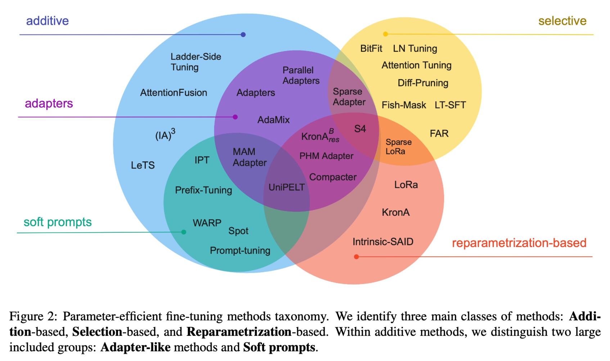

# Meeting Jan. 11

## LLM finetune

### PEFT

parameter-efficient fine-tune

### Ludwig: Fine-Tune Llama-2-7b

#### Ludwig

Ludwig is a **low-code** framework for building **custom** AI models like **LLMs** and other deep neural networks.

+ 🛠 **Build custom models with ease:** a declarative YAML configuration file is all you need to train a state-of-the-art LLM on your data.
+ ⚡ **Optimized for scale and efficiency:** automatic batch size selection, distributed training ([DDP](https://pytorch.org/tutorials/beginner/ddp_series_theory.html), [DeepSpeed](https://github.com/microsoft/DeepSpeed)), parameter efficient fine-tuning ([PEFT](https://github.com/huggingface/peft)), 4-bit quantization (QLoRA), paged and 8-bit optimizers, and larger-than-memory datasets.

#### huggingface 🤗 

🪜 vpn

## Op Vocabulary

Translation task [seq2seq]

🎯 Op2Code

### Op

[ONNX operators](https://onnx.ai/onnx/operators/)

### Code

#### DL Compiler

TVM, Tensor Comprehension, Glow, nGraph and XLA

#### TVM

- high-level IR: Relay
- low-level IR: Halide

**Design and Architecture**

