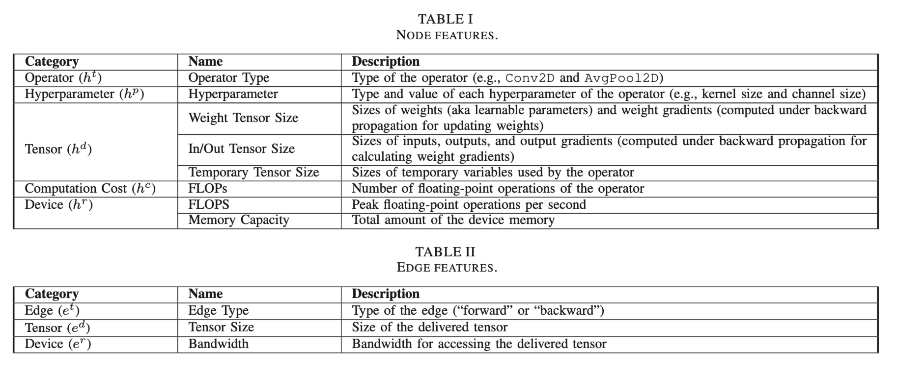
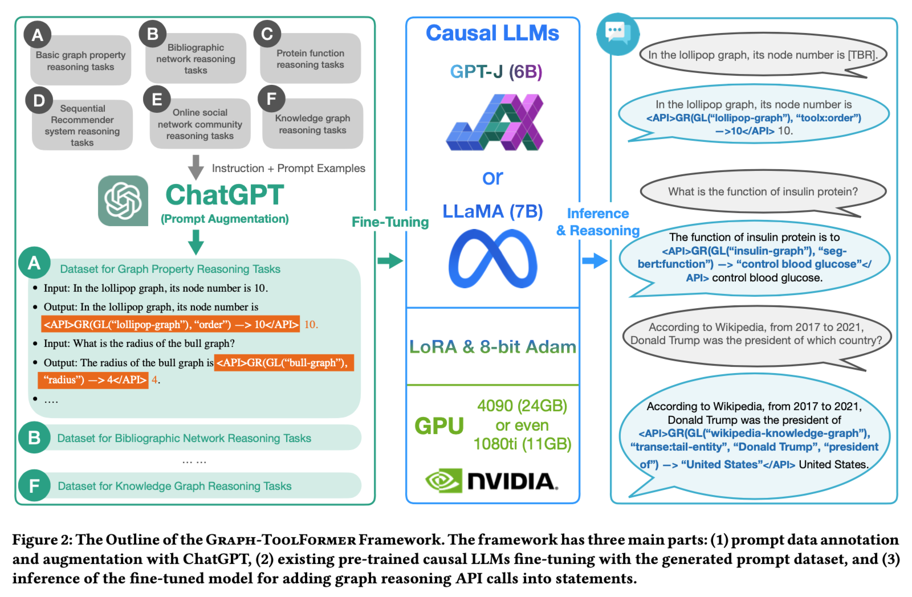

# Meeting Jan. 15

## 🎯 Op2FusedOp [Seq2Seq]

Op: [ONNX operators](https://onnx.ai/onnx/operators/)

Operator Embedding: GNN

- *Attention-based Node-Edge Encoder* [1]

## Graph-ToolFormer

Graph-ToolFormer: To Empower LLMs with Graph Reasoning Ability via Prompt Augmented by ChatGPT

**Prompt Tuning**

## Ref.

[1] Y. Gao, X. Gu, H. Zhang, H. Lin, and M. Yang, “Runtime Performance Prediction for Deep Learning Models with Graph Neural Network,” in *Proceedings of the 45th International Conference on Software Engineering: Software Engineering in Practice*, in ICSE-SEIP ’23. Melbourne, Australia: IEEE Press, 2023, pp. 368–380. doi: [10.1109/ICSE-SEIP58684.2023.00039](https://doi.org/10.1109/ICSE-SEIP58684.2023.00039).

