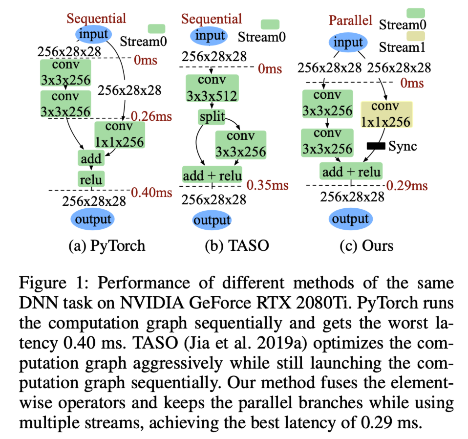
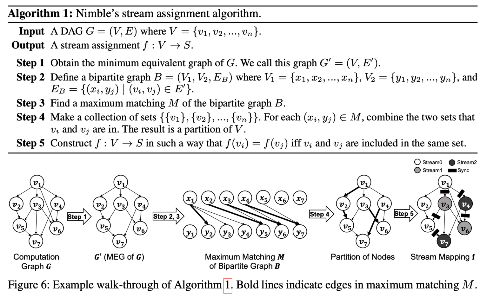
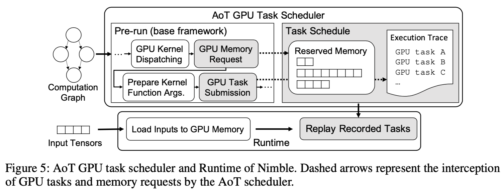
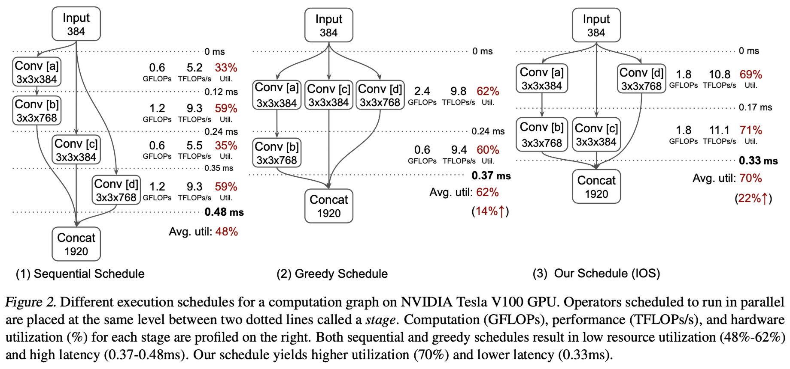
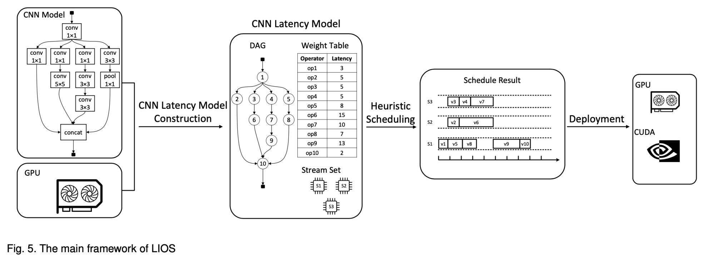
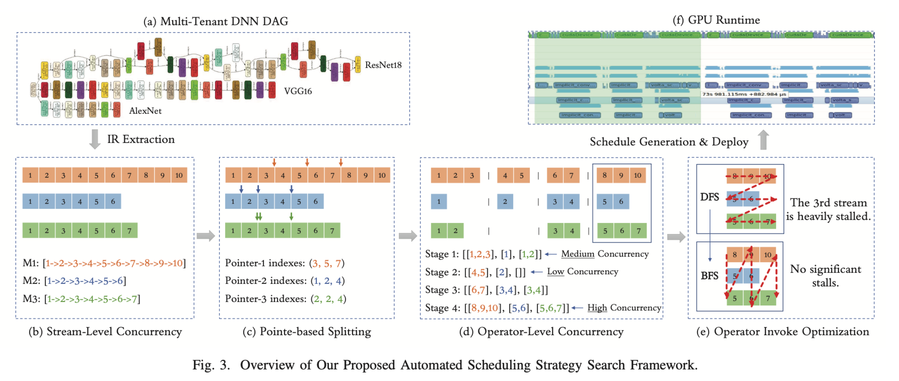

# Meeting Jan. 5

**IOS**: inter-operator scheduling

**Advantages of inter-operator parallism**

- new models use smaller conv => under utilization on GPU
- ensemble learning
- multi-task leaning

## Nimble [1]

### Graph Rewriter

**goal**

- maximum logical concurrency 
- minimum number of synchronization

### Ahead of Time Scheduler

packs the GPU trace and the reserved memory into a task schedule

## IOS [2]

+ *dynamic programming algorithm* to find a highly optimized schedule for inter-operator parallelization => platform-agnostic
+ profile-based scheduler
+ 🙅 huge scheduling time

## HIOS [3]

inter-operator parallelism both among *multiple GPUs* and in each GPU

Hierarchical Inter-Operator Scheduler based on the Longest-Path

## LIOS [4]

critical trade-off issue between inference latency (effectiveness) and scheduling time (efficiency)

**Operator Prioritizing Phase**

we can achieve a smaller makespan by executing the important (longer execution latency) operator first

**Stream Selection Phase**

making the current operator finish earlier will finally result in a smaller global makespan

## AutoGraph [5]

- we propose a mixed critical path cost for fast estimation
- novel dynamic programming algorithm, combined with backtracking search
- introduce accurate runtime information in the optimization flow

## Multi-tenant DNN Scheduler [6]

**Automated Scheduling Search**

ML-based search approach to solve the scheduling problem

## Ref.

[1] W. Kwon, G.-I. Yu, E. Jeong, and B.-G. Chun, “Nimble: Lightweight and Parallel GPU Task Scheduling for Deep Learning,” in *Advances in Neural Information Processing Systems*, Curran Associates, Inc., 2020, pp. 8343–8354.

[2] Y. Ding, L. Zhu, Z. Jia, G. Pekhimenko, and S. Han, “Ios: Inter- operator scheduler for cnn acceleration,” *Proceedings of Machine Learning and Systems*, vol. 3, pp. 167–180, 2021.

[3] T. Kundu and T. Shu, “HIOS: Hierarchical Inter-Operator Scheduler for Real-Time Inference of DAG-Structured Deep Learning Models on Multiple GPUs,” in *2023 IEEE International Conference on Cluster Computing (CLUSTER)*, Oct. 2023, pp. 95–106. doi: [10.1109/CLUSTER52292.2023.00016](https://doi.org/10.1109/CLUSTER52292.2023.00016).

[4] Y. Ping, H. Jiang, X. Liu, Z. Zhao, Z. Zhou, and X. Chen, “Latency-Based Inter-Operator Scheduling for CNN Inference Acceleration on GPU,” *IEEE Transactions on Services Computing*, pp. 1–14, 2023, doi: [10.1109/TSC.2023.3345952](https://doi.org/10.1109/TSC.2023.3345952).

[5] Y. Zhao, Q. Sun, Z. He, Y. Bai, and B. Yu, “AutoGraph: Optimizing DNN Computation Graph for Parallel GPU Kernel Execution,” *Proceedings of the AAAI Conference on Artificial Intelligence*, vol. 37, no. 9, Art. no. 9, Jun. 2023, doi: [10.1609/aaai.v37i9.26343](https://doi.org/10.1609/aaai.v37i9.26343).

[6] F. Yu *et al.*, “Automated Runtime-Aware Scheduling for Multi-Tenant DNN Inference on GPU,” in *2021 IEEE/ACM International Conference On Computer Aided Design (ICCAD)*, Nov. 2021, pp. 1–9. doi: [10.1109/ICCAD51958.2021.9643501](https://doi.org/10.1109/ICCAD51958.2021.9643501).

