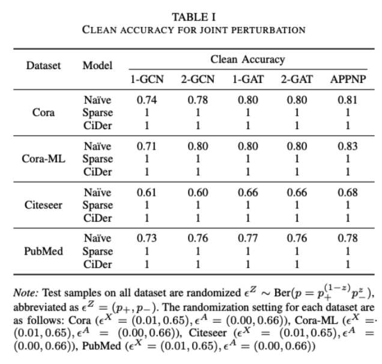
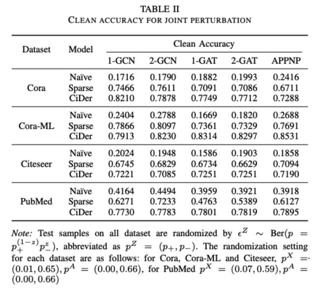
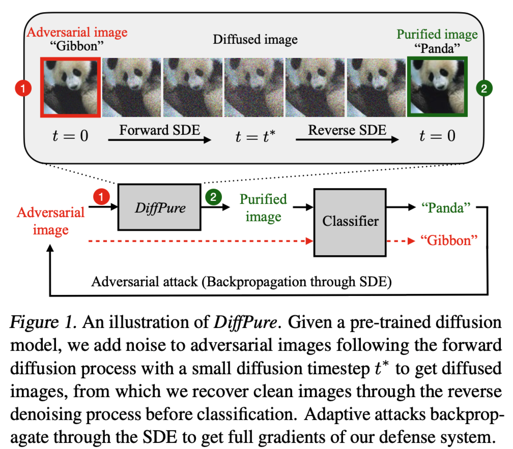
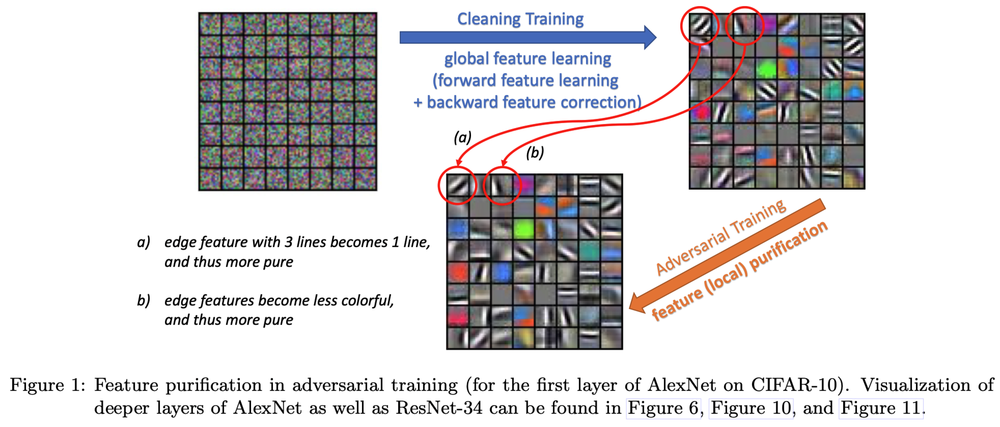
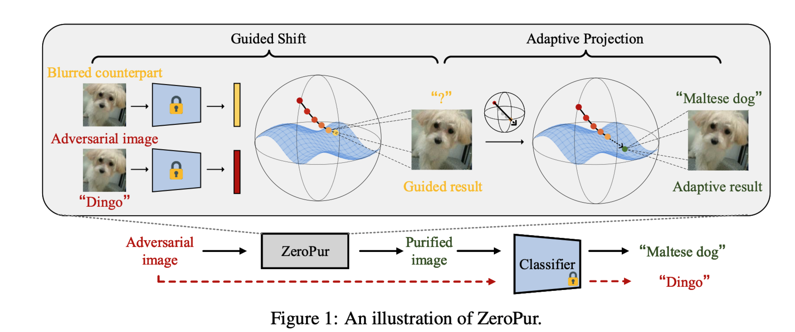
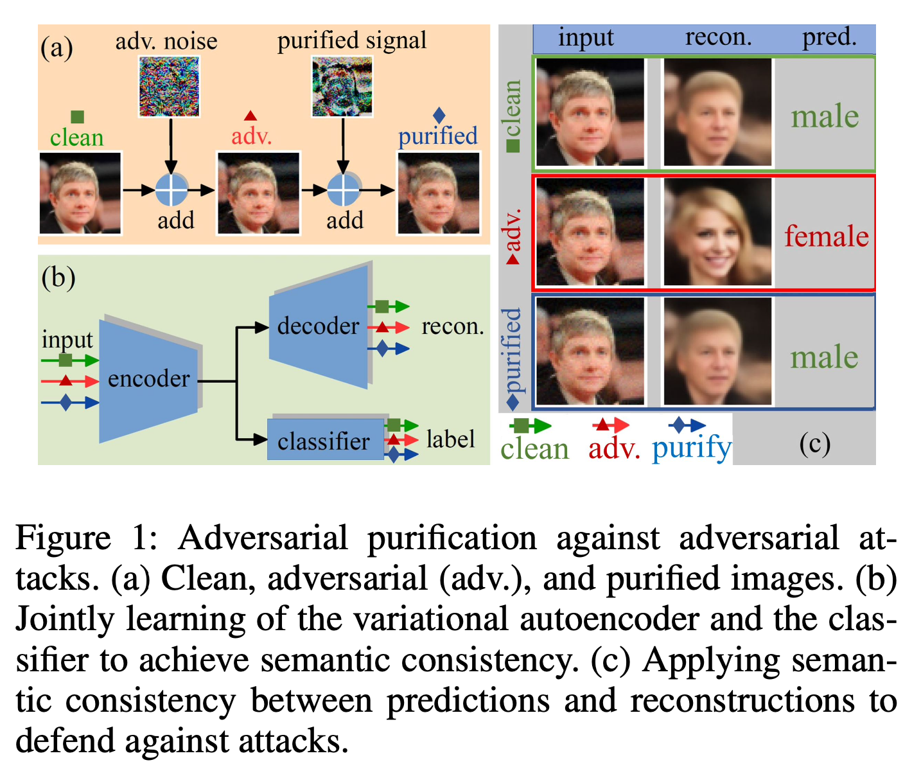

# Meeting Jun. 24

**Cora**

1-GCN[42]

78

|      |   0    |  100   |  200   |  300   |  350   |
| :--: | :----: | :----: | :----: | :----: | :----: |
|  X+  | 0.0000 | 0.0013 | 0.0045 | 0.0084 | 0.0101 |
|  X-  | 0.0001 | 0.1015 | 0.3498 | 0.6520 | 0.7875 |
|  E+  | 0.0000 | 0.0001 | 0.0005 | 0.0010 | 0.0011 |
|  E-  | 0.0001 | 0.1027 | 0.3538 | 0.6594 | 0.7965 |

**Citeseer**

1-GCN[78]

1-GCN[12], 2-GCN[123], 1-GAT[78], 2-GAT[78], APPNP[4]

|      |   0    |  100   |  200   |  300   |  350   |
| :--: | :----: | :----: | :----: | :----: | :----: |
|  X+  | 0.0000 | 0.0009 | 0.0030 | 0.0057 | 0.0068 |
|  X-  | 0.0001 | 0.1019 | 0.3513 | 0.6547 | 0.7908 |
|  E+  | 0.0000 | 0.0001 | 0.0003 | 0.0005 | 0.0007 |
|  E-  | 0.0001 | 0.1027 | 0.3540 | 0.6598 | 0.7970 |

**Cora-ML**

0

|      |   0    |  100   |  200   |  300   |  350   |
| :--: | :----: | :----: | :----: | :----: | :----: |
|  X+  | 0.0000 | 0.0018 | 0.0062 | 0.0116 | 0.0140 |
|  X-  | 0.0001 | 0.1010 | 0.3481 | 0.6488 | 0.7836 |
|  E+  | 0.0000 | 0.0002 | 0.0006 | 0.0012 | 0.0015 |
|  E-  | 0.0001 | 0.1026 | 0.3537 | 0.6592 | 0.7962 |

**PubMed**

71

|      |   0    |  100   |  200   |  300   |  350   |
| :--: | :----: | :----: | :----: | :----: | :----: |
|  X+  | 0.0000 | 0.0103 | 0.0355 | 0.0662 | 0.0799 |
|  X-  | 0.0001 | 0.0925 | 0.3188 | 0.5942 | 0.7177 |
|  E+  | 0.0000 | 0.0000 | 0.0001 | 0.0002 | 0.0002 |
|  E-  | 0.0001 | 0.1028 | 0.3542 | 0.6602 | 0.7974 |

1. introduction只写了要点
2. 还没排版
3. 参考文献格式没有调整

***

- [1]

  L. Gosch, S. Geisler, D. Sturm, B. Charpentier, D. Zügner, and S. Günnemann, “Adversarial Training for Graph Neural Networks: Pitfalls, Solutions, and New Directions,” *Advances in Neural Information Processing Systems*, vol. 36, pp. 58088–58112, Dec. 2023.