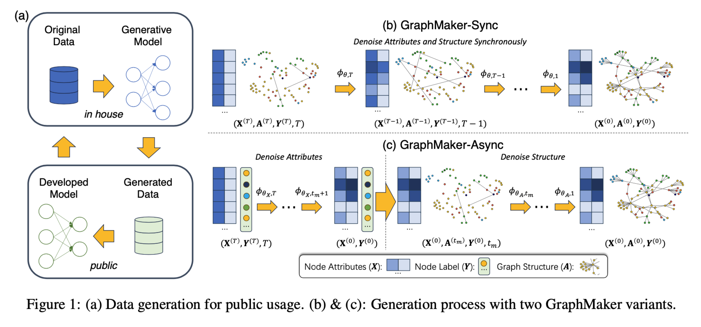
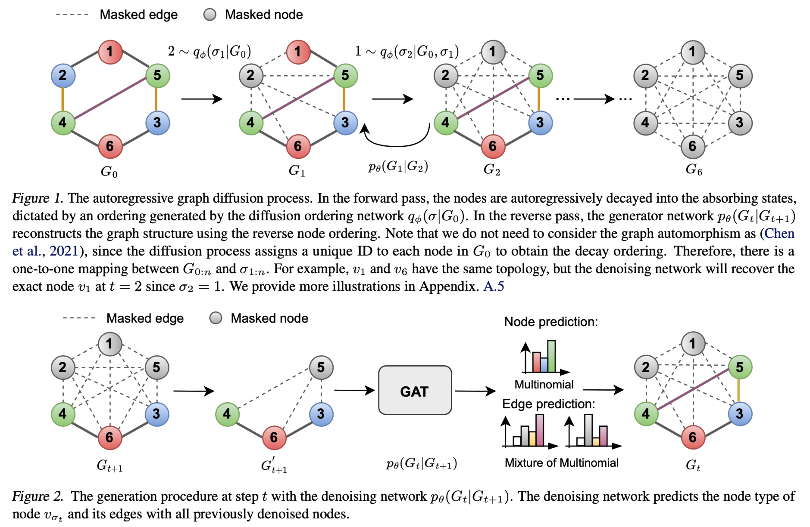
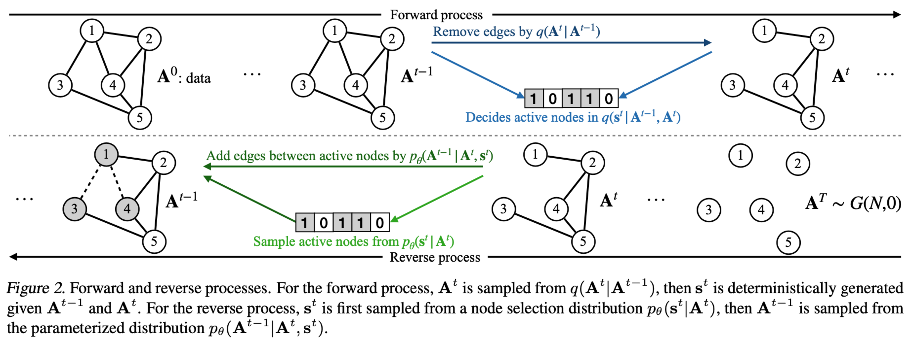
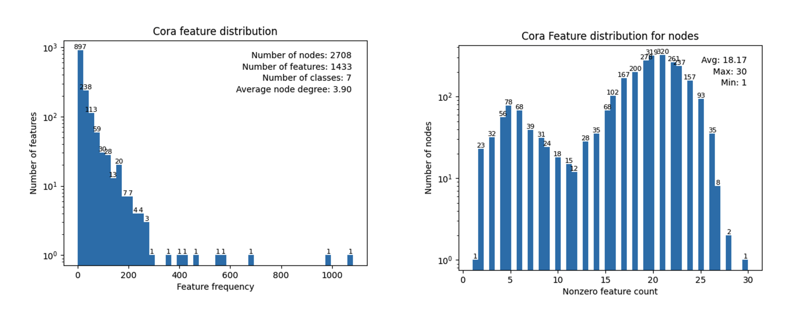
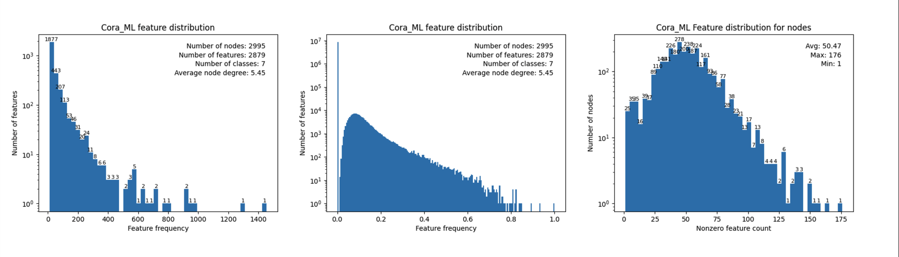
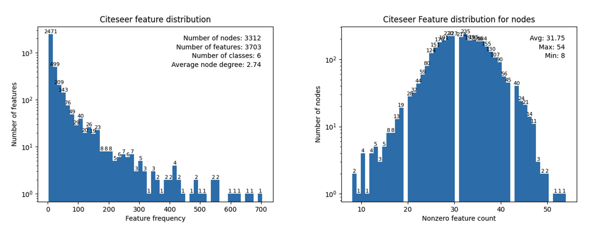
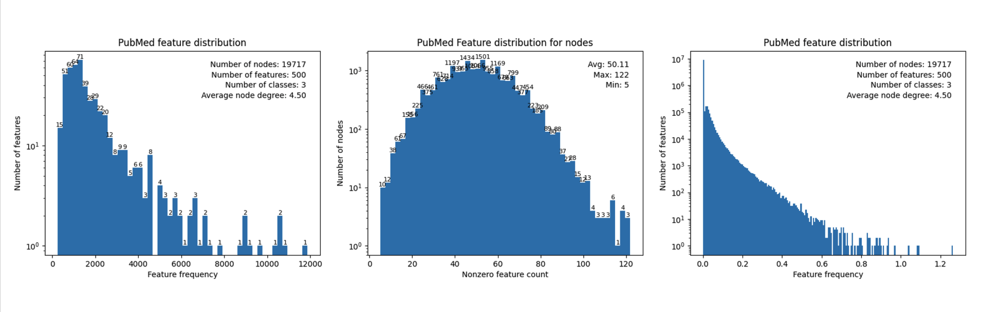

# Meeting Mar. 18

## Diffusion

### Discrete Diffusion

**transition matrices**

- uniform

  

- mask (absorbing diffusion)

💡joint diffusion on node & edge

💡 diffuse sepretely on node & egde

### Joint diffusion

asynchronous diffusion

- forward diffusion: catogarical discrete diffusion
- reverse: MPNN

### Node diffusion

node attributes:

- 0/1-valued word vector indicating the absence/presence of the word
-  TF/IDF weighted word vector from a dictionary => 0/1 feature
- GloVe CommonCrawl word vector

#### Discrete diffusion

- discrete diffusion on 0/1 bag-of-words
  - abosorbing trasition
  - DiffusionBert: using pre-trained denoising language models (e.g., BERT) to learn the reverse diffusion process

#### Gaussian Diffusion

- gaussian diffusion on word-vector node feature
  - Diffusion-LM: incrementally adds Gaussian noise to data (embedding)

### Edge diffusion

discrete absorbing diffusion on adjacent matrix

‼️ dense adjacent matrix

#### Subgraph diffusion

diffusion on ego graph

node classification => graph classification

🤔️ how to choose node

- attack

**SparseDiff**

- marginal transition

  the probability of transitioning to a state is proportional to the marginal probability of that state in the data

  - preserves the sparsity of edges during diffusion

- reverse: learning representations for edges (query edges & exsting edges)

  sparse message-passing transformer architecture

- dataset: SBM (*[44, 187] nodes*), Ego (*[50, 399] nodes* sampled from citeseer), Protein (*[100, 500] nodes*)

**GraphArm**

joint diffusion on node and egde

- node absorbing diffusion

  each node is independently decayed into an absorbing state with probabilities

  - learn a diffusion order network

- reverse: GAT predict node & egde type

- dataset: Cora (*[9, 87] nodes*), Ego-small (*[4, 18] nodes sampled from Citeseer*)

#### Graph diffusion

diffusion on graph

**EDGE**

- edge removal diffusion

  setting the empty graph as the convergent “distribution”

- reverse: only predicts edges for a small portion of “active nodes” that have edge changes in the original edge-removal process

  - predict active nodes, predict link between active nodes

  - degree-guided: generate node distribution

- dataset: Ego (*[50, 399] nodes* from citeseer), Cora (2485 nodes), Polblogs (1222 nodes), Road-MN (2640 nodes), PPI (3852 nodes)

### 

## Feature Distribution

### Cora

node attribute:  0/1-valued word vector indicating the absence/presence of the word

### Cora_ML

node attribute:  TF/IDF weighted word vector from a dictionary

### Citeseer

node attribute:  0/1-valued word vector indicating the absence/presence of the word

### PubMed

node attribute:  TF/IDF weighted word vector from a dictionary

### Reddit

node attribute:  GloVe CommonCrawl word vector

## 资助计划

  针对AI生成模型生成语音及声纹的检测及入侵防护研究

**基于活体特征的语音伪造检测技术研究**

1. 真实环境噪声中的活体表征信息挖掘及语义分析
   - 异质图神经网络模型 graph attention network
2. 特征信息与伪造语音之间的关系识别和分析
   - 相关链接预测
