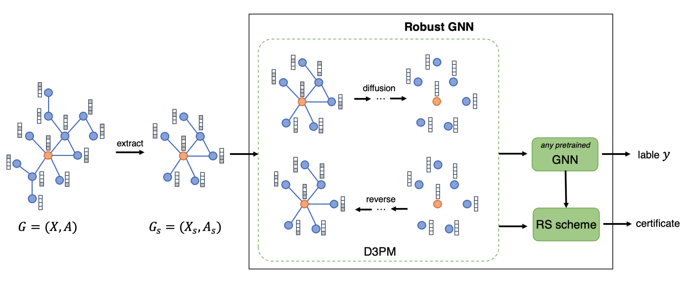
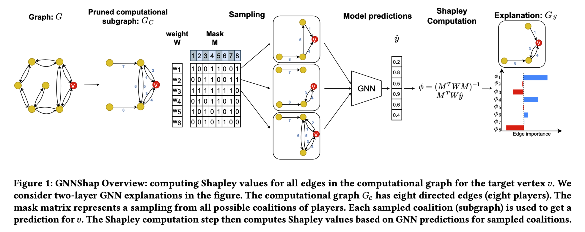
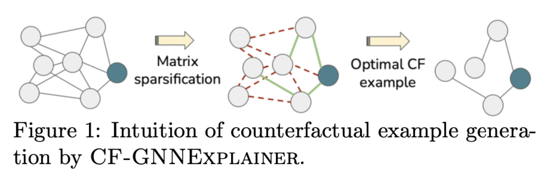

# Meeting Mar. 25

## pipeline

whole graph & target node => subgraph  => diffusion => certificate on gnn

### Certificate

Given a GNN model $f_\theta(x)$ and a graph $G=(X,A)$, certify that the prediction class $f^v_\theta(G)$ for  target node $v$ will not change under perturbation $\varphi(X,A)$.

$X\in \R^{n\times d}$ is feature matrix and $A$ is adjacent matrix. $\varphi(X,A)$ is adversarial perturbation on both node feature and graph structure.

### Equivalent Certificate

Given a GNN model $f_\theta(x)$ and a graph $G=(X,A)$, the predicted probability of the true class for the target node $v$ is no less than $p_\theta(v)$ under any perturbation.

## subgraph

- N-hop neighbor [我觉得最合理+简单的]
- shapley value [factual]
- surrogate model [factual]
- attack oriented [counterfactual]

### N-hop neighbor

only n-hop neighbours of $v$ can influence the prediction for $v$ [GCN paper, GAT paper]

一层GCN/GAT layer只聚合了一跳邻居的信息

n = num of GNN layers

🤔️ greybox model 需要知道GNN模型的层数

### Shapley

provides importance scores for all relevant *edges* for a target node, identifying a subgraph of the computation graph

计算n-hop邻居中shapley值最大的子图

sampling: mask / random walker / DFS / BFS

🤔️ greybox model 需要知道GNN模型的层数

👎 may preserve perturbation on subgraph 子图上的对抗扰动会具有很高的shapley value

### Surrogate model

 fit a simple and interpretable surrogate model in the locality of the prediction 使用一个可解释的简单模型模拟复杂模型的预测，为n-hop子图上的边/节点打分，表明其重要程度，识别出对预测结果影响最大的子图

- surrogate: GCN, HSIC Lasso, Weighted Linear Regression

sampling: n-hop neighbor / mask / entire dataset

🤔️ greybox model

👎 may preserve perturbation on subgraph

### Attack Oriented

counterfactual explaination

识别删除n-hop子图中的哪个部分会导致预测标签改变，类似于对抗攻击

find the minimal perturbation to the input (graph) data such that the prediction changes

1. identify minimal alternation results in prediction change
2. alter influential edges [low threshold]
   - for adversarail graph, CF alternation would be small
   - for benign graph, CF alternation would be large

## todo

- graph实验

- 优化实验

  

