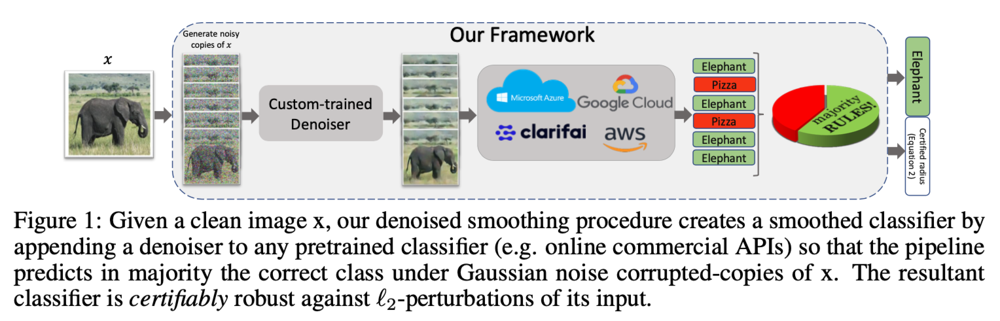
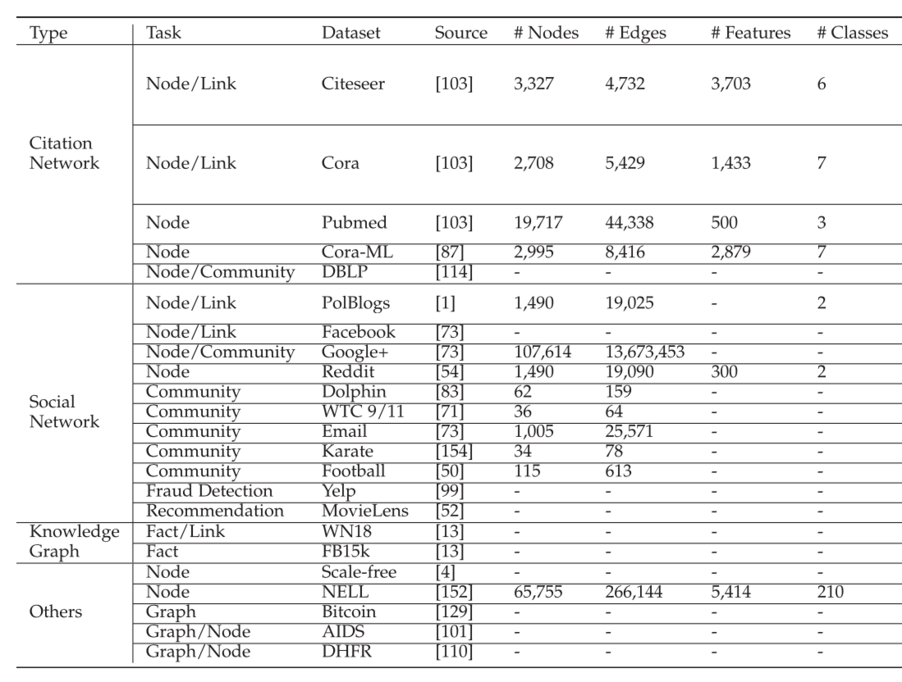
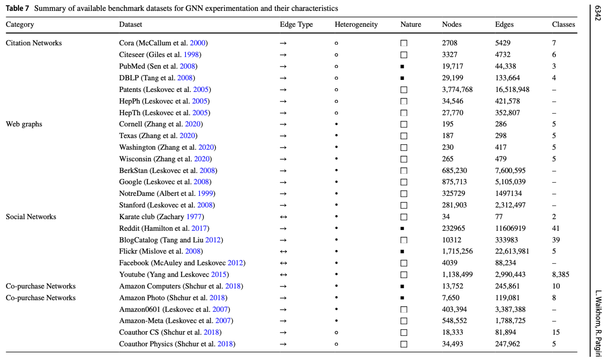
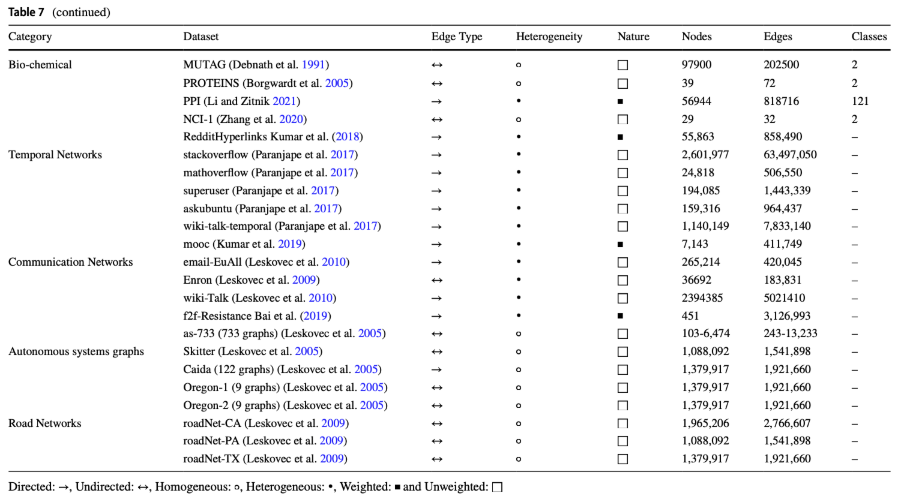

# Meeting Mar. 4

- node classification
- graph classification

## Node Classification

### Datasets

- Citation Network
  - Citeseer, Cora, Pubmed, Cora-ML, DBLP
- Social Network
  - Polblogs, Facebook, Reddit
- Web Page
  - wiki(Squirrel, Chameleon), WebKB(Wisconsin, Texas, Cornell), NELL

### Models

- GCN, GAT, PPNP

### Threat Model

$\mathcal{G}=(\mathcal {V,E})=(A,X)$, adjacency matrix $A\in \{0,1\}^{N\times N}$, node attributes $X\in \{0,1\}^{N\times D}$

**discrete data**: node attributes and/or graph structure

- $\mathcal{B}_{r_d,r_a}(x)=\{\hat x\in\mathcal{X}:\sum \mathbb{1}(\hat x_i=x_i-1)\leq r_d, \sum \mathbb{1}(\hat x_i=x_i+1)\leq r_a\}$
  - deleting at most $r_d$ bits (flipping 1 to 0); adding at most $r_a$  bits (flipping 0 to 1)
  - $\ell_0$ constraint: $r_a+r_d=r$
  - graph structure attack: $x=A$, node attribute attack: $x=X$, both: $x=[A|X]$

### Certificate

**node classification**: Given a graph $\mathcal{G}$, a perturbation set $\Phi(\mathcal{G})$, and a GNN $f_\theta$ . Verify that the predicted class for node $v$ stays the same for all $\mathcal {\hat G} \in \Phi(\mathcal{G})$. If this holds, we say that $v$ is *certifiably robust* w.r.t. $\Phi(\mathcal{G})$.

- metric: certified ratio, clean accuracy

### Comparison with RS

- improved accuracy

  - higher certified accuracy under same $\ell_p$ ball
  - much higher clean accuracy

- off-the-shelf

  - off-the-shelf classifier

    - large pre-trained models

  - we could have used other amounts of noise without training a new denoiser model

    - diffusion: multi-scale noise

  - 

    converting any pretrained classifier into a provably robust one

## Graph Classification

Threat Model, Comparison with RS [same]

### Dataset

- compound/protein
  - PROTEINS, MUTAG, NCI1, D&D, Enzymes
- fraudulent transaction
  - Bitcoin (illicit/licit transaction)
- social network
  - Twitter (fake/true user)

### Models

- GCN, GIN

### Certificate

**graph classification**: Given a graph set $\mathcal{G}$, a perturbation set $\Phi(\mathcal{G})$, and a GNN $f_\theta$ . Verify that the predicted class stays the same for all $\mathcal {\hat G} \in \Phi(\mathcal{G})$. If this holds, we say that $f_\theta$ is *certifiably robust* w.r.t. $\Phi(\mathcal{G})$.

- metric: certified accuracy, clean accuracy

## Other Tasks

‼️ need to define robustness, certificate

- **Community Detection**

  - *Dataset*
    - social network (Email, DBLP, Amazon)

  - *GNN Model*
    - Louvain’s method

- **Fraud Detection**
  - *dataset*
    - Yelp-Fraud, Amazon-Fraud

- **Recommendation System** (link prediction)
  - dataset
    - Yelp, Movies & TV

## Supplement

