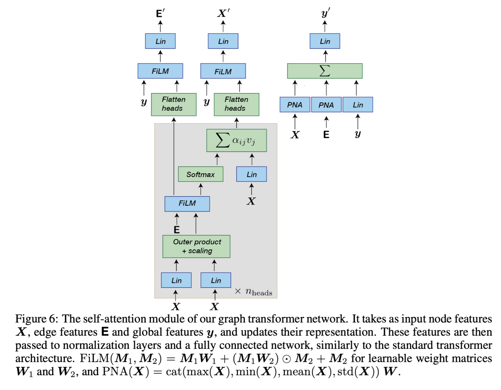
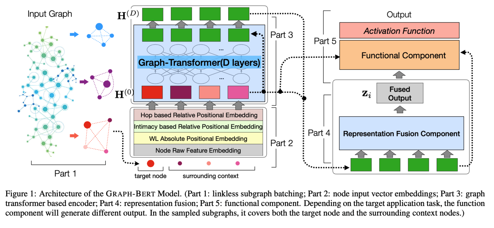
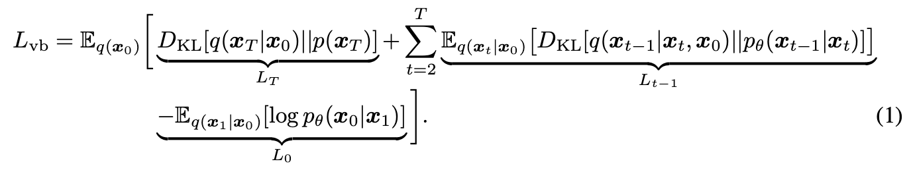
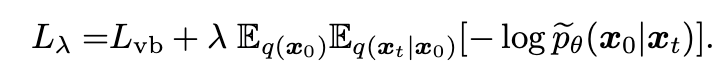

# Meeting May 15


## Experiment


### Diffusion Model

**training dataset**: 1-hop subgraph

**batch size**: 4

**noise predictor**: graph transformer

**train loss**: cross entropy

**train time**: EP100-1h


### Results

- classifier: GCN

**vanilla classifier**

whole graph acc=0.7807

1-hop subgraph acc=0.7426

| noise_scale | Diffusion acc | RS acc |
| :---------: | :-----------: | :----: |
|   50/500    |    0.5516     | 0.7900 |
|   200/500   |    0.4575     | 0.7709 |
|   250/500   |    0.4095     | 0.7260 |
|   300/500   |    0.3339     | 0.3297 |


## TODO

🤔️ 更换graph transformer结构？【GraphBert】学习node feature

不学习所有的edge feature，可以使用更大的graph (2-hop graph batchsize=1)

‼️ edge noise predictor精度低 => link predictor

> - GraphMaker
>   - Sync (Message Passing GNN as noise predictor for node/edge)
>   - Async (MLP as noise predictor for node => GNN as noise predictor for edge)

🤔️ 更换train loss 

【二分类cross entropy】

> DiGress
>
> - 适用mocular graph with catogorical node/edge 【多分类】

🤔️ 添加validation metrics

【$L=L_{vb}+L_{pn}$】

> - D3PM
>   - validation loss适用于生成任务
>   - 适用于去噪分类任务的validation loss


***

### Graph Transformer



### GraphBert



denoiser: ` checkpoints/0511-T500-LR1/last-v1.ckpt`

noise_scale=50 n_samples=200 acc=0.5073

*optimize a variational upper bound on the negative log-likelihood*





|       denoiser        | noise_scale |  acc   |
| :-------------------: | :---------: | :----: |
|  T500-EP1k/epoch=999  |   50/500    | 0.5221 |
|     WD/epoch=119      |   50/500    | 0.5332 |
| LR1-UL-EP1k/epoch=854 |   50/500    | 0.4926 |
|     T500/epoch=99     |   50/500    | 0.4926 |
|    T200/epoch=114     |   50/200    | 0.4833 |
|   T500-LR1/last-v1    |   50/500    | 0.5516 |
|   T500-LR1/last-v1    |   200/500   | 0.4575 |
|   T500-LR1/last-v1    |   250/500   | 0.4095 |
|   T500-LR1/last-v1    |   300/500   | 0.3339 |

noise_scale: 50/200

rs_acc=0.7900

```
X_p_plus: 0.00, X_p_minus: 0.16
E_p_plus: 0.00, E_p_minus: 0.16
```

noise_scale: 200/500

rs_acc=0.7709

```
X_p_plus: 0.00, X_p_minus: 0.35
E_p_plus: 0.00, E_p_minus: 0.35
```

noise_scale: 250/300

rs_acc=0.7260

```
X_p_plus: 0.01, X_p_minus: 0.50
E_p_plus: 0.00, E_p_minus: 0.51
```

noise_scale; 300/500

rs_acc=0.3297

```
X_p_plus: 0.01, X_p_minus: 0.65
E_p_plus: 0.01, E_p_minus: 0.66
```


