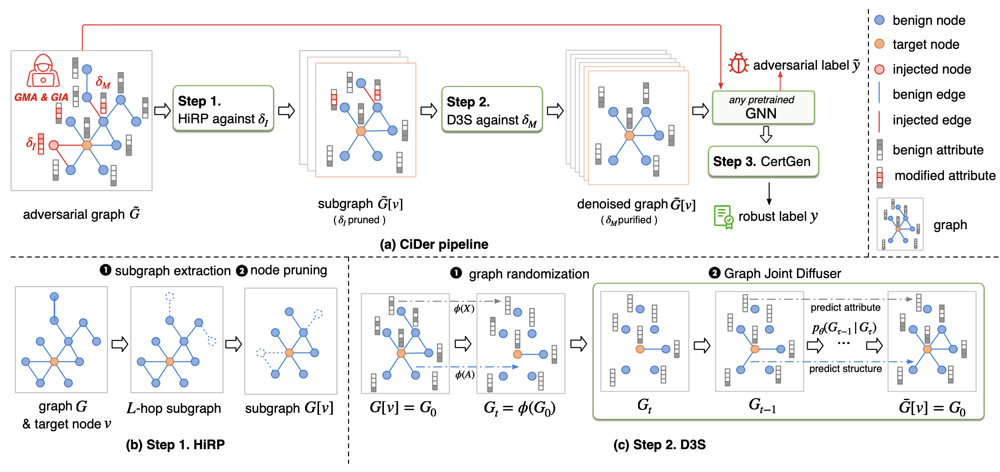

# Meeting May 27

## MPNN

- Message Passing Neural Network as denoiser
  - MLP => attribute denoisor
  - GNN => adjacent denoiser
  - pipeline: denoiser attribute 👉 denoise adjacent
- MPNN input: `X, E, label, t`
  - `label` at inference time
    - labeled (generator conditioned on label)
    - fake label for target node
    - fake label for all node
- MPNN input `X, E, t`
  - non-label

| noise scale |    RS    | labeled denoiser | target fake-labeled denoiser | fake-labeled denoiser | non-labeled denoiser |
| :---------: | :------: | :--------------: | :--------------------------: | :-------------------: | :------------------: |
|     500     | *0.1668* |      0.9982      |          **0.3726**          |        0.1346         |        0.1623        |
|     400     |  0.1913  |      0.9963      |          **0.4944**          |        0.1549         |       *0.2730*       |
|     300     |  0.5746  |      0.9483      |           *0.7546*           |        0.1771         |      **0.7915**      |
|     200     | *0.7873* |      0.8579      |            0.7564            |        0.2933         |      **0.8118**      |
|     100     | *0.7990* |      0.8118      |            0.7601            |        0.3800         |      **0.8007**      |

diffusion step=500

***

- MPNN

  

- MPNN & Transformer

  - batch loss

  

  - epoch loss

  

  - validation loss

    

## TODO

- asynchronous diffusion timestep for attribute and adjacent
  - seperate noise scale
- Hierarchical Randomized Pruning (HiRP) graph for test

