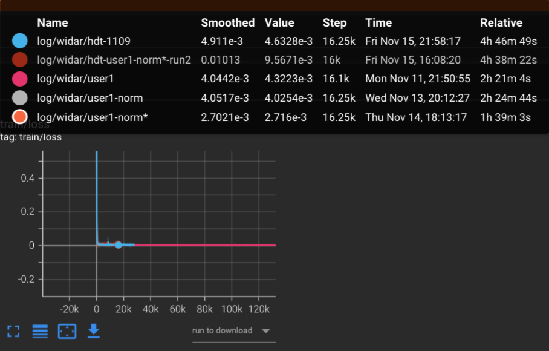

# Meeting Nov. 18


## HDT Experiment

- DiA on norm data

  FID value: 0.4545
  Average SSIM: 0.4713

- HDT on norm data

  - 1109/user1

    FID value: 0.7566
    Average SSIM: 0.3000

  - 1109

    FID value: 2.5637
    Average SSIM: 0.3738

**training**



- loss = MSEloss()

- ==loss = tfdiffLoss()==

  ```python
  target_fft = torch.fft.fft(target, dim=1) 
          est_fft = torch.fft(est)
          t_loss = self.complex_mse_loss(target, est)
          f_loss = self.complex_mse_loss(target_fft, est_fft)
          n_loss = self.complex_mse_loss(target_noise, est_noise) if (target_noise and est_noise) else 0.
          return (t_loss + f_loss + self.w * n_loss)
  ```


## Paper

overleaf


## TODO

- experiment on Widar3.0
- data augmentation
- 用RF生成模型来直接解决具体的回归（Regression）任务：
  1. 基于RF生成模型的异常行为检测；
  2. 基于RF生成模型的语义通信（信号去噪去畸变）；
  3. 基于RF生成模型的场景重建；