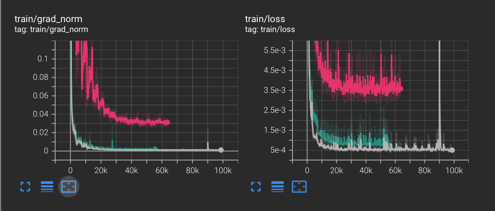
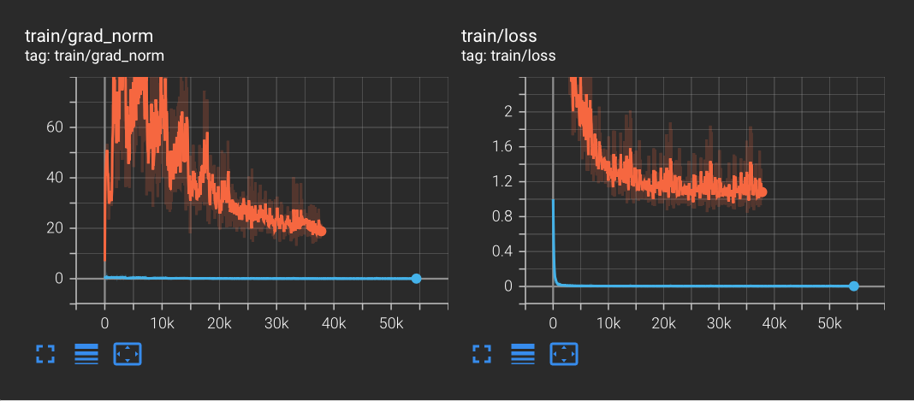

# Meeting Nov. 25

## GRACED Rebuttal

## RF-Diffusion

- |      model      | params |  SSIM  |  FID   |
  | :-------------: | :----: | :----: | :----: |
  |     DiT-MSE     |  19M   | 0.4390 | 0.5486 |
  | DiT-MSE-dropout |  19M   | 0.3115 | 0.6149 |
  |   DiT-MSE-b84   |  77M   | 0.3599 | 0.6342 |
  |   HDT-TFloss    |  13M   | 0.0533 | 2.1852 |
  |     HDT-MSE     |  13M   | 0.2361 | 0.2829 |

  DiT training

  

  - HDT training

    

    

## TODO

- Meeting for RF-Diffusion

- Experiment of GRACED

## Supplementary

### Result of DiT/HDT

- pretrained model DiA params=19M

  - robust sampling

    FID value: 0.9511
    Average SSIM: 0.1437

- DiA params=19M

  - Widar 

    - mse weight15

      - native sampling
    
        FID value: 0.5486
        Average SSIM: 0.4390

      - robust sampling
    
        FID value: 0.9511
        Average SSIM: 0.0023
    
    - dropout
    
      FID value: 0.6149
      Average SSIM: 0.3115
      
    - b64-256 77M
    
      FID value: 0.6342119148603295
      Average SSIM: 0.35987610974748585

- HDT params=13M

  - Widar weight10

    - lr=1e-5 tfloss weight10

      FID value: 2.1852
      Average SSIM: 0.0533

    - lr=1e-4 mse weight14

      - native sampling

        FID value: 0.2824
        Average SSIM: 0.2385

      - robust sampling

        FID value: 1.0304
        Average SSIM: 0.0013

    - lr=1e-4 mse weight10

      FID value: 0.2829
      Average SSIM: 0.2361

  - 1109 

    - tfloss lr=1e-5 weight10

      FID value: 2.3461
      Average SSIM: 0.0890

    - tfloss lr=1e-4 weight20

      - native sampling

        FID value: 2.3490
        Average SSIM: 0.0892

      - sampling

        FID value: 1.4267
        Average SSIM: 0.0753

    - mse weight3 param=13M

      FID value: 2.5637
      Average SSIM: 0.3738

### Gesture Encoding

|           Gesture           |  ID  |
| :-------------------------: | :--: |
|          Push&Pull          |  1   |
|            Sweep            |  2   |
|            Clap             |  3   |
|            Slide            |  4   |
|   Draw- Zigzag(Vertical)    |  5   |
|      Draw-N(Vertical)       |  6   |
|      Draw-O(Vertical)       |  7   |
|  Draw- Zigzag(Horizontal)   |  8   |
|     Draw-N(Horizontal)      |  9   |
|     Draw-O(Horizontal)      |  10  |
|  Draw-Triangle(Horizontal)  |  11  |
| Draw- Rectangle(Horizontal) |  12  |

### GRACED Rebuttal

review #1

**Theoretical Development**

+ \3. Probably correct; provides limited new insights or understanding

review #3

 **Justification of Clarity of Presentation Score (required if score is 1 or 2).** 

+ There are some issues with the symbols in the text, such as the lack of clear explanations for certain symbols.

review #4

重点讲确实是基于这个方法论做的，但是应用上仍然是具有创新性的，从理论到应用里也需要解决blablabla几个问题（对比diffusion）

RS不是黑盒 强调黑盒（对比RS）

工作的意义：提供工具 解决问题

实验

简单的baseline对比 新的实验 表格放在rebuttal 和final paper

ddl：周一

