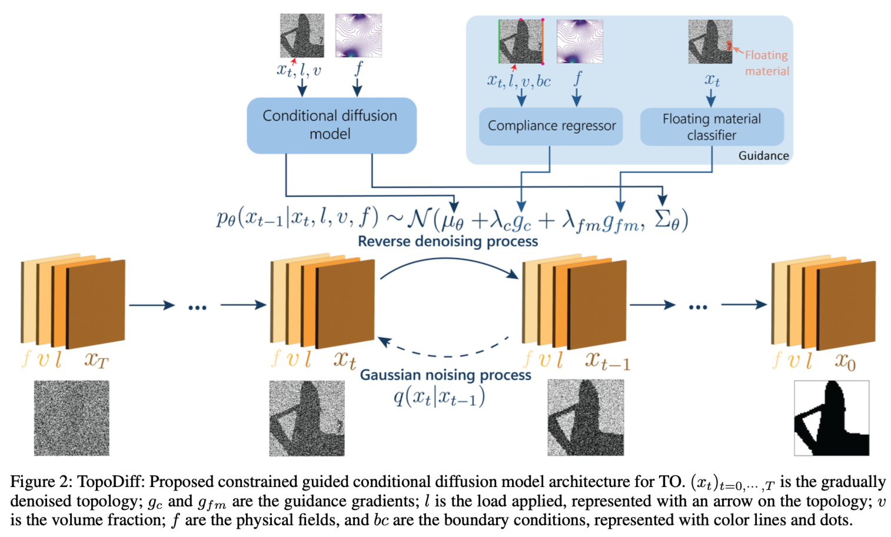

# Meeting Oct. 14

## Shannon theorem

$$
C=B\cdot \log(1+\frac{S}{N})
$$

- $C$是信道容量（比特/秒），表示信道在给定带宽和信噪比情况下的最大传输速率
- $B$是信道的带宽（赫兹），即信号可以使用的频率范围
- $S$是信号功率
- $N$是噪声功率
- $\frac{S}{N}$是信噪比（SNR）

### Path Loss

路径损耗 caused by the **dissipation of the power**

path loss $\text{FSPL}=\frac{P_t}{P_r}=(\frac{4\pi d}{\lambda})^2=(\frac{4\pi df}{c})^2$

#### Friis transmission equation

$\frac{P_r}{P_t}=G_tG_r(\frac{\lambda}{4\pi d})^2$

- $G_*$ are the antenna gains (w.r.t. isotropic radiator)

$P_r^{[\text{dB}]}=P_t+G_t+G_r+20\lg(\frac{\lambda}{4\pi d})$

#### Simplified Path Loss Model [dB]

$P_r = P_t+G_t+G_r+20\lg(\frac{\lambda}{4\pi d_0})+10\gamma\lg(\frac{d_0}{d})$

- $\gamma$是路径损耗指数，用于描述信号在不同环境中的衰减程度，通常在2到5之间，具体值取决于环境（例如：自由空间中取 2，城市环境中取 3~4，室内复杂环境中取更高的值）

### Shadow Fading

阴影衰减 caused by **obstacles between the transmitter and receiver**

引起给定距离内接收功率的**随机变化**

由于参数是未知的，所以只能通过统计模型来表征这种随机变化。

### log-normal shadowing model

发射接收功率比$ψ=\frac{P_t}{P_r}$是服从对数正态分布

则接收功率和接收信噪比都服从对数正态分布

### Simplified model

combined path loss and shadowing
$$
P_r = P_t+G_t+G_r+20\lg(\frac{\lambda}{4\pi d_0})+10\gamma\lg(\frac{d_0}{d})-\psi^{[\text{dB}]}
$$

- $\psi^{[\text{dB}]} \sim N(0, \sigma^2)$

- $\gamma$ obtained by minimizing MSE

  

## SF-DM

wearable sensor-based human activity recognition

statistical features as conditions

**noise predictor** conv inputs: noisy data, time step, statistic features

statistical feature selection:

- mean
- standard deviation
- Z-score
- skewness
- no labels

## constraint guidance

- $f, v, l$: additional features 数据维度
- regressor: surrogate neural network predicting compliance under given constriants 回归值🙆
- classiffier: predicting the probability of some feature 分类标签

## Ref.

[11] S. Zuo, V. F. Rey, S. Suh, S. Sigg, and P. Lukowicz, “Unsupervised Statistical Feature-Guided Diffusion Model for Sensor-based Human Activity Recognition,” May 19, 2024, *arXiv*: arXiv:2306.05285. doi: [10.48550/arXiv.2306.05285](https://doi.org/10.48550/arXiv.2306.05285).