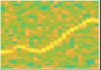
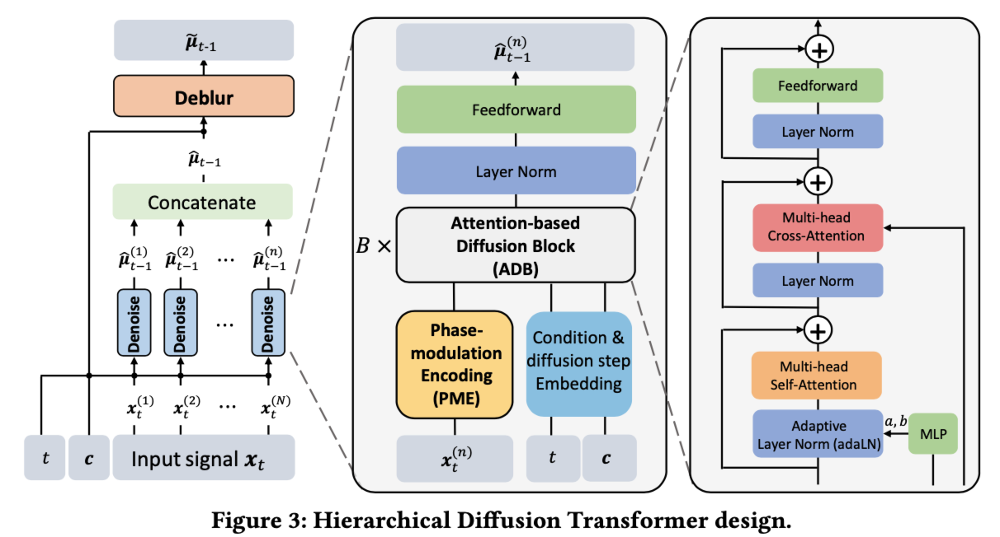
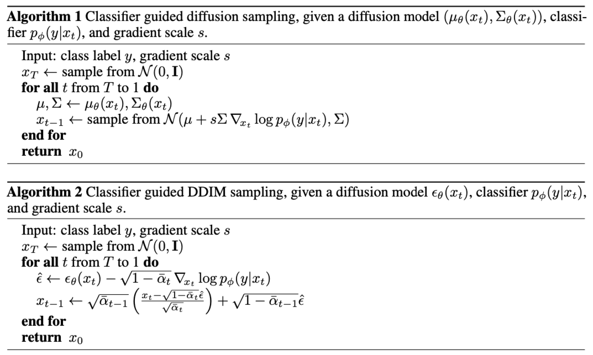
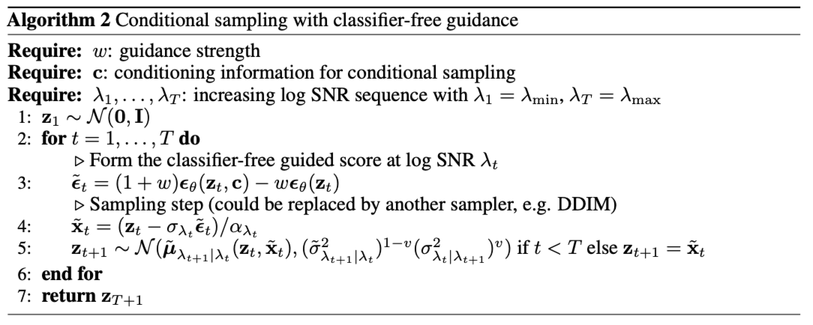
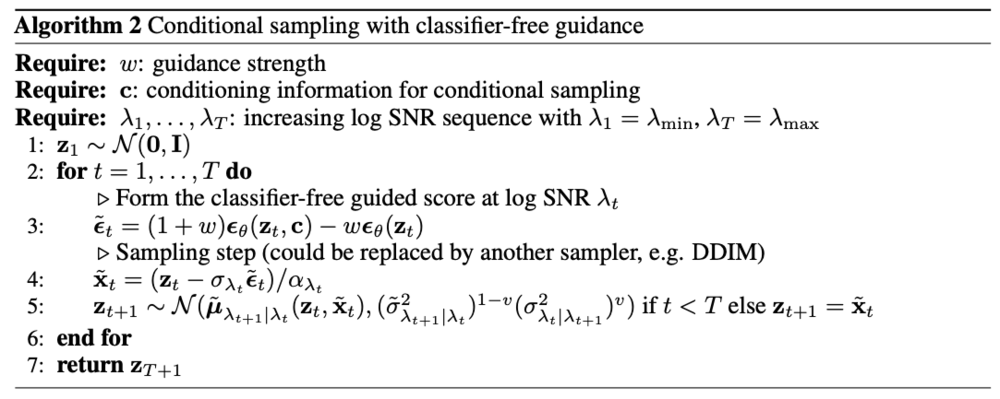

# Meeting Oct. 9

## RF-Diffusion

Wi-Fi

**challenge**

- time-series
- frequency domain
- number field (complex-valued)

**RF-Diffusion**

- Time-Frequency Diffusion Theory (TFD)
  - conditional generation (label)

- Hierarchical Diffusion Transformer (HDT)
  - denoise => deblur
  - attention-based diffusion block
  - phase modulation encoding

## Diff for Multivariate Time-series

- conditional DDPM
  - guidance
    - classifier
      1. train a classifier $p_\phi(y|x_t,t)$ on noisy samples $x_t$
      2. use gradients $\nabla_{x_t}\log p_\phi(y|x_t,t)$ to guide sampling process to label $y$
    - classifier-free
      1. train unconditional denoising diffusion model and conditional model
      2. perform sampling using the linear combination of the conditional and unconditional score estimates

|      name      |           domain           |        condition        |                       method                        |
| :------------: | :------------------------: | :---------------------: | :-------------------------------------------------: |
|    CDiffuSE    |     speech enhancement     |      noisy speech       |               add condition as noise                |
|      DOSE      |     speech enhancement     |          label          |        label embedding, dropout, prior noise        |
|   DR-DiffuSE   |     speech enhancement     |      noisy speech       | condition representation & classifier-free guidance |
| GuidedDiffTime |     financial / energy     |  history, constraints   |                  classifier-guided                  |
|     MediC      |         healthcare         |          label          |                   label embedding                   |
|  Diffsformer   |     stock forecasting      |  sector, return ratio   |              classifier-free guidance               |
|   TimeWeaver   |        time series         |        metadata         |              metadata token embedding               |
|     SF-DM      | human activity recognition | statistical information |            concatenate statiscal feature            |

## TODO

- RF-Diffusion on Widar3.0
  - improvement over RF-Diffusion

## Supplement

### DiffuSE[1]

speech enhancement

DDPM
$$
q(x_t|x_0)=\mathcal{N}(x_y;\sqrt{\bar \alpha_t}x_0, (1-\bar \alpha_t)I)
$$
*Supportive Reverse Process*

DiffuSE uses noisy *spectral features* as the conditioner

DiffWave: clean Mel-spectral features

add noisy speech to reverse steps

### CDiffuSE[2]

speech enhancement

DDPM

conditional diffusion: incorporates characteristics of the observed *noisy* speech
$$
q(x_t|x_0)=\mathcal{N}(x_y;(1-m_t)\sqrt{\bar \alpha_t}x_0+m_t\sqrt{\bar \alpha_t}y, \delta_tI)
$$

### GuidedDiffTime[3]

financial and energy data

DDIM

generate TS data: smilier to history & match constraints 

does not require re-training for new constraints

constriants => loss penalty

classifier-guided

### MediC[4]

Electroencephalography (EEG) dataset (medical)

DDPM

class-conditioned: class label => MLP => label embedding

### DOSE[5]

speech enhancement

DDPM

label as condition

dropout intermediate-generated samples

generate from an adaptive *prior* derived from the conditional factor

### Diffsformer[6]

stock forecasting

DDPM

condition: sector, return ratio

predictor-free guidance
$$
\hat\epsilon_\theta(x_t,c)=\epsilon_\theta(x_t,\phi)+\omega(\epsilon_\theta(x_t,c)-\epsilon_\theta(x_t,\phi))
$$

### TimeWeaver[7]

time-series data (air quality, traffic, electricity, egg)

DDPM

use metadata as condition

tokenizer: metadata embedding

### DiffSTG[8]

spatio-temporal graph forecasting (traffic flow)

DDPM

condition: history, graph

add condition in ST-Residual Block of UGNet denoiser

### ImDiffusion[9]

imputation-based anomaly detection

MTS anomaly detection datasets

condition: observed data => unconditional using masking strategy

### DR-DiffuSE[10]

speech enhancement

condition collapse

auxiliary conditional generation network => condition representation

classifier-free: utilizing the gradient between the diffusion

condition representation and intermediate output as guidance

### SF-DM[11]

wearable sensor-based human activity recognition

condition on statistical information (mean, Z-score, skewness)

statistical feature 

### Classifier guidance[12]

### Classifier-free guidance[13]

## Ref.

[1] Y.-J. Lu, Y. Tsao, and S. Watanabe, “A Study on Speech Enhancement Based on Diffusion Probabilistic Model,” in *2021 Asia-Pacific Signal and Information Processing Association Annual Summit and Conference (APSIPA ASC)*, Dec. 2021, pp. 659–666. Accessed: Sep. 26, 2024. [Online]. Available: https://ieeexplore.ieee.org/document/9689602/?arnumber=9689602

[2] Y.-J. Lu, Z.-Q. Wang, S. Watanabe, A. Richard, C. Yu, and Y. Tsao, “Conditional Diffusion Probabilistic Model for Speech Enhancement,” in *ICASSP 2022 - 2022 IEEE International Conference on Acoustics, Speech and Signal Processing (ICASSP)*, May 2022, pp. 7402–7406. doi: [10.1109/ICASSP43922.2022.9746901](https://doi.org/10.1109/ICASSP43922.2022.9746901).

[3] A. Coletta, S. Gopalakrishnan, D. Borrajo, and S. Vyetrenko, “On the Constrained Time-Series Generation Problem,” *Advances in Neural Information Processing Systems*, vol. 36, pp. 61048–61059, Dec. 2023.

[4] G. Sharma, A. Dhall, and R. Subramanian, “MEDiC: Mitigating EEG Data Scarcity Via Class-Conditioned Diffusion Model,” presented at the Deep Generative Models for Health Workshop NeurIPS 2023, Oct. 2023. Accessed: Sep. 25, 2024. [Online]. Available: https://openreview.net/forum?id=0aeDKGhlTo

[5] W. Tai, Y. Lei, F. Zhou, G. Trajcevski, and T. Zhong, “DOSE: Diffusion Dropout with Adaptive Prior for Speech Enhancement,” *Advances in Neural Information Processing Systems*, vol. 36, pp. 40272–40293, Dec. 2023.

[6] Y. Gao *et al.*, “DiffsFormer: A Diffusion Transformer on Stock Factor Augmentation,” Feb. 04, 2024, *arXiv*: arXiv:2402.06656. doi: [10.48550/arXiv.2402.06656](https://doi.org/10.48550/arXiv.2402.06656).

[7] S. S. Narasimhan, S. Agarwal, O. Akcin, S. Sanghavi, and S. Chinchali, “Time Weaver: A Conditional Time Series Generation Model,” Mar. 05, 2024, *arXiv*: arXiv:2403.02682. Accessed: Sep. 25, 2024. [Online]. Available: http://arxiv.org/abs/2403.02682

[8] S. S. Narasimhan, S. Agarwal, O. Akcin, S. Sanghavi, and S. Chinchali, “Time Weaver: A Conditional Time Series Generation Model,” Mar. 05, 2024, *arXiv*: arXiv:2403.02682. Accessed: Sep. 25, 2024. [Online]. Available: http://arxiv.org/abs/2403.02682

[9] Y. Chen *et al.*, “ImDiffusion: Imputed Diffusion Models for Multivariate Time Series Anomaly Detection,” Nov. 14, 2023, *arXiv*: arXiv:2307.00754. doi: [10.48550/arXiv.2307.00754](https://doi.org/10.48550/arXiv.2307.00754).

[10] W. Tai, F. Zhou, G. Trajcevski, and T. Zhong, “Revisiting Denoising Diffusion Probabilistic Models for Speech Enhancement: Condition Collapse, Efficiency and Refinement,” *Proceedings of the AAAI Conference on Artificial Intelligence*, vol. 37, no. 11, Art. no. 11, Jun. 2023, doi: [10.1609/aaai.v37i11.26597](https://doi.org/10.1609/aaai.v37i11.26597).

[11] S. Zuo, V. F. Rey, S. Suh, S. Sigg, and P. Lukowicz, “Unsupervised Statistical Feature-Guided Diffusion Model for Sensor-based Human Activity Recognition,” May 19, 2024, *arXiv*: arXiv:2306.05285. doi: [10.48550/arXiv.2306.05285](https://doi.org/10.48550/arXiv.2306.05285).

[12] P. Dhariwal and A. Nichol, “Diffusion Models Beat GANs on Image Synthesis,” in *Advances in Neural Information Processing Systems*, Curran Associates, Inc., 2021, pp. 8780–8794. Accessed: Oct. 08, 2024. [Online]. Available: https://proceedings.neurips.cc/paper/2021/hash/49ad23d1ec9fa4bd8d77d02681df5cfa-Abstract.html
