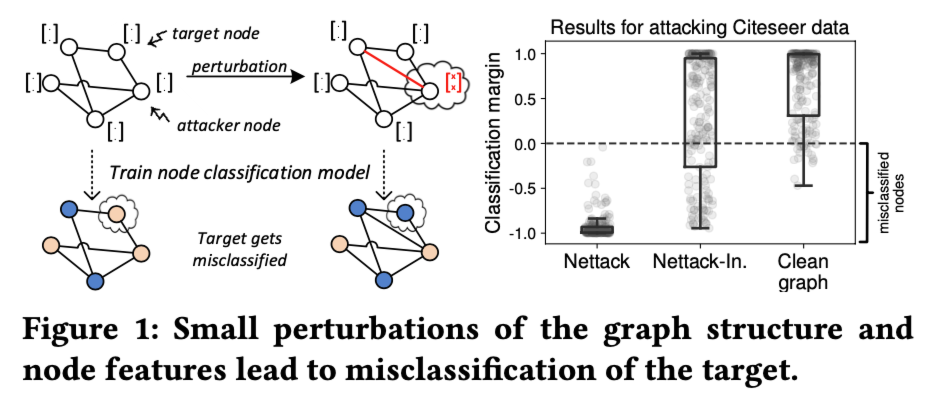

# Metting Mar. 11

- GNN
- attack
- random smoothing
- todo

 

## GNN

### dataset

Cora-ML (n = 2995, e = 8416, d = 2879, nc=7) 

- nodes = papers
- edges =citations (undirected)
- node features = 0/1-valued word vector indicating the absence/presence of the word

use 10%/10%/80% nodes for training/validation/test 

### GNN

- GCN
  - acc=0.8599
- GAT
  - acc=0.8474

## Attack

### Adversarial Perturbation

- Edge-Level Perturbation
  - adding/removing/rewiring edges in the whole original graph within a given budget
  - number of modified edges ($\ell_0$)
- Node-Level Perturbation
  - adding/removing nodes, *or* manipulating the features of target nodes
  - number of nodes modified ($\ell_0$) *or* the distance between the benign and adversarial feature vectors
- Structure Preserving Perturbation
  - more structural preservation, such as total degree, node distribution, etc.
- Attribute Perturbation
  - modify the features of nodes or edges

### Nettack

**Perturbation**

node’s features and the graph structure

remain *unnoticeable* by preserving important data characteristics (egree distribution, feature statistics)

**Algorithm**

**Evasion attack**

> (i) the 10 nodes with highest margin of classification, i.e. they are clearly correctly classified,
>
> (ii) the 10 nodes with lowest margin (but still correctly classified) and
>
> (iii) 20 more nodes randomly

- GCN
  - mis rate: 0.75
- GAT
  - mis rate: 0.6

## Random Smoothing

**Threat Model**

discrete data: node attributes or graph structure

- $\mathcal{B}_{r_d,r_a}(x)=\{\hat x\in\mathcal{X}:\sum \mathbb{1}(\hat x_i=x_i-1)\leq r_d, \sum \mathbb{1}(\hat x_i=x_i+1)\leq r_a\}$
  - deleting at most $r_d$ bits (flipping 1 to 0); adding at most $r_a$  bits (flipping 0 to 1)

**Certified accuracy**

- GCN

  - ATT
    - acc=0.8233

    - ra_base: 2.76, rd_base: 6.57

      ra_loup: 2.88, rd_loup: 6.35

  - ADJ
    - acc=0.8233
    - ra_base: 1.0, rd_base: 1.45
    - ra_loup: 1.0, rd_loup: 1.50

- GAT
  - ATT
    - acc=0.8201
    - ra_base: 2.83, rd_base: 6.79
    - ra_loup: 2.97, rd_loup: 6.55
  - ADJ
    - acc=0.8209
    - ra_base: 1.0, rd_base: 1.37
    - ra_loup: 1.0, rd_loup: 1.41
  
- APPNP

  - ATT
    - acc=0.8375
    - ra_base: 2.62, rd_base: 6.22
    - ra_loup: 2.77, rd_loup: 6.10
  - ADJ
    - acc=0.8249
    - ra_base: 1.0, rd_base: 1.0
    - ra_loup: 1.0, rd_loup: 1.0

## TODO

- more attacks
- 网安资助计划
