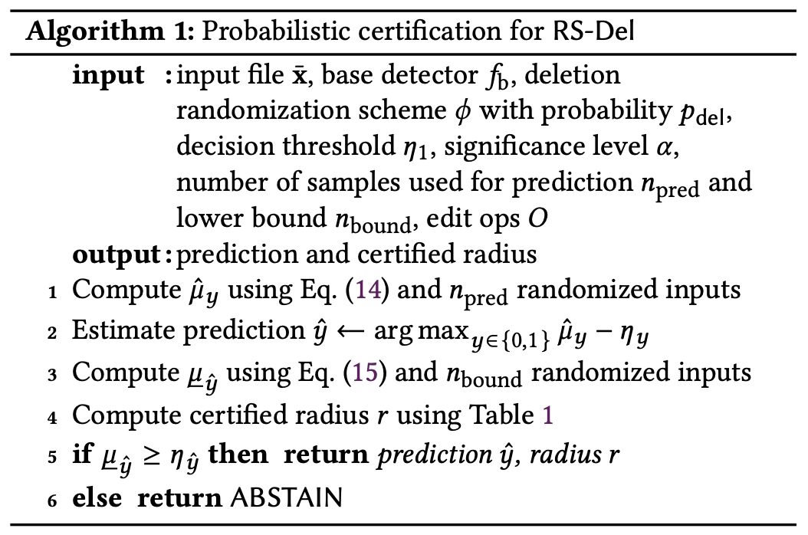
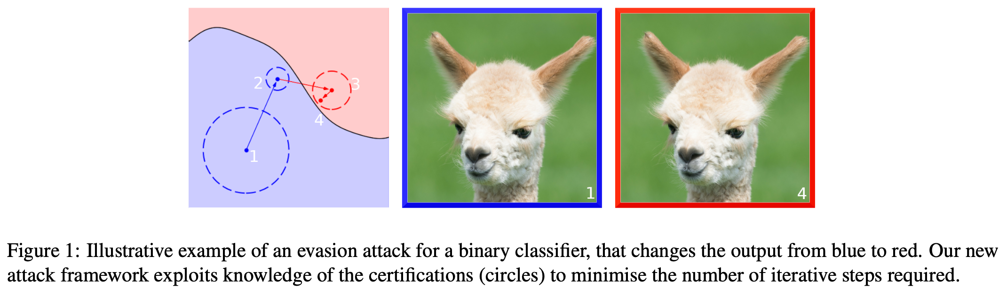
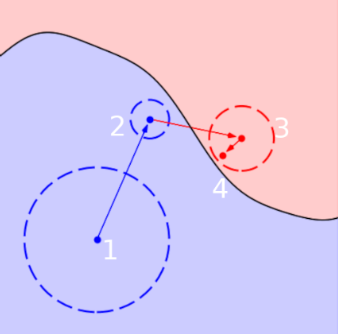

# Meeting Aug. 14

with Prof. Cavallaro

## Certification with RS for malware

### Papers

#### RS-Del[1]

**problem**

static windows malware detection on byte-level data

byte-level edit attack: inserting, deleting, and/or substituting bytes

**challenge**

- variable-length categorical byte array

**method: *randomized smoothing***

- deletion randomization on bytes or chunks
- certificate for generalized edit distance 

**contribution**

- randomized deletion smoothing (RS-Del) & edit distance certificate
  
- accuracy/robustness tradeoff
  - high accuracy (91%) for 128-byte edits
  
    ==small edit attacks==[6]
  
- practical defense
  - ASR=0% with 17.2KB file 

***

***problem formulation***

- model: $f:\mathcal{X}\rightarrow \{0,1\}, \mathcal{X}=\{0,\dots,255\}^\star$
- attacker capability: $\mathcal{A}_c(x)=\{\bar x \in \mathcal{X}:\text{dist}_O(x, \bar x)\leq c\}$
  - edit distance: $c$
  - edit operation: $O=\{\text{del, ins, sub}\}$

***robustness certificate*** - edit distance
$$
f(x)=f(x'), x\in \mathcal{N}_r(x)=\{x'\in \mathcal{X}:\text{dist}_O(x, \bar x)\leq c\}
$$
**RS-Del**

- smooth detector

  - randomization: $p_y(x;f_b)=\Pr_{z\sim \phi(x)}[f_b(z)=y]$

  - smoothing: $f(x)=\arg\max_{y\in\{0,1\}}p_y(x)-\eta_y$ (decision threshold $\eta_y$)

- *del randomization*

  - random edit: each byte is deleted iid with $p_{\text{del}}$

    $\Pr[\phi(x)=z]=\sum_{\epsilon\in\mathcal{E}(x)} \Pr[G(x)=\epsilon]\pmb{1}_{\text{apply}(x,\epsilon)=z}$

- certificate

  - objective: $\min_{x\in \mathcal{N}_r(\bar x)}p_y(x;f_b)> \eta_y$
  - lower bound $p_y$ over edit distance neighborhood

- practical considerations

  - approximate the confidence score using sampling

    

  - training: train the base detector on randomized inputs

  - exploit semantics: group byte to instruction and regard them as a single token

    token-level edit/deletion
    
    

#### DRSM[5]

modify(substitution), add(insertion) byte-level malware data

***randomized smoothing***

- De-Randomized Smoothed MalConv: window ablation on byte data
- Classifier: MalConv (embedding + conv*2 + maxpool + lin)
- certificate: $n$ windows, $\Delta=\lceil \frac{p}{w}\rceil+1$
- open-source 

#### Ablate Smoothing[7]

***randomized smoothing***

- random byte ablation(substitutions) with encoded 'PAD' token
- do not provide certificate

#### (De)Randomized Smoothing[6]

patch(sub) / append(ins) /block injection(ins) attack

***randomized smoothing***

- ablate whole subsequences of bytes
- ablated $\tilde x$ consists only a subset/chunk of bytes
- certificate: patch size, p, corresponds to a percentage of the original file
- open-source

### Comparison

- problem: (windows) byte-level malware detection
  - ==Android？==
  - ==graph-based detection==
- method: randomized smoothing

|           Name           |       RS strategy       |      Certificate       |
| :----------------------: | :---------------------: | :--------------------: |
|     Ablate Smoothing     | ablate bytes with 'PAD' |           no           |
|          RS-Del          |     random deletion     |   edit distance cert   |
| (De)Randomized Smoothing |  ablate chunk of bytes  | patch/append size cert |
|           DRSM           | ablate window of bytes  | patch/append size cert |

## Limitation of Certification

### Position[2]

**Problem**

aliignment issue between certifications and their capabilities 

**Certification**

- false sense of security

  - detection without distinction: no information for distinguishing between clean and attacked samples
    - provide no guarantees that the label is *accurate*, just not change
      - ==model robustness by design==
    - adversarial example can also be certified[4]
  - practical attacks still exisit *outside* of certification region[4]

- what does certification imply

  - a certification only measures the distance to the *nearest class-flipping example*
    - *correctly predicted sample*: certification to nearest adversarial example / true semantics class boundary
    - *adversarial example*: certification to the true class/another class
    - ==the distance between adv and clean is larger than the certified radius==
  - certification distance does not *reliable* imply the difficulty of attack
    - ==Turning strengths into weaknesses[3]: *sample with smaller certified radius are easier to be attacked*==
  
- certifications bring security threat

  - certification can guide attack

    *Certification Aware Attack*[4]: more efficient generation and smaller perturbation

  

  - employing certification mechanisms may compromise AI security
    - ==access to certification: surrogate model==

## Proposal

### Graph-based malware certification

- graph abstraction of Android malware
- graph randomization[8]
- graph certification[8] => malware certification 

### Certification guided attack

- graph vs bytes
  - graph: Turning strengths into weaknesses[3]
    - certificate aware loss: larger certified radius, smaller weight => budget allocated to non-robust nodes
  - bytes: Et Tu Certifications[4]
    - 

## Ref.

[1] Z. Huang, N. G. Marchant, K. Lucas, L. Bauer, O. Ohrimenko, and B. Rubinstein, “RS-Del: Edit Distance Robustness Certificates for Sequence Classifiers via Randomized Deletion,” in NeurIPS. 2023.

[2] A. C. Cullen, P. Montague, S. M. Erfani, and B. I. P. Rubinstein, “Position: Certified Robustness Does Not (Yet) Imply Model Security,” in ICML Position Paper Track, June 2025.

[3] B. Wang, M. Pang, and Y. Dong, “Turning Strengths Into Weaknesses: A Certified Robustness Inspired Attack Framework Against Graph Neural Networks,” in CVPR 2023.

[4] A. C. Cullen, S. Liu, P. Montague, S. M. Erfani, and B. I. P. Rubinstein, “Et Tu Certifications: Robustness Certificates Yield Better Adversarial Examples,” in ICML 2024.

[5] S. Saha, W. Wang, Y. Kaya, S. Feizi, and T. Dumitras, “DRSM: De-Randomized Smoothing on Malware Classifier Providing Certified Robustness,” in ICLR 2024.

[6] D. Gibert, G. Zizzo, and Q. Le, “Certified Robustness of Static Deep Learning-based Malware Detectors against Patch and Append Attacks,” in AISec 2023.

[7] D. Gibert, G. Zizzo, and Q. Le, “Towards a Practical Defense Against Adversarial Attacks on Deep Learning-Based Malware Detectors via Randomized Smoothing,” in *Computer Security. ESORICS 2023 International Workshops: CPS4CIP, ADIoT, SecAssure, WASP, TAURIN, PriST-AI, and SECAI*, 2023.

[8] A. Bojchevski, J. Gasteiger, and S. Günnemann, “Efficient Robustness Certificates for Discrete Data: Sparsity-Aware Randomized Smoothing for Graphs, Images and More,” in ICML 2020.

## Supplementary

**Position Open Question**

- *How best should certifications be employed to enhance model security?*

  ==system-level defense==

- *What is required for certifications to be practically deployed for end users?*

  ==computational cost==

- *How do we test certification schemes in a manner that reflects real world use cases?*

  ==dataset / threat model==

- *How do we improve the quality of guarantees provided by certifications?*

  ==different $\ell_p$ / ensemble certifications==

- *How can we build certification mechanisms that can be generalized to a broader set of model types?*

  ==LLM / RL==

- *How do we incentivize the development of more secure code?*

  ==system-level / OpenDP==
