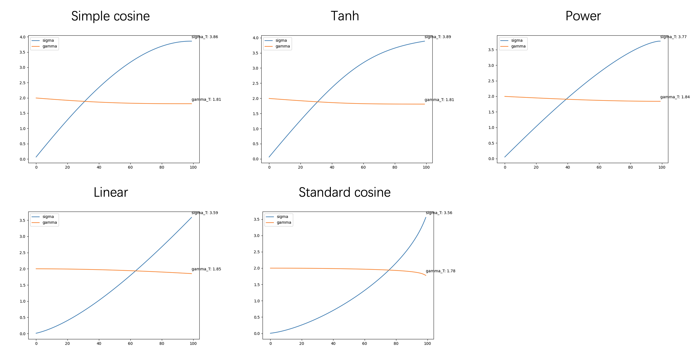

# Meeting Jan. 15


## Noise Schedule 

$$
x_t &= \bar \gamma_tx_0+\bar\sigma_t\epsilon\\
$$

- simple cos
  $$
  \beta_t = \left(1 + \cos\left(\frac{t \cdot \pi}{T}\right)\right)
  $$

- tanh
  $$
  \beta=1+\tanh(2-t)
  $$

- power
  $$
  \beta_t=1-t^2
  $$

- lin
  $$
  \beta_t =\frac{t}{T}
  $$

- standard cos
  $$
  \bar \alpha_t=\frac{f(t)}{f(0)}， f(t) = \cos(\frac{t/T+s}{1+s}\cdot \frac{\pi}{2})^2\\
  \beta_t = 1-\frac{\bar \alpha_t}{\bar \alpha_{t-1}}
  $$
  

|   schedule   |  SSIM  |  FID   | Spec SSIM |
| :----------: | :----: | :----: | :-------: |
|  simple cos  | 0.7935 | 0.0503 |  0.8183   |
|     tanh     | 0.7335 | 0.0797 |  0.7787   |
|    power     | 0.6969 | 0.0546 |  0.7544   |
|     lin      | 0.7028 | 0.2071 |  0.7208   |
| standard cos | 0.6596 | 0.2973 |  0.6775   |


**sampling**

degrade function [*add noise*]: $\mathcal{D}(x,t)$

restore function [*remove noise*]: $\mathcal{R}(x, t, c)$

- one-shot sampling：生成确定性的结果
  $$
  \hat x_0 = \mathcal{R}(\mathcal{D}(x_0, T), T, c)
  $$

- sampling：生成多样化的结果，需要模型很大

  ```python
  for s=t, t-1, ..., 0
  ```

  $$
  \hat x_0=\mathcal{R}(x_s, s, c)\\
  x_{s-1}=\mathcal{D}(\hat x_0, s-1)
  $$

| $T $ | Sampling |  SSIM  |  FID   | Spec SSIM |
| :--: | :------: | :----: | :----: | :-------: |
| 200  | one-shot | 0.4137 | 2.8990 |  0.4412   |
| 100  | one-shot | 0.7935 | 0.0503 |  0.8183   |
|  50  | one-shot | 0.9658 | 0.0487 |  0.9675   |
|  20  | one-shot | 0.9645 | 0.0275 |  0.9613   |
|      |          |        |        |           |
| 200  | sampling | 0.1777 | 1.4474 |  0.1987   |
| 100  | sampling | 0.2095 | 1.7556 |  0.2016   |
|  50  | sampling | 0.2335 | 1.8215 |  0.1967   |
|  20  | sampling | 0.2019 | 2.085  |  0.2208   |

shcedule: simple cosine
