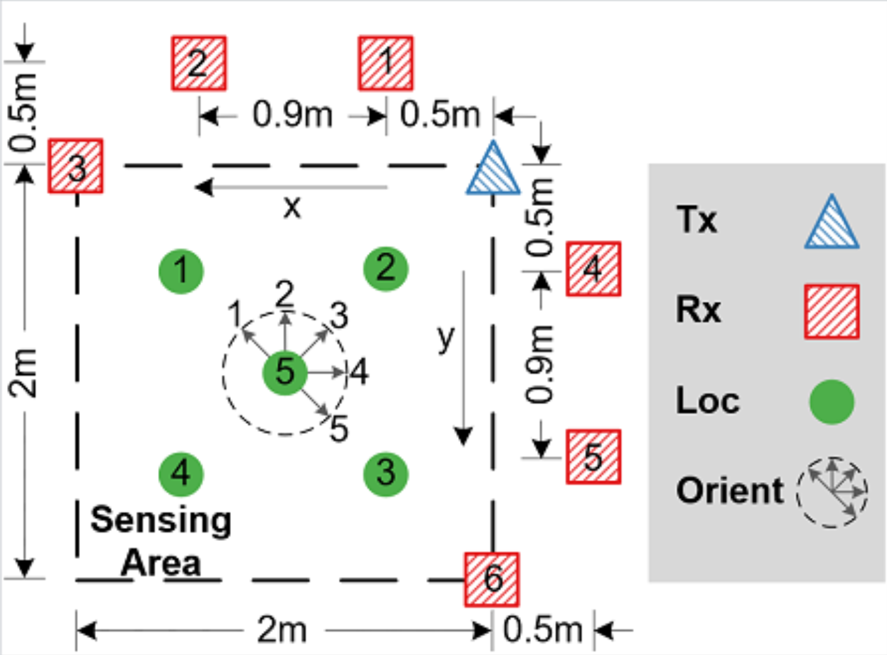

# Meeting Jan. 7

$$
\begin{align}
    x_t &= \bar \gamma_t\mu_dx_0+\bar\sigma_t\epsilon\\
    % &= \bar \gamma_tx_t +\bar \gamma_t\mu_d+\bar\sigma_t\epsilon
    &1. \text{Minimize} ||\mu_d\tilde x_{t-1} - p_\theta(x_t)||^2\\
    &2. \text{Minimize} ||\tilde x_{t-1} - p_\theta(x_t)||^2
\end{align}
$$
`condition=[d]`

|   loss   |  noisy  | dataset  |  SSIM  |  FID   | Spec SSIM |
| :------: | :-----: | :------: | :----: | :----: | :-------: |
|   $x$    | $\mu_d$ | ges[1-5] | 0.6882 | 0.0792 |  0.7749   |
|   $x$    |    /    | ges[1-5] | 0.7018 | 0.0646 |  0.7618   |
|   $x$    | $\mu_d$ | rx[1-5]  | 0.7790 | 0.1112 |  0.8420   |
|   $x$    |    /    | rx[1-5]  | 0.8504 | 0.0829 |  0.8297   |
|   $x$    | $\mu_d$ |   all    | 0.6522 | 1.7968 |  0.7351   |
|   $x$    |    /    |   all    | 0.7437 | 0.0672 |  0.7769   |
| $\mu_dx$ | $\mu_d$ |   all    | 0.6013 | 0.2216 |  0.6217   |

- noise: 表示是否添加$\mu_d$噪声
- dataset（train:test = 5:1）：
  - ges[1-5]：表示用gesture1-5训练，在gesture6上测试
  - rx[1-5]：表示用rx1-5训练，在rx6上测试（rx3和rx6的$d$相同）
  - all：将完整数据集按照5:1划分训练和测试

**SSIM下降的原因**

1. 数据泄露

   之前的实验简化，测试数据集也用于训练，存在数据泄露

2. 训练数据量

3. 缺少condition引导

