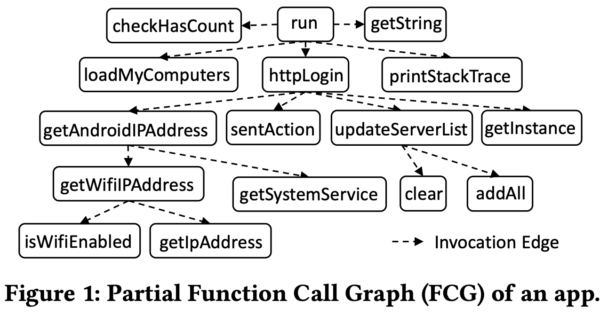

# Meeting Jul. 11

## Graph-based Adversarial Learning for Malware Detection

### Graph-based Attacks

#### HART[1]

Structural attack against graph-based Android malware detection techniques

Function call graph (FCG) based methods 

Problem-space attack

Heuristic optimization integrated Reinforcement learning ATtack (HRAT) algorithm

***Existing limitations***

1. L1-system-specific attack methods (feature-oriented)
   - structural attack - feature agnostic
2. L2-limited software modification operations (dead code)
   - insert methods, remove methods, add call relations, rewire call relations
3. L3-inconsistent transformation relation (feature-guided no-op code)
   - structural attack action

***Challenge***

1. How to determine a manipulation operation type
   - Determine an action type according to the current graph state
     - RL
2. How to select the most effective objects (node/edge)
   - Select optimal edges or nodes to conduct the modifications on the graph
     - gradient search

***Contribution***

- A novel structural attack
- Adversarial feature inverse mapping
- 90% ASR in feature space & 100% ASR in problem space

******

***Attack Formulation***

$\tilde G = G+\delta$, FCG adj matrix

- constraints $\mathbb{C}=[c_1,\dots, c_{N_n}]$ indicates modifiable
- adding edge $A_a=\{v_{beg},v_{tar}\}$
- rewiring $A_r=\{v_{beg},v_{end}, v_{end}\}$
- inserting node $A_i=\{v_{caller}\} \{v_{nice}\}$
- deleting node $A_a=\{v_{tar}, \hat v_{caller}, \hat v_{callee}\}$

**Heuristic optimized RL**

find the modification sequence with minimum modifications on graph rather than the hidden structure, e.g., the distributions of dataset, in the target graph

decision-making $P=\{S,A,R,\pi\}$

action: adding edges, rewiring, inserting nodes, and deleting nodes

- decide an action
  - RL (Deep Q-learning - 2MLP) - according to the current graph state (feature vector)
  - reward 
-  select optimal node/edge
  - kNN to differentiable version
  - get grad of each edge

***Android App Manipulation***

***Workflow***

==Idea==: diffusion policy for RL

==Challenge==: training diffusion

> open-source: https://github.com/zacharykzhao/HRAT.git
>

#### BagAmmo[2]

FCG-based + GAN

Black-box attacks towards FCG-based Android malware detection, termed BagAmmo

***Challenge***

1. functionality preserving
   - *try-catch trap* to insert never-executed function call
2. feature space gap
   - FCG feature mapping
3. black-box mode
   - GAN discriminator (substitute model)
4. black-box feature granularity (incomplete feature information)
   - surmise feature granularity with population

***Contribution***

- novel black-box attack
- Adversarial multi-population co-evolation (Apeom)

***

***Feature* for Android malware**

feature granularity: function / class / package / family

**BagAmoo**

action: adding nodes / adding edges

- create candidate edges

  - adding edge between nodes of any type  (different granularity)
  - leaf: callee, non-leaf: caller

- insert selected edges

  - 

  - GAN: select candidate edges

    - generator: Adversarial multi-population co-evolution algorithm (Apoem)
    - discriminator: function level GCN

    

    multi-population co-evolve

    

> Implemantation by FCGHunter: https://anonymous.4open.science/r/FCGHUNTER

#### MalGuise[3]

CFG-based black-box Windows AE

***Challenges***

1. Semantics preserving
   - fine-grained transformation: *call-based redividing*
2. Perturbation searching
   - Monte-Carlo-tree-search-based optimization

***Contributions***

- practical black-box attack
- fine-grained transformation to CFG of Windows malware

***

**MalGuise**

- adversarial transformation

  - call-based redividing: blocks with call instruction => fore-basic-block + mid + post

    

- MCTS-guided searching: optimized transformation sequence

  - select 'call', determine nops

    

- reconstruction

> Request CAS: https://github.com/jiyuay/MalGuise-Access-Instructions.git

#### VGAE-MalGAN[4]

API graph-based Android malware detection + GAN 

API graph embedding along with Permission and Intent as features for classification.

***Contributions***

- GNN for API graph classification
- VGAE-MalGAN for semantics preserving AE
- Adversarial training

***

**VGAE-MalGAN**

***API Graph-based Malware Detection***

- Graph construction
  - API extraction & selection
    - extract API => Sklearn feature selection to select 7k API
  - API graph
    - local graph: edge if belong to the same code block
    - global graph: edge if any edge in local graph
  - feature extraction
    - centrality feature
    - Permission and Intent
  - GraphSAGE(GCN)-based node encoder
  - Malware detector
    - 

***MalGAN***

- Generator: variation graph autoencoder (VGAE)
  - encoder: two-layer GraphSAGE
  - 
- Discriminator: GraphSAGE model

==Idea==: generative diffusion model

==Challenge==: training diffusion

> open-course: https://github.com/Yumlembam/VGAEMalGAN.git

#### FCGHunter[10]

FCG

enhance *exploration* and *exploitation*

***Challenge***

1. vast perturbation space
   - pinpoint critical areas with sensitive API calls
   - novel perturbation types
   - dependency-aware mutation representation and conflict-resolving strategy
   - SHAP-based interpretation feedback

***Contribution***

- adversarial samples

***

***genetic algorithm***

- individual=sequence of perturbation 
- gene=subsequence

***perturbation***

three new: add sparse node, add dense node, add long edges

**FCGHunter**

1. identify critical area
   - sensitive API then backward traversal
2. genetic algorithm to optimize perturbation
   1. dependency analysis, group operation into subsequences
   2. crossover and mutation
   3. select based on interpretation
3. evaluate and select
   - guidance with feature interpretation (SHAP)
   - surrogate model for instance-based model

***workflow***

> open-source: https://anonymous.4open.science/r/FCGHUNTER

### Graph-based Detection

#### MaMaDroid[5]

API call sequence (Markov chain) => class, package, family `java.lang.Thrwoable`

***Abstraction***: three modes API call sequences

***Workflow***:

1. Graph extraction (Soot, Flowdroid)

2. Feature encoding

   1. Sequence extraction

   

   2. Markov chain modeling

   

   3. feature: transition probability (|familty|$^2$ dim) + PCA

3. Classification

   Random Forests, 1-Nearest Neighbor(1-NN), 3-Nearest Neighbor(3-NN), Support Vector Machines(SVM)

#### MalScan[6]

FCG-based + centrality feature

***Abstraction:*** API FCG

***Workflow***:

1. Graph extraction (Static analysis)

2. Feature encoding (Centrality analysis)

   sensitive API centrality 

   

3. Classification

   1-Nearest Neighbor (1-NN), 3-Nearest Neighbor (3-NN), and Random Forest

#### APIGraph[7]

enhance malware classifier with similarity information among evolved Android malware

malware, during evolution, keep semantics but different implementation 

***Abstraction:*** API relation graph (official document) 

***Workflow***:

1. Graph extraction 

   node=entity (method, class, package, permission), edge=relation(ten types)

   

2. Feature encoding (TransE)

   add relation to permission node => mimize embedding distance if same relation to same permission => k-means cluster

3. Classification

   MaMaDroid (use API cluster pair), DroidEvolver, Drebin, Drebin-DL

#### MsDroid[8]

identify malicious snippets with interpretable explanation

***Abstraction:*** function call graph

***Workflow***:

1. Graph extraction 
   - behavior subgraph set (BSS): possible malicious snippets
     1. k-hop neighbourhoods permissions related API
     2. partition into four subsets
     3. subgraph reduction
2. Feature encoding 
   - call graph, opcode, permissions
3. Classification
   - subgraph classification with MPNN (MLP+avg pool+max pool+MLP)
   - app subgraph loss
3. Explaination
   - suspicious API usage, calling heat graphs, similar behavioral snippets 

### Graph-based defense

#### MaskDroid[9]

masking mechinism + GNN to recover graph with a small portion of nodes

contrastive module to learn more compact representation 

***Abstraction:*** function call graph

***Workflow***:

1. Graph extraction 
   - 
   - same as MsDroid: sensitive API subgraph with opcode + permission as feature
2. Feature encoding 
   - random masking (80% masked out) with learninable vector
   - GNN encoder + GNN decoder
3. Classification
   - proxy-based (learnable vector) contrastive learning

==Idea==: diffusion as reconstruction module

==Challenge==: diffusion noise design

## Ref.

[1] K. Zhao et al., “Structural Attack against Graph-Based Android Malware Detection,” in CCS ’21.

[2] H. Li *et al.*, “Black-box Adversarial Example Attack towards FCG Based Android Malware Detection under Incomplete Feature Information,” in Usenix Security 23.

[3] X. Ling *et al.*, “A Wolf in Sheep’s Clothing: Practical Black-box Adversarial Attacks for Evading Learning-based Windows Malware Detection in the Wild,” in USENIX Security 24.

[4] R. Yumlembam, B. Issac, S. M. Jacob, and L. Yang, “IoT-Based Android Malware Detection Using Graph Neural Network With Adversarial Defense,” IEEE IoTJ 2023.

[5] L. Onwuzurike, E. Mariconti, P. Andriotis, E. D. Cristofaro, G. Ross, and G. Stringhini, “MaMaDroid: Detecting Android Malware by Building Markov Chains of Behavioral Models,” in NDSS'17.

[6] Y. Wu, X. Li, D. Zou, W. Yang, X. Zhang, and H. Jin, “MalScan: Fast Market-Wide Mobile Malware Scanning by Social-Network Centrality Analysis,” in ASE'19.

[7] X. Zhang *et al.*, “Enhancing State-of-the-art Classifiers with API Semantics to Detect Evolved Android Malware,” in CCS ’20.

[8] Y. He, Y. Liu, L. Wu, Z. Yang, K. Ren, and Z. Qin, “MsDroid: Identifying Malicious Snippets for Android Malware Detection,” TDSC 2023.

[9] J. Zheng *et al.*, “MaskDroid: Robust Android Malware Detection with Masked Graph Representations,” in ASE'24.

[10] S. Song, X. Xie, R. Feng, Q. Guo, and S. Chen, “FCGHunter: Towards Evaluating Robustness of Graph-Based Android Malware Detection,” 2025, arXiv:2504.19456.