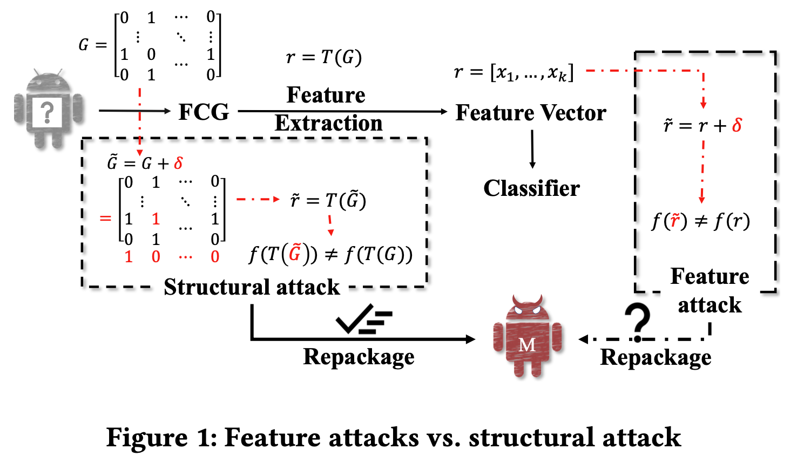
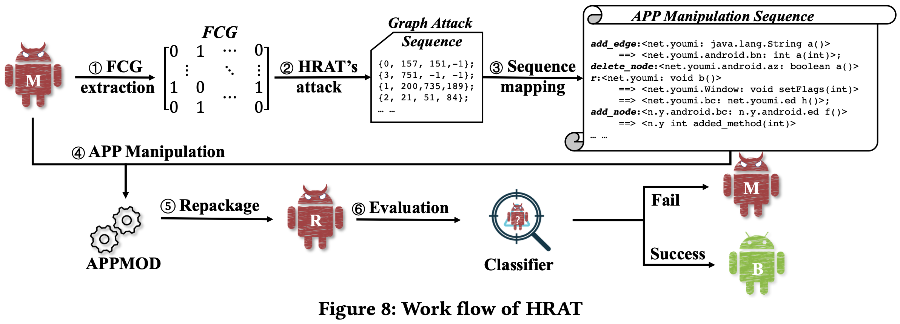
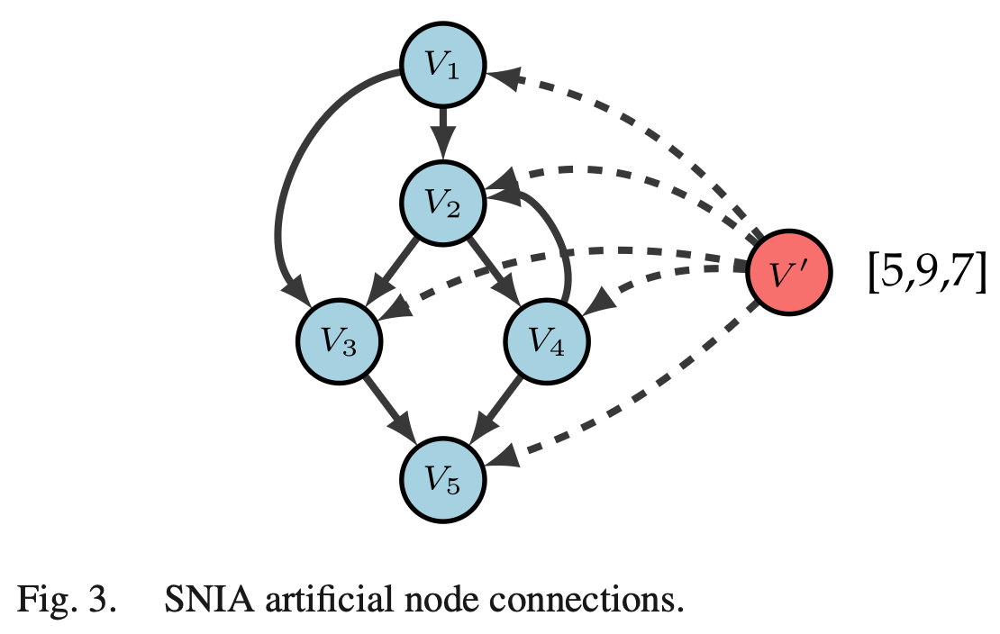
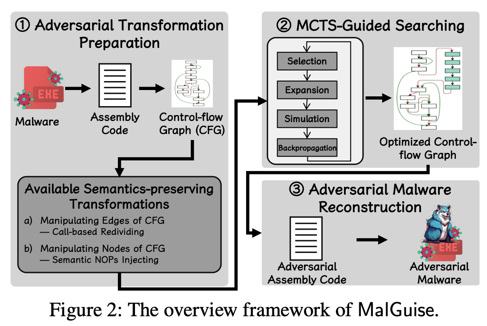
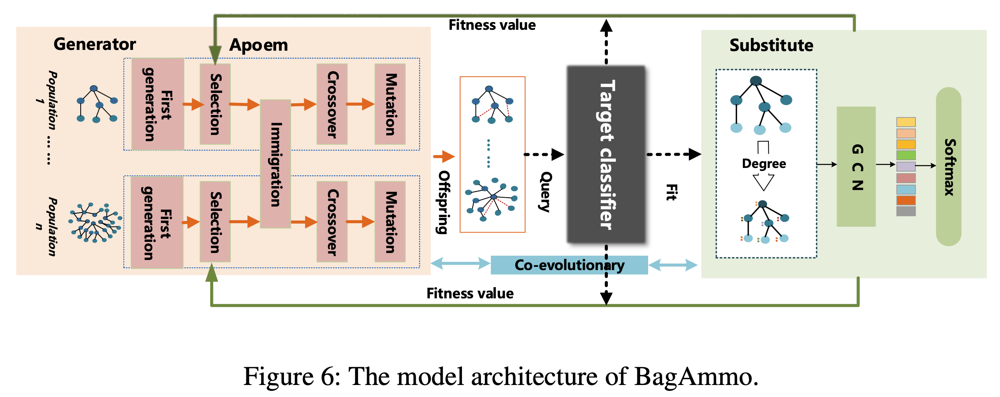

# Meeting Jul. 11

### Graph-based adversarial attack for malware detection

#### HART[1]

Structural attack against graph-based Android malware detection techniques

Function call graph (FCG) based methods 

Problem-space attack

Heuristic optimization integrated Reinforcement learning ATtack (HRAT) algorithm

***Existing limitations***

1. L1-system-specific attack methods (feature-oriented)
   - structural attack - feature agnostic
2. L2-limited software modification operations (dead code)
   - insert methods, remove methods, add call relations, rewire call relations
3. L3-inconsistent transformation relation (feature-guided no-op code)
   - structural attack action

***Challenge***

1. How to determine a manipulation operation type
   - Determine an action type according to the current graph state
     - RL
2. How to select the most effective objects (node/edge)
   - Select optimal edges or nodes to conduct the modifications on the graph
     - gradient search

***Contribution***

- A novel structural attack
- Adversarial feature inverse mapping
- 90% ASR in feature space & 100% ASR in problem space

******

**Attack Formulation**

$\tilde G = G+\delta$, FCG adj matrix

- constraints $\mathbb{C}=[c_1,\dots, c_{N_n}]$ indicates modifiable
- adding edge $A_a=\{v_{beg},v_{tar}\}$
- rewiring $A_r=\{v_{beg},v_{end}, v_{end}\}$
- inserting node $A_i=\{v_{caller}\} \{v_{nice}\}$
- deleting node $A_a=\{v_{tar}, \hat v_{caller}, \hat v_{callee}\}$

***Heuristic optimized RL***

find the modification sequence with minimum modifications on graph rather than the hidden structure, e.g., the distributions of dataset, in the target graph

decision-making $P=\{S,A,R,\pi\}$

action: adding edges, rewiring, inserting nodes, and deleting nodes

- decide an action
  - RL (Deep Q-learning - 2MLP) - according to the current graph state (feature vector)
  - reward 
-  select optimal node/edge
  - kNN to differentiable version
  - get grad of each edge

***Android App Manipulation***

***Workflow***

==Idea==: diffusion policy for RL

==Challenge==: training diffusion

#### SNIA[2]

Semantics-preserving (Multiple)Node Injection (Clustering) Attack (SNIA)

injecting semantic nop instructions, e.g., `ADD EAX 0`

grey-box gradient-based methods for AttributedCFG

 Specific features manipulated: Opcodes of the programs

#### MalGuise[4]

CFG-based

semantics-preserving transformation of call-based redividing (modify edge)

Monte-Carlo-tree-search-based optimization

#### BagAmmo[3]

FCG-based + GAN

Black-box attacks towards FCG-based Android malware detection with multi-population co-evolution, termed BagAmmo.

GAN

- generator: Adversarial multi-population co-evolution algorithm (Apoem)
  - Add edges (malware function call) from non-leaf nodes to leaf nodes

## Ref.

[1] K. Zhao et al., “Structural Attack against Graph-Based Android Malware Detection,” in CCS ’21.

[2] D. Zapzalka, S. Salem, and D. Mohaisen, “Semantics-Preserving Node Injection Attacks Against GNN-Based ACFG Malware Classifiers,” IEEE TDSC 2023.

[5] H. Li *et al.*, “Black-box Adversarial Example Attack towards FCG Based Android Malware Detection under Incomplete Feature Information,” in Usenix Security 23.

[11] X. Ling *et al.*, “A Wolf in Sheep’s Clothing: Practical Black-box Adversarial Attacks for Evading Learning-based Windows Malware Detection in the Wild,” in USENIX Security 24.