# Meeting Jun. 30

## Ideas for ICASSP

graph + adversarial robustness + malware detection

### Graph-based adversarial attack for malware detection

Malware graph abstraction

#### HART[2]

FCG-based detection methods 

edges and nodes - structural attack method

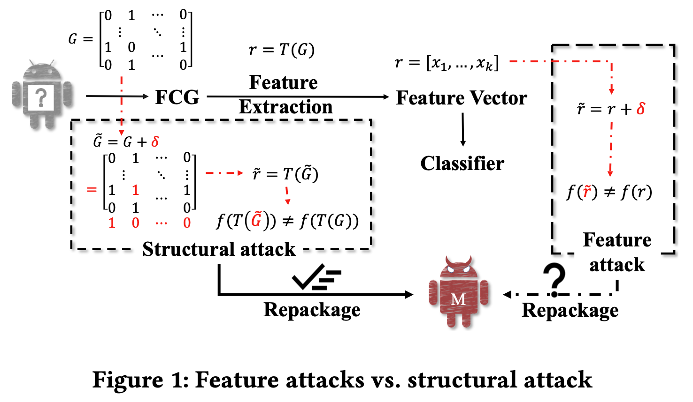

Heuristic optimization integrated Reinforcement learning ATtack (HRAT) algorithm

RL (Deep Q-learning) - determining an action type according to current graph state 

- action: adding edges, rewiring, inserting nodes, and deleting nodes

Gradient search - selecting optimal edges or nodes

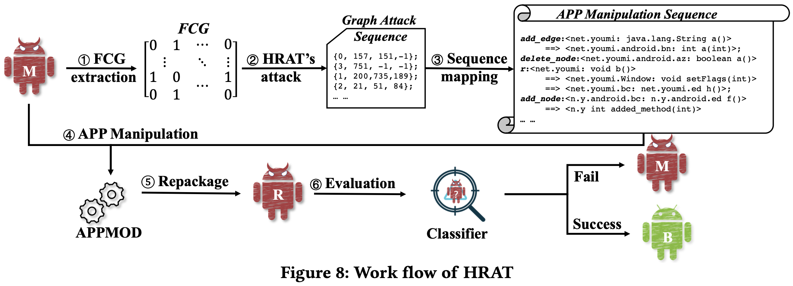

==Idea==: diffusion policy for RL

==Challenge==: training diffusion

### Graph-based generative method for adversarial malware

#### VGAE-MalGAN[6]

API graph

- Generator: variation graph autoencoder (VGAE)
  - encoder: two-layer GraphSAGE
- Discriminator: GraphSAGE model

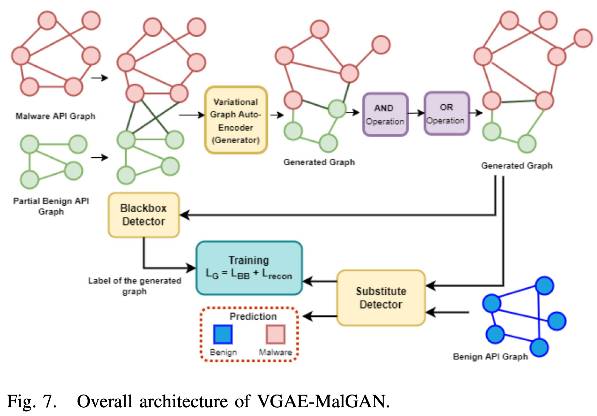

==Idea==: generative diffusion model

==Challenge==: training diffusion

### Graph-based Robust Malware Detection 

#### MaskDroid[4]

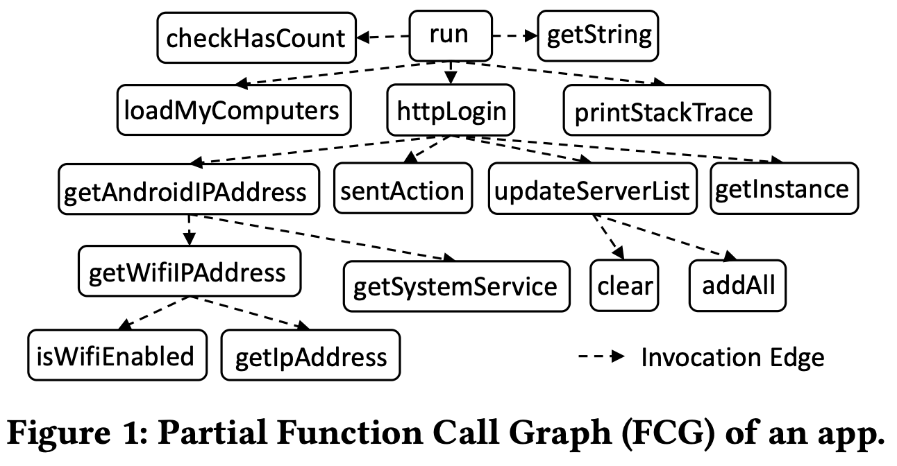

graph-based Android malware detector, MaskDroid

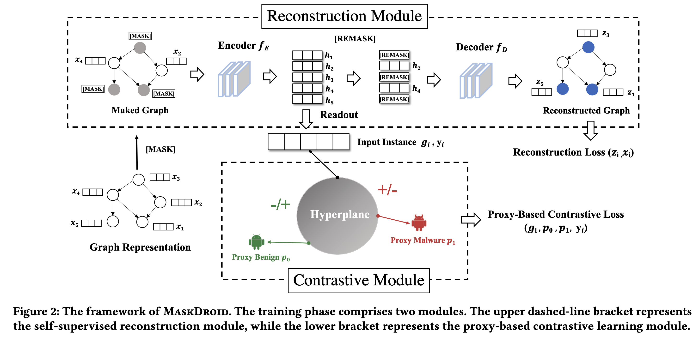

masking mechanism into the Graph Neural Network (GNN) based framework

contrastive module to learn more compact representations

==Idea==: diffusion as reconstruction module

==Challenge==: diffusion noise design

### Certified robustness for malware detection

#### DRSM[8]

Data: executable bytes $x=(x_1,x_2,\cdots,x_k),x_i\in\{0,1,\dots,255\}$ with padding

De-Randomized Smoothed MalConv: window ablation

Classifier: MalConv (embedding + conv*2 + maxpool + lin)

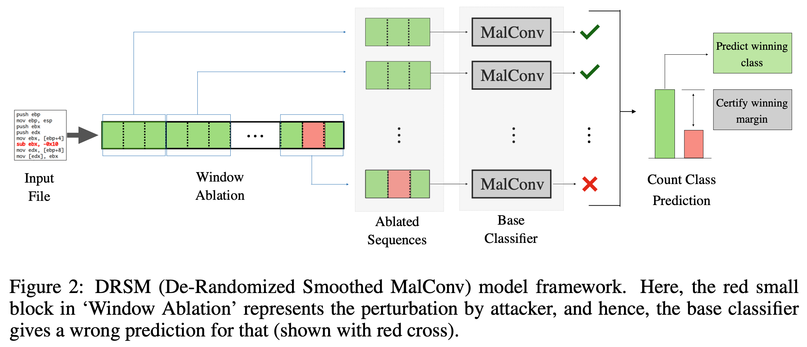

==Idea==: ablated diffusion model for reconstruction

==Challenge==: Conv as a noise predictor?

### Adversarial Purification for malware detection

#### MalPurifier[10]

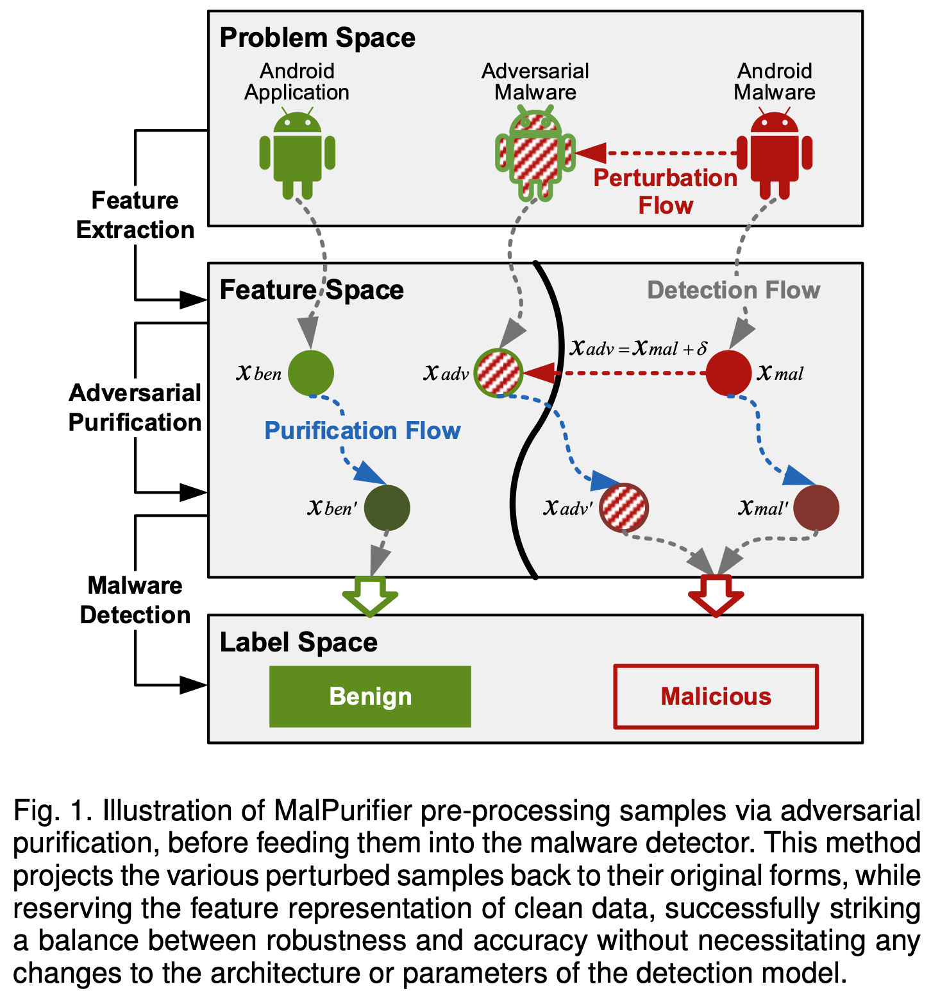

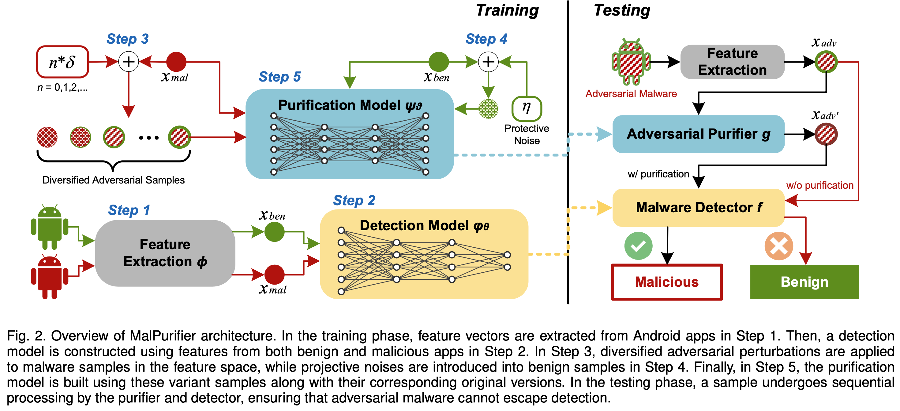

- Adversarial perturbation mechanism for robustness and generalizability
  - Set the adversarial depth in proportion to the batch index
- Noise injection strategy for benign data integrity
  - Binary mask for feature indices to be flipped
- Denoising AutoEncoder (DAE) with a dual-objective loss
  - Compared to Diffusion Model, the DAE is easier to train
  - reconstruction loss + prediction loss
  - MLP + Attention

==Idea==: diffusion as purifier

==Challenge==: a lot of experiments

## Noise Schedule

|   schedule   |  SSIM  |  FID   | Spec SSIM |
| :----------: | :----: | :----: | :-------: |
|  simple cos  | 0.7935 | 0.0503 |  0.8183   |
|     tanh     | 0.7335 | 0.0797 |  0.7787   |
|    power     | 0.6969 | 0.0546 |  0.7544   |
|     lin      | 0.7028 | 0.2071 |  0.7208   |
| standard cos | 0.6596 | 0.2973 |  0.6775   |

## Supplementary

#### MANIS[1]

feature-space attack

Directed graph $G=(V,E,L,\ell)$

- $V$: instruction
- $E$: directed edge
- $L$: instruction label
- $\ell$: mapping from function to instruction

n-strongest node

- Insert a node with minimal weight until the classification is flipped

Gradient-Based Approach

#### SNIA[3]

Semantics-preserving (Multiple)Node Injection (Clustering) Attack (SNIA)

injecting semantic nop instructions, e.g., `ADD EAX 0`

grey-box gradient-based methods for AttributedCFG

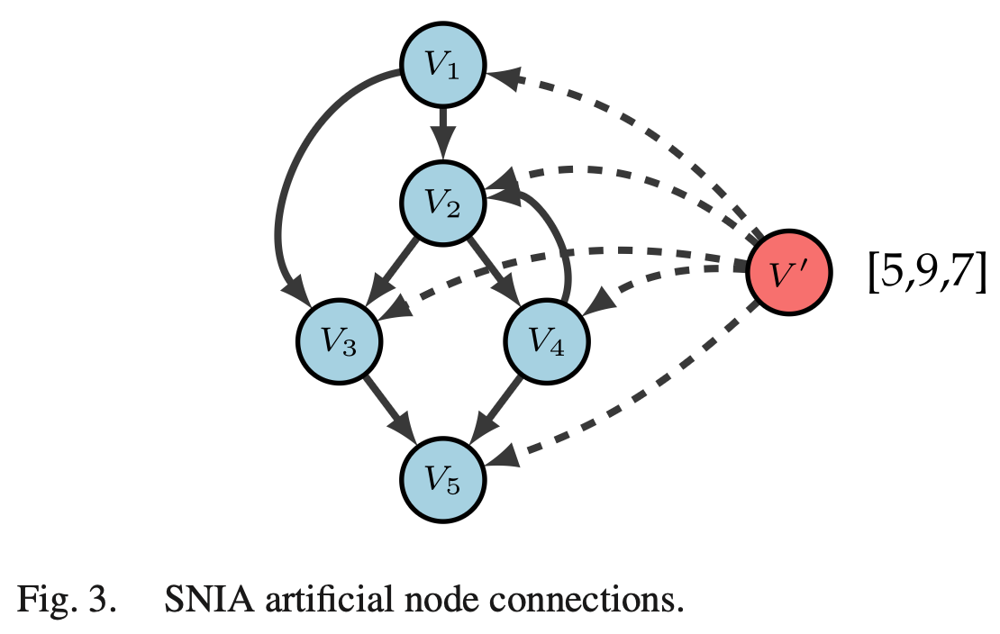

 Specific features manipulated: Opcodes of the progras

#### MalGuise[11]

CFG-based

semantics-preserving transformation of call-based redividing (modify edge)

Monte-Carlo-tree-search-based optimization

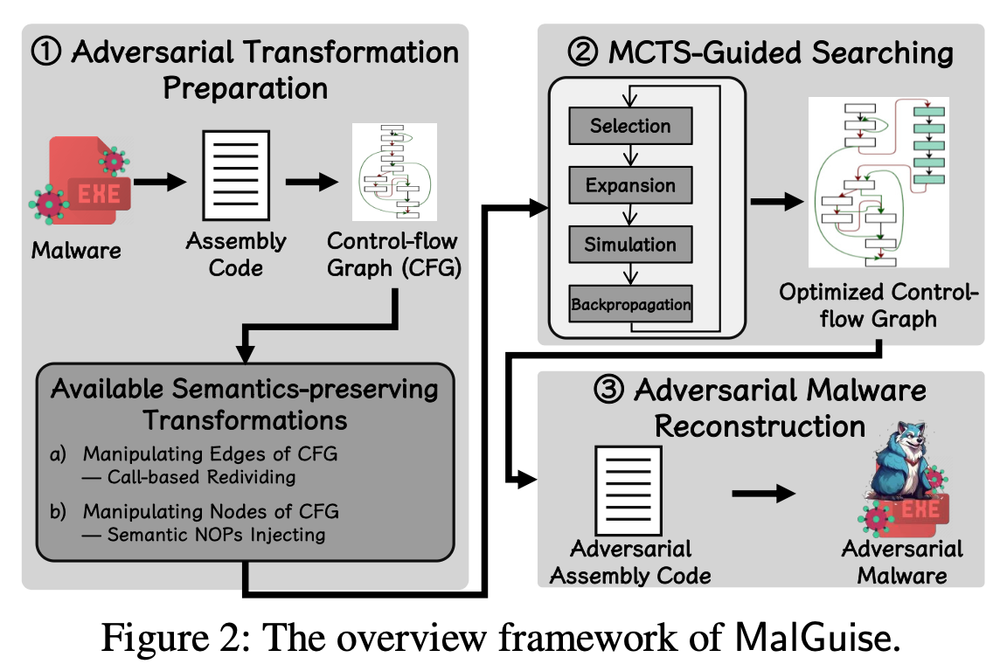

#### BagAmmo[5]

FCG-based + GAN

Black-box attacks towards FCG-based Android malware detection with multi-population co-evolution, termed BagAmmo.

GAN

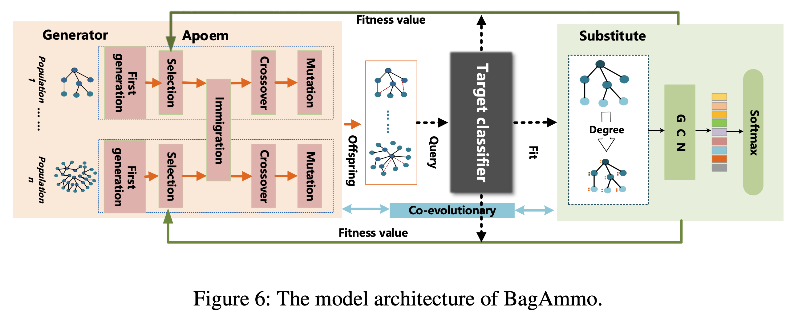

- generator: Adversarial multi-population co-evolution algorithm (Apoem)
  - Add edges (malware function call) from non-leaf nodes to leaf nodes

#### RS-Del[7]

Adversarial perturbation: inserting, deleting and/or substituting bytes

Certification: edit distance

Randomization scheme: randomly delete bytes

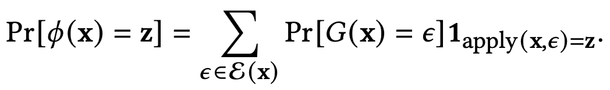

#### DRS-Chunk[9]

chunk-based RS

patch attack/append attack

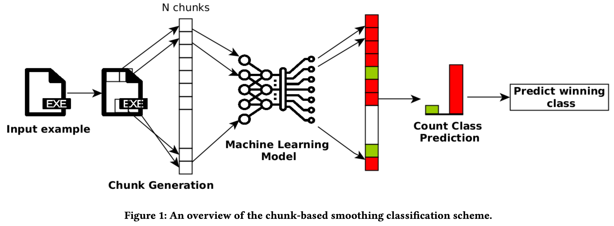

## Ref.

[1] P. Xu, B. Kolosnjaji, C. Eckert, and A. Zarras, “MANIS: evading malware detection system on graph structure,” in SAC’20.

[2] K. Zhao et al., “Structural Attack against Graph-Based Android Malware Detection,” in CCS ’21.

[3] D. Zapzalka, S. Salem, and D. Mohaisen, “Semantics-Preserving Node Injection Attacks Against GNN-Based ACFG Malware Classifiers,” IEEE TDSC 2023.

[4] J. Zheng *et al.*, “MaskDroid: Robust Android Malware Detection with Masked Graph Representations,” in ASE'24.

[5] H. Li *et al.*, “Black-box Adversarial Example Attack towards FCG Based Android Malware Detection under Incomplete Feature Information,” in Usenix Security 23.

[6] R. Yumlembam, B. Issac, S. M. Jacob, and L. Yang, “IoT-Based Android Malware Detection Using Graph Neural Network With Adversarial Defense,” IEEE IoTJ 2023.

[7] Z. Huang, N. G. Marchant, K. Lucas, L. Bauer, O. Ohrimenko, and B. I. P. Rubinstein, “Certified Robustness of Learning-based Static Malware Detectors,”  2023, *arXiv*: arXiv:2302.01757.

[8] S. Saha, W. Wang, Y. Kaya, S. Feizi, and T. Dumitras, “DRSM: De-Randomized Smoothing on Malware Classifier Providing Certified Robustness,” in ICLR 2024.

[9] D. Gibert, G. Zizzo, and Q. Le, “Certified Robustness of Static Deep Learning-based Malware Detectors against Patch and Append Attacks,” in AISec 2023.

[10] Y. Zhou, G. Cheng, Z. Chen, and S. Yu, “MalPurifier: Enhancing Android Malware Detection with Adversarial Purification against Evasion Attacks,” arXiv:2312.06423.

[11] X. Ling *et al.*, “A Wolf in Sheep’s Clothing: Practical Black-box Adversarial Attacks for Evading Learning-based Windows Malware Detection in the Wild,” in USENIX Security 24.

