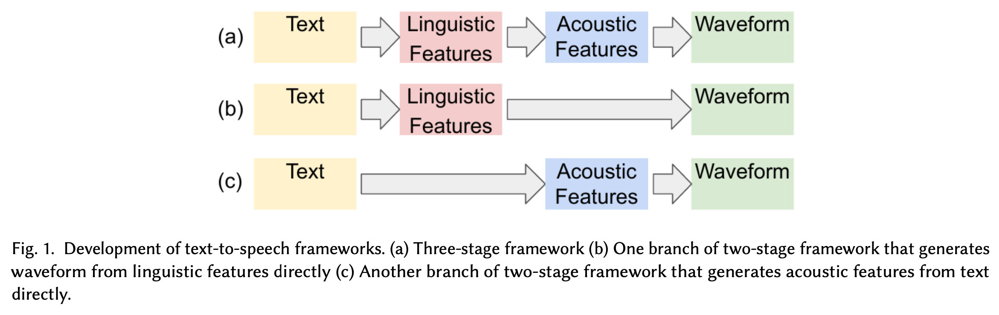

# Meeting Mar. 20

## Noise Schedule

|   schedule   |  SSIM  |  FID   | Spec SSIM |
| :----------: | :----: | :----: | :-------: |
|  simple cos  | 0.7935 | 0.0503 |  0.8183   |
|     tanh     | 0.7335 | 0.0797 |  0.7787   |
|    power     | 0.6969 | 0.0546 |  0.7544   |
|     lin      | 0.7028 | 0.2071 |  0.7208   |
| standard cos | 0.6596 | 0.2973 |  0.6775   |

## Audio Diffusion

### DiffWave[1]

|   schedule   | color  |  SSIM  |
| :----------: | :----: | :----: |
|  simple cos  |  blue  | 0.4308 |
|     lin      | orange | 0.6109 |
| standard cos |  red   | 0.6706 |

- generation conditioned on mel spectrogram
- TODO: unconditional generation
- TODO: FID evaluation

## TODO

- INFOCOM slides
- audio diffusion experiment
- 报销
- [BIGCOM]()

## Ref.

[1] Z. Kong, W. Ping, J. Huang, K. Zhao, and B. Catanzaro, “DiffWave: A Versatile Diffusion Model for Audio Synthesis,” presented at the International Conference on Learning Representations, Oct. 2020.

## Supplementary

- (a) acoustic model
- (b) vocoder
- (c) end-to-end

PhD

- University of Cologne [Aleksandar Bojchevski](https://abojchevski.github.io)
- UCL [Lorenzo Cavallaro](https://s2lab.cs.ucl.ac.uk)